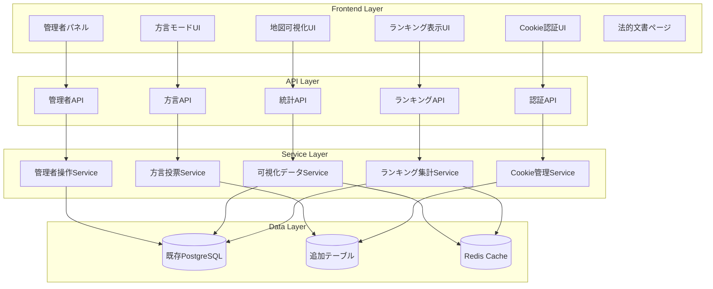
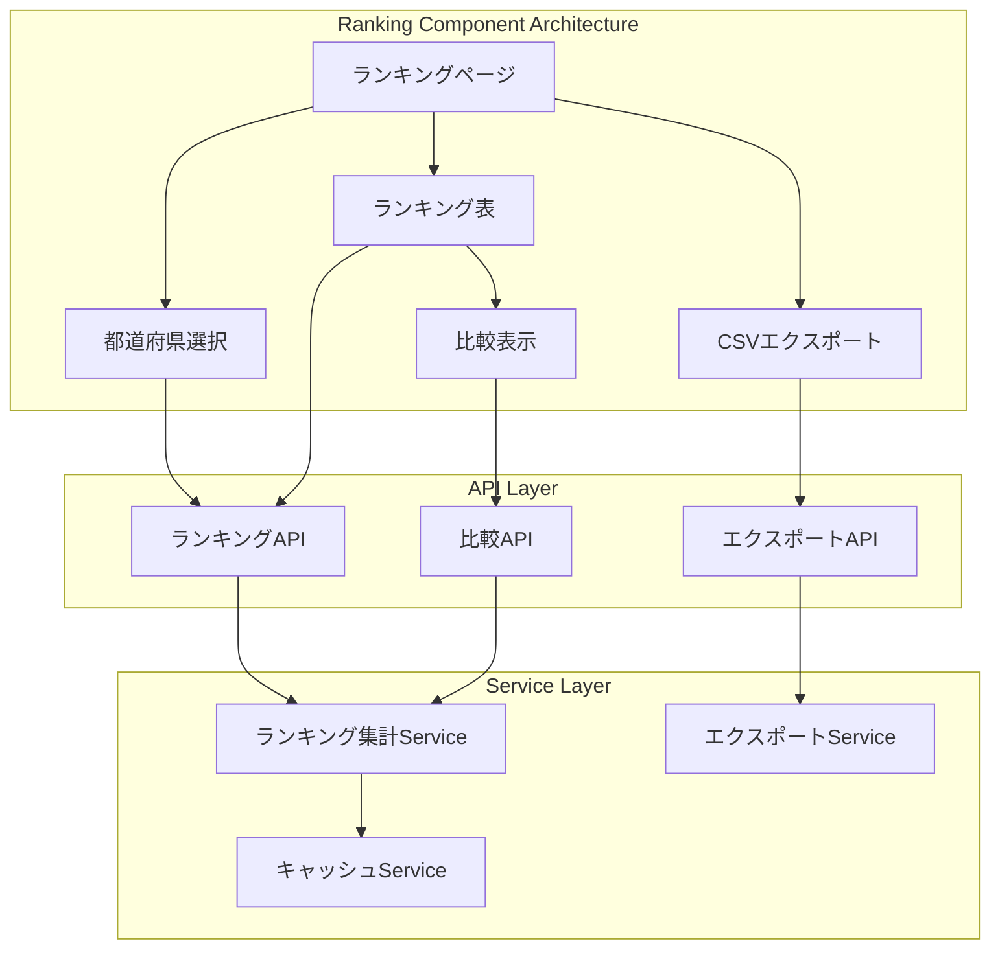
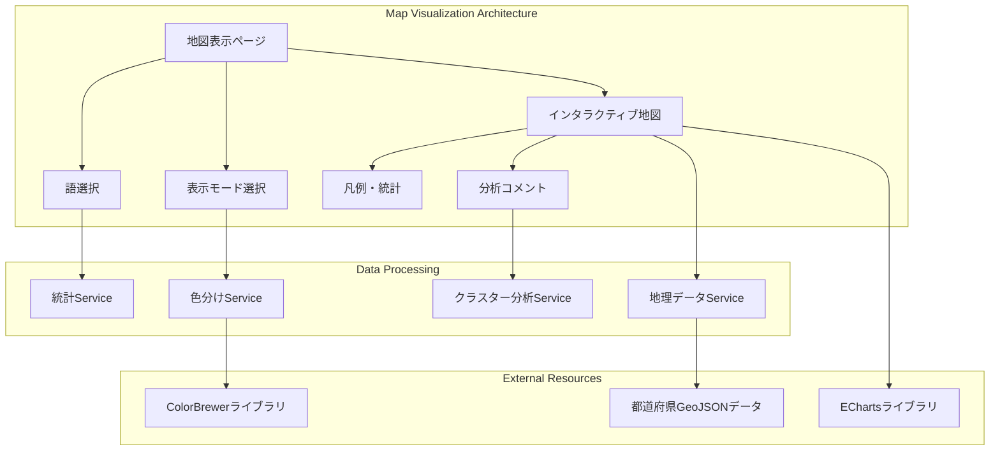
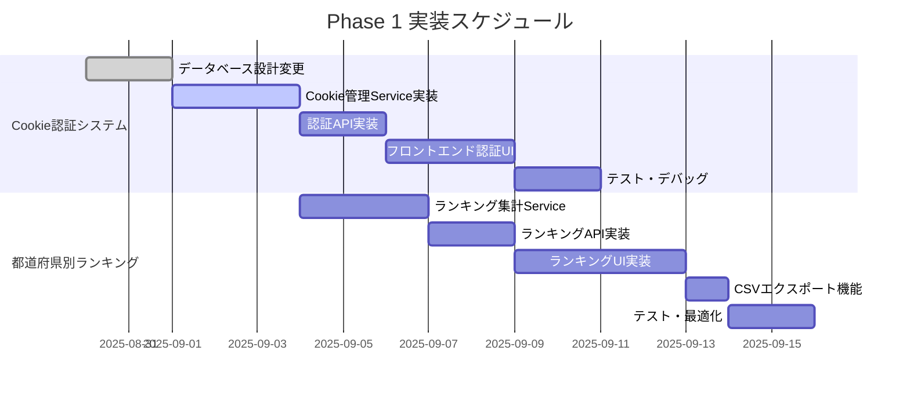
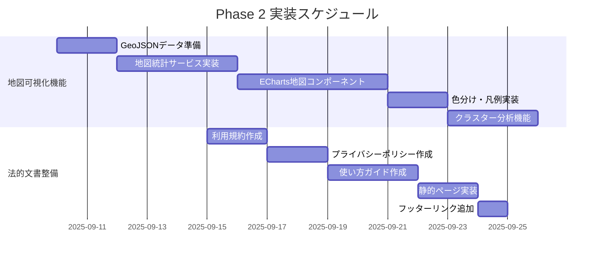
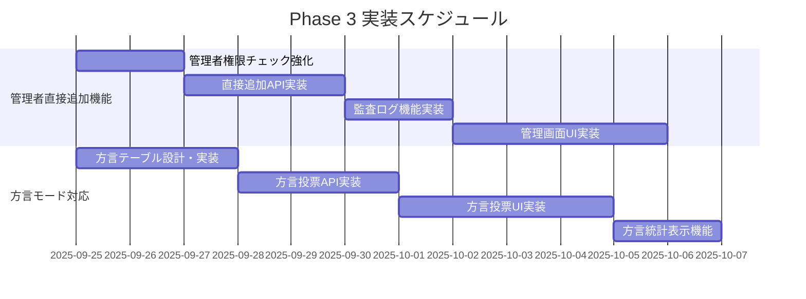

# 追加機能技術設計書: 日本語アクセント投票サイト

**バージョン**: 1.0  
**最終更新日**: 2025-08-29  
**対象システム**: 日本語アクセント投票サイト

## 1. 概要と設計方針

### 1.1 設計の基本方針
- **既存アーキテクチャとの整合性**: 現行システムのNext.js Full-Stack架構を維持
- **段階的実装**: 既存機能への影響を最小化した段階的な機能追加
- **並列開発対応**: チーム開発を想定したモジュール境界の明確化
- **パフォーマンス重視**: 大量データ処理と高速レスポンスの両立
- **セキュリティ強化**: Cookie認証への移行によるセキュリティ向上

### 1.2 追加機能アーキテクチャ概観



## 2. データベース設計変更

### 2.1 既存スキーマとの関係性
既存のPrismaスキーマを拡張し、新機能に必要なテーブルを追加します。JWT認証を削除し、Cookie基盤の匿名認証システムに移行します。

### 2.2 追加テーブル設計

#### 2.2.1 匿名ユーザー管理テーブル (anonymous_users)
```sql
CREATE TABLE anonymous_users (
    device_id UUID PRIMARY KEY DEFAULT gen_random_uuid(),
    age_group VARCHAR(10) NOT NULL CHECK (age_group IN ('10s', '20s', '30s', '40s', '50s', '60s', '70s+')),
    gender VARCHAR(20) NOT NULL CHECK (gender IN ('male', 'female', 'other', 'prefer_not_to_say')),
    prefecture_code VARCHAR(5) NOT NULL REFERENCES prefectures(code),
    registered_at TIMESTAMP WITH TIME ZONE DEFAULT NOW(),
    last_active_at TIMESTAMP WITH TIME ZONE DEFAULT NOW(),
    session_data JSONB DEFAULT '{}',
    
    INDEX idx_anonymous_users_prefecture (prefecture_code),
    INDEX idx_anonymous_users_active (last_active_at),
    INDEX idx_anonymous_users_registered (registered_at)
);
```

#### 2.2.2 方言オプション管理テーブル (dialect_options)
```sql
CREATE TABLE dialect_options (
    id SERIAL PRIMARY KEY,
    word_id INT NOT NULL REFERENCES words(id) ON DELETE CASCADE,
    option_text VARCHAR(50) NOT NULL,
    description TEXT,
    usage_example VARCHAR(200),
    display_order INT DEFAULT 0,
    created_at TIMESTAMP WITH TIME ZONE DEFAULT NOW(),
    
    INDEX idx_dialect_options_word (word_id),
    INDEX idx_dialect_options_order (word_id, display_order)
);
```

#### 2.2.3 方言投票テーブル (dialect_votes)
```sql
CREATE TABLE dialect_votes (
    id SERIAL PRIMARY KEY,
    word_id INT NOT NULL REFERENCES words(id) ON DELETE CASCADE,
    device_id UUID NOT NULL REFERENCES anonymous_users(device_id),
    selected_option_id INT NOT NULL REFERENCES dialect_options(id),
    voted_at TIMESTAMP WITH TIME ZONE DEFAULT NOW(),
    
    UNIQUE(word_id, device_id),
    INDEX idx_dialect_votes_word (word_id),
    INDEX idx_dialect_votes_device (device_id),
    INDEX idx_dialect_votes_option (selected_option_id),
    INDEX idx_dialect_votes_voted_at (voted_at)
);
```

#### 2.2.4 方言統計テーブル (word_prefecture_dialect_stats)
```sql
CREATE TABLE word_prefecture_dialect_stats (
    word_id INT NOT NULL REFERENCES words(id) ON DELETE CASCADE,
    prefecture_code VARCHAR(5) NOT NULL REFERENCES prefectures(code),
    option_id INT NOT NULL REFERENCES dialect_options(id),
    vote_count INT DEFAULT 0,
    percentage DECIMAL(5, 2) DEFAULT 0.00,
    last_updated TIMESTAMP WITH TIME ZONE DEFAULT NOW(),
    
    PRIMARY KEY (word_id, prefecture_code, option_id),
    INDEX idx_dialect_stats_prefecture (prefecture_code),
    INDEX idx_dialect_stats_updated (last_updated)
);
```

#### 2.2.5 管理者監査ログテーブル (admin_audit_logs)
```sql
CREATE TABLE admin_audit_logs (
    id SERIAL PRIMARY KEY,
    admin_user_id UUID NOT NULL REFERENCES users(id),
    action VARCHAR(50) NOT NULL,
    resource_type VARCHAR(30) NOT NULL,
    resource_id INT,
    old_data JSONB,
    new_data JSONB,
    ip_address INET,
    user_agent TEXT,
    created_at TIMESTAMP WITH TIME ZONE DEFAULT NOW(),
    
    INDEX idx_admin_logs_user (admin_user_id),
    INDEX idx_admin_logs_action (action),
    INDEX idx_admin_logs_created (created_at),
    INDEX idx_admin_logs_resource (resource_type, resource_id)
);
```

### 2.3 既存テーブルの変更

#### 2.3.1 Words テーブル拡張
```sql
-- 方言モード対応のためのカラム追加
ALTER TABLE words 
ADD COLUMN mode VARCHAR(10) DEFAULT 'accent' CHECK (mode IN ('accent', 'dialect')),
ADD COLUMN direct_added BOOLEAN DEFAULT FALSE,
ADD COLUMN direct_added_by UUID REFERENCES users(id),
ADD COLUMN direct_added_at TIMESTAMP WITH TIME ZONE;

-- インデックス追加
CREATE INDEX idx_words_mode ON words(mode);
CREATE INDEX idx_words_direct_added ON words(direct_added) WHERE direct_added = TRUE;
```

#### 2.3.2 Votes テーブル拡張
```sql
-- 匿名ユーザーとの紐付けを可能にするカラム追加
ALTER TABLE votes 
ADD COLUMN anonymous_device_id UUID REFERENCES anonymous_users(device_id);

-- インデックス追加  
CREATE INDEX idx_votes_anonymous_device ON votes(anonymous_device_id);
```

## 3. 機能別詳細設計

### 3.1 F-09: Cookie認証システム

#### 3.1.1 アーキテクチャ設計
JWT認証を廃止し、Cookie基盤の匿名認証システムに移行します。

```mermaid
sequenceDiagram
    participant User as 初回訪問ユーザー
    participant Frontend as Frontend
    participant API as Cookie Auth API
    participant Service as Cookie Service
    parameter DB as Database

    User->>Frontend: 初回訪問
    Frontend->>API: Cookie確認 GET /api/auth/verify
    API->>Service: verifyCookie()
    Service-->>API: Cookie不存在
    API-->>Frontend: 未登録状態
    
    Frontend->>User: 属性入力画面表示
    User->>Frontend: 年齢・性別・都道府県入力
    Frontend->>API: POST /api/auth/anonymous-register
    API->>Service: registerAnonymousUser()
    Service->>DB: anonymous_users INSERT
    Service->>Service: Cookie生成
    Service-->>API: デバイスID + Cookie
    API-->>Frontend: Cookie設定 + デバイスID
    Frontend-->>User: メイン画面遷移
```

#### 3.1.2 Cookie仕様
```typescript
// Cookie構造
interface AccentVoteCookie {
  deviceId: string;        // UUIDv4
  age: string;            // 年齢層
  gender: string;         // 性別
  prefecture: string;     // 都道府県コード
  registeredAt: number;   // 登録タイムスタンプ
  lastActiveAt: number;   // 最終アクセス
}

// Cookie設定
const cookieOptions = {
  name: 'accent_vote_user',
  httpOnly: true,
  secure: process.env.NODE_ENV === 'production',
  sameSite: 'strict' as const,
  maxAge: 30 * 24 * 60 * 60 * 1000, // 30日
  path: '/',
}
```

#### 3.1.3 サービス層実装
```typescript
export class CookieAuthService {
  async registerAnonymousUser(userData: {
    age: string;
    gender: string;
    prefecture: string;
  }): Promise<{ deviceId: string; cookie: string }> {
    // 匿名ユーザー登録処理
    const deviceId = randomUUID();
    
    const anonymousUser = await this.prisma.anonymousUser.create({
      data: {
        deviceId,
        ageGroup: userData.age,
        gender: userData.gender,
        prefectureCode: userData.prefecture,
      }
    });

    const cookieData: AccentVoteCookie = {
      deviceId,
      age: userData.age,
      gender: userData.gender,
      prefecture: userData.prefecture,
      registeredAt: Date.now(),
      lastActiveAt: Date.now(),
    };

    const encryptedCookie = await this.encryptCookieData(cookieData);
    return { deviceId, cookie: encryptedCookie };
  }

  async verifyCookie(cookieValue: string): Promise<AnonymousUser | null> {
    try {
      const decryptedData = await this.decryptCookieData(cookieValue);
      
      // 有効期限チェック
      if (Date.now() - decryptedData.registeredAt > 30 * 24 * 60 * 60 * 1000) {
        return null; // 期限切れ
      }

      // データベースでユーザー存在確認
      const user = await this.prisma.anonymousUser.findUnique({
        where: { deviceId: decryptedData.deviceId }
      });

      if (user) {
        // 最終アクセス時間更新
        await this.prisma.anonymousUser.update({
          where: { deviceId: decryptedData.deviceId },
          data: { lastActiveAt: new Date() }
        });
      }

      return user;
    } catch (error) {
      return null;
    }
  }
}
```

### 3.2 F-10: 都道府県別ランキング表示

#### 3.2.1 アーキテクチャ設計
既存の統計機能を拡張し、都道府県別の集計機能を追加します。



#### 3.2.2 データ集計ロジック
```typescript
export class RankingService {
  async getPrefectureRanking(params: {
    prefectureCode?: string;
    period: '7d' | '30d' | 'all';
    limit: number;
    offset: number;
  }): Promise<RankingResult> {
    
    // キャッシュキー生成
    const cacheKey = `ranking:${params.prefectureCode || 'all'}:${params.period}:${params.limit}:${params.offset}`;
    
    // キャッシュ確認
    const cached = await this.redis.get(cacheKey);
    if (cached) {
      return JSON.parse(cached);
    }

    // 期間に応じた日付フィルター
    const dateFilter = this.getDateFilter(params.period);
    
    // 複雑なクエリはRaw SQLで実装
    const query = `
      WITH word_vote_stats AS (
        SELECT 
          w.id,
          w.headword,
          w.reading,
          COUNT(v.id) as total_votes,
          MODE() WITHIN GROUP (ORDER BY v.accent_type_id) as most_voted_accent_type_id,
          COUNT(DISTINCT v.device_id) as unique_voters
        FROM words w
        LEFT JOIN votes v ON w.id = v.word_id
        WHERE 1=1
          ${params.prefectureCode ? 'AND v.prefecture_code = $1' : ''}
          ${dateFilter ? 'AND v.created_at >= $2' : ''}
        GROUP BY w.id, w.headword, w.reading
        HAVING COUNT(v.id) >= 50  -- 最小投票数閾値
      ),
      ranked_words AS (
        SELECT 
          *,
          ROW_NUMBER() OVER (ORDER BY total_votes DESC) as current_rank,
          LAG(total_votes) OVER (ORDER BY total_votes DESC) as prev_total_votes
        FROM word_vote_stats
      )
      SELECT 
        rw.*,
        at.name as accent_type_name,
        at.code as accent_type_code
      FROM ranked_words rw
      LEFT JOIN accent_types at ON rw.most_voted_accent_type_id = at.id
      ORDER BY rw.current_rank
      LIMIT $${params.prefectureCode ? '3' : '2'} OFFSET $${params.prefectureCode ? '4' : '3'}
    `;

    const results = await this.prisma.$queryRaw(query, /* パラメータ */);
    
    // 結果加工
    const ranking: RankingResult = {
      prefecture: params.prefectureCode,
      period: params.period,
      items: results.map(this.formatRankingItem),
      totalCount: results.length,
      lastUpdated: new Date().toISOString(),
    };

    // キャッシュ保存（5分間）
    await this.redis.setex(cacheKey, 300, JSON.stringify(ranking));
    
    return ranking;
  }

  async getComparisonData(prefectureCodes: string[]): Promise<ComparisonResult> {
    // 複数都道府県の並列データ取得
    const rankings = await Promise.all(
      prefectureCodes.map(code => 
        this.getPrefectureRanking({ 
          prefectureCode: code, 
          period: '30d', 
          limit: 20, 
          offset: 0 
        })
      )
    );

    // 比較テーブル用データ整形
    return this.formatComparisonData(rankings);
  }
}
```

#### 3.2.3 フロントエンド実装方針
```tsx
// hooks/useRanking.ts
export const useRanking = (params: RankingParams) => {
  return useQuery({
    queryKey: ['ranking', params],
    queryFn: () => api.getRanking(params),
    staleTime: 5 * 60 * 1000, // 5分間キャッシュ
    select: (data) => ({
      ...data,
      items: data.items.map(item => ({
        ...item,
        rankChange: calculateRankChange(item),
        trendIcon: getTrendIcon(item),
      }))
    })
  });
};

// components/RankingTable.tsx
export const RankingTable: React.FC<RankingTableProps> = ({ 
  prefecture, 
  period,
  onCompareClick 
}) => {
  const { data: ranking, isLoading, error } = useRanking({ prefecture, period });
  const [compareMode, setCompareMode] = useState(false);
  const [selectedPrefectures, setSelectedPrefectures] = useState<string[]>([]);

  if (isLoading) return <RankingTableSkeleton />;
  if (error) return <ErrorMessage error={error} />;

  return (
    <div className="space-y-4">
      <RankingFilters 
        prefecture={prefecture}
        period={period}
        onPrefectureChange={onPrefectureChange}
        onPeriodChange={onPeriodChange}
      />
      
      <div className="bg-white rounded-lg shadow overflow-hidden">
        <table className="min-w-full divide-y divide-gray-200">
          <thead className="bg-gray-50">
            <tr>
              <th className="px-6 py-3 text-left text-xs font-medium text-gray-500 uppercase tracking-wider">
                順位
              </th>
              <th className="px-6 py-3 text-left text-xs font-medium text-gray-500 uppercase tracking-wider">
                語・読み
              </th>
              <th className="px-6 py-3 text-left text-xs font-medium text-gray-500 uppercase tracking-wider">
                投票数
              </th>
              <th className="px-6 py-3 text-left text-xs font-medium text-gray-500 uppercase tracking-wider">
                主要アクセント
              </th>
              <th className="px-6 py-3 text-left text-xs font-medium text-gray-500 uppercase tracking-wider">
                前回比
              </th>
            </tr>
          </thead>
          <tbody className="bg-white divide-y divide-gray-200">
            {ranking?.items.map((item, index) => (
              <RankingRow key={item.id} item={item} rank={index + 1} />
            ))}
          </tbody>
        </table>
      </div>

      <div className="flex justify-between items-center">
        <ExportButton 
          data={ranking?.items} 
          filename={`ranking_${prefecture}_${period}.csv`}
        />
        <ComparisonModeToggle 
          enabled={compareMode}
          onToggle={setCompareMode}
        />
      </div>

      {compareMode && (
        <ComparisonPanel 
          selectedPrefectures={selectedPrefectures}
          onPrefectureSelect={setSelectedPrefectures}
        />
      )}
    </div>
  );
};
```

### 3.3 F-11: 日本地図アクセント分布可視化

#### 3.3.1 アーキテクチャ設計
EChartsとGeoJSONを活用した地図可視化システムを構築します。



#### 3.3.2 地図データ生成サービス
```typescript
export class MapVisualizationService {
  private readonly ACCENT_COLORS = {
    atamadaka: '#FF6B6B',  // 頭高型 - 赤
    heiban: '#4ECDC4',     // 平板型 - 緑青
    nakadaka: '#45B7D1',   // 中高型 - 青
    odaka: '#FFA07A',      // 尾高型 - オレンジ
    insufficient: '#E0E0E0' // データ不足 - グレー
  };

  async generateMapData(wordId: number, displayMode: 'majority' | 'diversity' | 'participation'): Promise<MapVisualizationData> {
    // 都道府県別統計データ取得
    const prefectureStats = await this.getPrefectureStatistics(wordId);
    
    // 表示モード別のデータ処理
    const processedData = await this.processDataByMode(prefectureStats, displayMode);
    
    // GeoJSONデータと統合
    const geoJsonWithStats = await this.mergeWithGeoJson(processedData);
    
    // クラスター分析実行
    const clusterAnalysis = await this.performClusterAnalysis(processedData);
    
    return {
      geoJson: geoJsonWithStats,
      legend: this.generateLegend(processedData, displayMode),
      statistics: this.calculateNationalStatistics(prefectureStats),
      analysis: clusterAnalysis,
      lastUpdated: new Date().toISOString(),
    };
  }

  private async getPrefectureStatistics(wordId: number): Promise<PrefectureStatistics[]> {
    const query = `
      SELECT 
        ps.prefecture_code,
        p.name as prefecture_name,
        p.region,
        ps.accent_type_id,
        at.code as accent_type,
        at.name as accent_name,
        ps.vote_count,
        ps.vote_percentage,
        ps.total_votes_in_pref
      FROM word_pref_stats ps
      JOIN prefectures p ON ps.prefecture_code = p.code
      JOIN accent_types at ON ps.accent_type_id = at.id
      WHERE ps.word_id = $1
      AND ps.vote_count >= 10  -- 最小投票数閾値
      ORDER BY ps.prefecture_code, ps.vote_count DESC
    `;

    const results = await this.prisma.$queryRaw(query, wordId);
    return this.groupByPrefecture(results);
  }

  private async processDataByMode(
    stats: PrefectureStatistics[], 
    mode: 'majority' | 'diversity' | 'participation'
  ): Promise<ProcessedMapData[]> {
    
    return stats.map(prefStats => {
      switch (mode) {
        case 'majority':
          // 最多得票アクセント型で色分け
          const majorityAccent = prefStats.accentTypes[0];
          return {
            prefectureCode: prefStats.prefectureCode,
            prefectureName: prefStats.prefectureName,
            color: this.ACCENT_COLORS[majorityAccent.type] || this.ACCENT_COLORS.insufficient,
            intensity: this.calculateIntensity(majorityAccent.percentage),
            tooltipData: {
              accent: majorityAccent.name,
              percentage: majorityAccent.percentage,
              votes: majorityAccent.votes,
              total: prefStats.totalVotes,
            }
          };

        case 'diversity':
          // アクセント多様性指数で色分け
          const diversityIndex = this.calculateDiversityIndex(prefStats.accentTypes);
          return {
            prefectureCode: prefStats.prefectureCode,
            prefectureName: prefStats.prefectureName,
            color: this.getDiversityColor(diversityIndex),
            intensity: diversityIndex,
            tooltipData: {
              diversity: diversityIndex,
              accentCount: prefStats.accentTypes.length,
              total: prefStats.totalVotes,
            }
          };

        case 'participation':
          // 参加者数（推定）で色分け
          const participationRate = prefStats.totalVotes / prefStats.population;
          return {
            prefectureCode: prefStats.prefectureCode,
            prefectureName: prefStats.prefectureName,
            color: this.getParticipationColor(participationRate),
            intensity: participationRate,
            tooltipData: {
              participation: participationRate,
              votes: prefStats.totalVotes,
              estimatedPopulation: prefStats.population,
            }
          };
      }
    });
  }

  private async performClusterAnalysis(data: ProcessedMapData[]): Promise<ClusterAnalysisResult> {
    // k-meansクラスタリングによる地域グループ化
    const features = data.map(d => [
      d.intensity,
      d.tooltipData.percentage || 0,
      d.tooltipData.diversity || 0,
    ]);

    const clusters = await this.kMeansClusteringr(features, 4); // 4クラスターに分類
    
    return {
      clusters: this.interpretClusters(clusters, data),
      patterns: this.identifyLinguisticPatterns(clusters, data),
      commentary: this.generateAnalysisCommentary(clusters, data),
    };
  }
}
```

#### 3.3.3 フロントエンド地図コンポーネント
```tsx
// components/MapVisualization.tsx
export const MapVisualization: React.FC<MapVisualizationProps> = ({ 
  wordId, 
  initialMode = 'majority' 
}) => {
  const [displayMode, setDisplayMode] = useState<DisplayMode>(initialMode);
  const [selectedPrefecture, setSelectedPrefecture] = useState<string | null>(null);
  const mapRef = useRef<HTMLDivElement>(null);
  const chartInstanceRef = useRef<echarts.ECharts | null>(null);

  const { 
    data: mapData, 
    isLoading, 
    error 
  } = useMapVisualization(wordId, displayMode);

  const initializeMap = useCallback(() => {
    if (!mapRef.current || !mapData) return;

    const chartInstance = echarts.init(mapRef.current);
    
    // 地図オプション設定
    const option: EChartsOption = {
      title: {
        text: `「${mapData.wordTitle}」のアクセント分布`,
        left: 'center',
        textStyle: {
          fontSize: 18,
          fontWeight: 'bold',
        }
      },
      
      tooltip: {
        trigger: 'item',
        formatter: (params: any) => {
          const data = params.data;
          if (!data || !data.tooltipData) return '';
          
          return `
            <div class="p-3 bg-white rounded shadow-lg">
              <h3 class="font-bold text-lg">${data.name}</h3>
              ${this.formatTooltipContent(data.tooltipData, displayMode)}
            </div>
          `;
        }
      },

      visualMap: {
        type: 'piecewise',
        pieces: mapData.legend.pieces,
        orient: 'horizontal',
        left: 'center',
        bottom: 20,
        textStyle: {
          color: '#333'
        }
      },

      series: [
        {
          type: 'map',
          map: 'Japan',
          aspectScale: 0.75,
          layoutCenter: ['50%', '50%'],
          layoutSize: '80%',
          itemStyle: {
            borderColor: '#fff',
            borderWidth: 1,
            areaColor: '#f0f0f0'
          },
          emphasis: {
            itemStyle: {
              borderColor: '#333',
              borderWidth: 2,
            },
            label: {
              show: true,
              fontSize: 12,
              fontWeight: 'bold'
            }
          },
          data: mapData.geoJson.features.map((feature: any) => ({
            name: feature.properties.name,
            value: feature.properties.value,
            tooltipData: feature.properties.tooltipData,
            itemStyle: {
              areaColor: feature.properties.color,
            }
          }))
        }
      ]
    };

    chartInstance.setOption(option);

    // イベントリスナー設定
    chartInstance.on('click', (params: any) => {
      if (params.data) {
        setSelectedPrefecture(params.data.name);
        onPrefectureClick?.(params.data);
      }
    });

    chartInstanceRef.current = chartInstance;

    // レスポンシブ対応
    const handleResize = () => chartInstance.resize();
    window.addEventListener('resize', handleResize);

    return () => {
      window.removeEventListener('resize', handleResize);
      chartInstance.dispose();
    };
  }, [mapData, displayMode]);

  useEffect(() => {
    initializeMap();
  }, [initializeMap]);

  if (isLoading) return <MapVisualizationSkeleton />;
  if (error) return <ErrorMessage error={error} />;

  return (
    <div className="w-full bg-white rounded-lg shadow-lg overflow-hidden">
      <div className="p-4 border-b border-gray-200">
        <DisplayModeSelector 
          currentMode={displayMode}
          onModeChange={setDisplayMode}
        />
      </div>

      <div className="relative">
        <div 
          ref={mapRef}
          className="w-full h-96 md:h-[500px]"
          style={{ minHeight: '400px' }}
        />
        
        {selectedPrefecture && (
          <PrefectureDetailOverlay 
            prefecture={selectedPrefecture}
            wordId={wordId}
            onClose={() => setSelectedPrefecture(null)}
          />
        )}
      </div>

      <div className="p-4 border-t border-gray-200">
        <div className="grid grid-cols-1 md:grid-cols-2 gap-4">
          <StatisticsSummary statistics={mapData.statistics} />
          <AnalysisCommentary analysis={mapData.analysis} />
        </div>
      </div>
    </div>
  );
};
```

## 4. API設計

### 4.1 Cookie認証関連API

```typescript
// POST /api/auth/anonymous-register
interface AnonymousRegisterRequest {
  age: '10s' | '20s' | '30s' | '40s' | '50s' | '60s' | '70s+';
  gender: 'male' | 'female' | 'other' | 'prefer_not_to_say';
  prefecture: string; // 都道府県コード
}

interface AnonymousRegisterResponse {
  success: boolean;
  deviceId: string;
  message: string;
}

// GET /api/auth/verify-cookie
interface VerifyCookieResponse {
  success: boolean;
  user?: {
    deviceId: string;
    age: string;
    gender: string;
    prefecture: string;
    registeredAt: string;
    lastActiveAt: string;
  };
  requiresRegistration: boolean;
}

// PUT /api/auth/refresh-session
interface RefreshSessionResponse {
  success: boolean;
  message: string;
}
```

### 4.2 ランキング関連API

```typescript
// GET /api/rankings/prefecture/:code
interface PrefectureRankingRequest {
  period?: '7d' | '30d' | 'all';
  limit?: number;
  offset?: number;
}

interface PrefectureRankingResponse {
  success: boolean;
  data: {
    prefecture: {
      code: string;
      name: string;
      region: string;
    };
    period: string;
    items: RankingItem[];
    pagination: {
      total: number;
      limit: number;
      offset: number;
      hasNext: boolean;
    };
    summary: {
      totalVotes: number;
      uniqueWords: number;
      participantCount: number;
      lastUpdated: string;
    };
  };
}

// GET /api/stats/comparison
interface ComparisonRequest {
  prefectures: string[]; // 最大3件
  period?: '7d' | '30d' | 'all';
  limit?: number;
}

interface ComparisonResponse {
  success: boolean;
  data: {
    prefectures: PrefectureInfo[];
    comparison: ComparisonMatrix;
    insights: ComparisonInsight[];
  };
}
```

### 4.3 地図可視化関連API

```typescript
// GET /api/stats/map/:wordId
interface MapVisualizationRequest {
  mode?: 'majority' | 'diversity' | 'participation';
  minVotes?: number;
}

interface MapVisualizationResponse {
  success: boolean;
  data: {
    wordId: number;
    wordInfo: {
      headword: string;
      reading: string;
      category: string;
    };
    geoJson: {
      type: 'FeatureCollection';
      features: Array<{
        type: 'Feature';
        properties: {
          prefectureCode: string;
          name: string;
          color: string;
          value: number;
          tooltipData: object;
        };
        geometry: object;
      }>;
    };
    legend: {
      type: string;
      pieces: Array<{
        value: number | [number, number];
        color: string;
        label: string;
      }>;
    };
    statistics: {
      totalVotes: number;
      coveragePrefectures: number;
      dominantAccent: string;
      diversityIndex: number;
    };
    analysis: {
      clusters: ClusterInfo[];
      patterns: LinguisticPattern[];
      commentary: string;
    };
    lastUpdated: string;
  };
}
```

### 4.4 管理者関連API

```typescript
// POST /api/admin/words/direct
interface DirectWordAddRequest {
  headword: string;
  reading: string;
  category: string;
  aliases?: string[];
  publicFlag: boolean;
  recommendedAccent?: 'atamadaka' | 'heiban' | 'nakadaka' | 'odaka';
  notes?: string;
  source?: string;
}

interface DirectWordAddResponse {
  success: boolean;
  data: {
    wordId: number;
    message: string;
    duplicateWarnings?: Array<{
      existingWordId: number;
      headword: string;
      reading: string;
      similarity: number;
    }>;
  };
}

// GET /api/admin/audit-logs
interface AuditLogRequest {
  adminUserId?: string;
  action?: string;
  resourceType?: string;
  startDate?: string;
  endDate?: string;
  limit?: number;
  offset?: number;
}

interface AuditLogResponse {
  success: boolean;
  data: {
    logs: Array<{
      id: number;
      adminUser: {
        id: string;
        displayName: string;
      };
      action: string;
      resourceType: string;
      resourceId?: number;
      oldData?: object;
      newData?: object;
      ipAddress?: string;
      userAgent?: string;
      createdAt: string;
    }>;
    pagination: {
      total: number;
      limit: number;
      offset: number;
      hasNext: boolean;
    };
  };
}
```

### 4.5 方言モード関連API

```typescript
// POST /api/votes/dialect
interface DialectVoteRequest {
  wordId: number;
  selectedOptionId: number;
  deviceId: string;
}

interface DialectVoteResponse {
  success: boolean;
  data: {
    voteId: number;
    message: string;
    updatedStats: {
      selectedOption: {
        id: number;
        text: string;
        voteCount: number;
        percentage: number;
      };
      allOptions: Array<{
        id: number;
        text: string;
        voteCount: number;
        percentage: number;
      }>;
    };
  };
}

// GET /api/words/:id/dialect-stats
interface DialectStatsResponse {
  success: boolean;
  data: {
    wordId: number;
    wordInfo: {
      headword: string;
      reading: string;
      mode: 'dialect';
    };
    options: Array<{
      id: number;
      text: string;
      description?: string;
      usageExample?: string;
      voteCount: number;
      percentage: number;
      prefectureDistribution: Array<{
        prefecture: string;
        voteCount: number;
        percentage: number;
      }>;
    }>;
    totalVotes: number;
    lastUpdated: string;
  };
}
```

## 5. セキュリティ設計

### 5.1 Cookie認証セキュリティ

#### 5.1.1 Cookie暗号化
```typescript
export class CookieEncryptionService {
  private readonly algorithm = 'aes-256-gcm';
  private readonly secretKey = process.env.COOKIE_SECRET_KEY!;

  async encrypt(data: object): Promise<string> {
    const iv = randomBytes(16);
    const cipher = createCipher(this.algorithm, this.secretKey);
    cipher.setAAD(Buffer.from('accent-vote-cookie', 'utf8'));
    
    const jsonString = JSON.stringify(data);
    let encrypted = cipher.update(jsonString, 'utf8', 'hex');
    encrypted += cipher.final('hex');
    
    const authTag = cipher.getAuthTag();
    
    // IV + AuthTag + EncryptedData の形式で結合
    return [
      iv.toString('hex'),
      authTag.toString('hex'),
      encrypted
    ].join(':');
  }

  async decrypt(encryptedData: string): Promise<object> {
    const [ivHex, authTagHex, encrypted] = encryptedData.split(':');
    
    if (!ivHex || !authTagHex || !encrypted) {
      throw new Error('Invalid encrypted data format');
    }

    const iv = Buffer.from(ivHex, 'hex');
    const authTag = Buffer.from(authTagHex, 'hex');
    
    const decipher = createDecipher(this.algorithm, this.secretKey);
    decipher.setAAD(Buffer.from('accent-vote-cookie', 'utf8'));
    decipher.setAuthTag(authTag);
    
    let decrypted = decipher.update(encrypted, 'hex', 'utf8');
    decrypted += decipher.final('utf8');
    
    return JSON.parse(decrypted);
  }
}
```

#### 5.1.2 CSRF対策
```typescript
// middleware/csrf-protection.ts
export class CSRFProtectionMiddleware {
  async validateCSRFToken(req: NextRequest): Promise<boolean> {
    if (['GET', 'HEAD', 'OPTIONS'].includes(req.method)) {
      return true; // 読み取り専用メソッドはCSRF対象外
    }

    const cookieToken = req.cookies.get('csrf-token')?.value;
    const headerToken = req.headers.get('x-csrf-token');
    
    if (!cookieToken || !headerToken) {
      return false;
    }

    // トークンの一致確認（タイミング攻撃対策付き）
    return this.safeCompare(cookieToken, headerToken);
  }

  private safeCompare(a: string, b: string): boolean {
    if (a.length !== b.length) return false;
    
    let result = 0;
    for (let i = 0; i < a.length; i++) {
      result |= a.charCodeAt(i) ^ b.charCodeAt(i);
    }
    return result === 0;
  }
}
```

### 5.2 管理者権限セキュリティ

#### 5.2.1 IP制限機能
```typescript
// middleware/ip-restriction.ts
export class IPRestrictionMiddleware {
  private readonly allowedIPs = process.env.ADMIN_ALLOWED_IPS?.split(',') || ['127.0.0.1'];

  isAllowedIP(clientIP: string): boolean {
    // IPv4/IPv6対応のIP範囲チェック
    return this.allowedIPs.some(allowedIP => {
      if (allowedIP.includes('/')) {
        // CIDR記法対応
        return this.isIPInCIDR(clientIP, allowedIP);
      } else {
        return clientIP === allowedIP;
      }
    });
  }

  private isIPInCIDR(ip: string, cidr: string): boolean {
    // CIDR記法のIP範囲チェック実装
    const [network, prefixLength] = cidr.split('/');
    // 実装省略（ip-rangecheck等のライブラリ使用推奨）
    return false;
  }
}
```

#### 5.2.2 操作監査ログ
```typescript
// services/audit-log.service.ts
export class AuditLogService {
  async logAdminAction(params: {
    adminUserId: string;
    action: string;
    resourceType: string;
    resourceId?: number;
    oldData?: object;
    newData?: object;
    ipAddress?: string;
    userAgent?: string;
  }): Promise<void> {
    
    // データベースログ記録
    await this.prisma.adminAuditLog.create({
      data: {
        adminUserId: params.adminUserId,
        action: params.action,
        resourceType: params.resourceType,
        resourceId: params.resourceId,
        oldData: params.oldData,
        newData: params.newData,
        ipAddress: params.ipAddress,
        userAgent: params.userAgent,
      }
    });

    // 構造化ファイルログ記録
    this.logger.info('Admin action performed', {
      adminUserId: params.adminUserId,
      action: params.action,
      resourceType: params.resourceType,
      resourceId: params.resourceId,
      ipAddress: params.ipAddress,
      timestamp: new Date().toISOString(),
      dataChanged: !!(params.oldData || params.newData),
    });

    // 重要操作の場合はSlack通知
    if (this.isCriticalAction(params.action)) {
      await this.notificationService.sendAdminAlert({
        message: `管理者操作が実行されました: ${params.action}`,
        adminId: params.adminUserId,
        details: params,
      });
    }
  }

  private isCriticalAction(action: string): boolean {
    const criticalActions = [
      'USER_DELETE',
      'WORD_DELETE',
      'BULK_DATA_IMPORT',
      'SYSTEM_CONFIG_CHANGE'
    ];
    return criticalActions.includes(action);
  }
}
```

## 6. パフォーマンス設計

### 6.1 キャッシュ戦略

#### 6.1.1 多層キャッシュ構成
```typescript
// services/cache.service.ts
export class CacheService {
  constructor(
    private redis: Redis,
    private memoryCache: NodeCache // インメモリキャッシュ
  ) {}

  async get<T>(key: string): Promise<T | null> {
    // L1: メモリキャッシュ確認
    const memoryResult = this.memoryCache.get<T>(key);
    if (memoryResult !== undefined) {
      return memoryResult;
    }

    // L2: Redisキャッシュ確認  
    const redisResult = await this.redis.get(key);
    if (redisResult) {
      const parsed = JSON.parse(redisResult) as T;
      // メモリキャッシュにも保存（短時間）
      this.memoryCache.set(key, parsed, 60); // 1分間
      return parsed;
    }

    return null;
  }

  async set<T>(key: string, value: T, ttl: number): Promise<void> {
    // Redis保存
    await this.redis.setex(key, ttl, JSON.stringify(value));
    
    // メモリキャッシュ保存（TTLの1/4または最大5分）
    const memoryTTL = Math.min(ttl / 4, 300);
    this.memoryCache.set(key, value, memoryTTL);
  }

  // キャッシュ無効化
  async invalidatePattern(pattern: string): Promise<void> {
    // Redis pattern削除
    const keys = await this.redis.keys(pattern);
    if (keys.length > 0) {
      await this.redis.del(...keys);
    }

    // メモリキャッシュ削除
    this.memoryCache.keys().forEach(key => {
      if (key.match(pattern)) {
        this.memoryCache.del(key);
      }
    });
  }
}
```

#### 6.1.2 統計データキャッシュ戦略
```typescript
// services/statistics-cache.service.ts
export class StatisticsCacheService extends CacheService {
  // 都道府県別ランキング（5分間キャッシュ）
  async getRankingCache(prefecture: string, period: string): Promise<RankingResult | null> {
    return this.get(`ranking:${prefecture}:${period}`);
  }

  async setRankingCache(prefecture: string, period: string, data: RankingResult): Promise<void> {
    return this.set(`ranking:${prefecture}:${period}`, data, 300);
  }

  // 地図統計データ（10分間キャッシュ）
  async getMapStatsCache(wordId: number, mode: string): Promise<MapVisualizationData | null> {
    return this.get(`map:${wordId}:${mode}`);
  }

  async setMapStatsCache(wordId: number, mode: string, data: MapVisualizationData): Promise<void> {
    return this.set(`map:${wordId}:${mode}`, data, 600);
  }

  // 投票時の関連キャッシュ無効化
  async invalidateVoteRelatedCache(wordId: number, prefecture?: string): Promise<void> {
    const patterns = [
      `ranking:${prefecture || '*'}:*`,
      `map:${wordId}:*`,
      'stats:summary:*',
    ];

    await Promise.all(
      patterns.map(pattern => this.invalidatePattern(pattern))
    );
  }
}
```

### 6.2 データベース最適化

#### 6.2.1 インデックス戦略
```sql
-- 都道府県別ランキング用複合インデックス
CREATE INDEX CONCURRENTLY idx_votes_prefecture_word_created 
ON votes (prefecture_code, word_id, created_at DESC) 
WHERE prefecture_code IS NOT NULL;

-- 地図統計用インデックス
CREATE INDEX CONCURRENTLY idx_word_pref_stats_word_votes 
ON word_pref_stats (word_id, vote_count DESC) 
WHERE vote_count >= 10;

-- 匿名ユーザー活動状況用
CREATE INDEX CONCURRENTLY idx_anonymous_users_active_recent 
ON anonymous_users (last_active_at DESC) 
WHERE last_active_at >= NOW() - INTERVAL '30 days';

-- 方言投票用複合インデックス
CREATE INDEX CONCURRENTLY idx_dialect_votes_word_device 
ON dialect_votes (word_id, device_id);

CREATE INDEX CONCURRENTLY idx_dialect_votes_option_created 
ON dialect_votes (selected_option_id, voted_at DESC);
```

#### 6.2.2 マテリアライズドビュー
```sql
-- 都道府県別日次統計マテリアライズドビュー
CREATE MATERIALIZED VIEW daily_prefecture_ranking_mv AS
SELECT 
  DATE(v.created_at) as vote_date,
  v.prefecture_code,
  p.name as prefecture_name,
  p.region,
  w.id as word_id,
  w.headword,
  w.reading,
  COUNT(v.id) as daily_votes,
  COUNT(DISTINCT v.device_id) as unique_voters,
  MODE() WITHIN GROUP (ORDER BY v.accent_type_id) as popular_accent_type_id,
  at.name as popular_accent_name
FROM votes v
JOIN words w ON v.word_id = w.id
JOIN prefectures p ON v.prefecture_code = p.code
JOIN accent_types at ON v.accent_type_id = at.id
WHERE v.created_at >= CURRENT_DATE - INTERVAL '90 days'
  AND v.prefecture_code IS NOT NULL
GROUP BY 
  DATE(v.created_at), 
  v.prefecture_code, 
  p.name, 
  p.region, 
  w.id, 
  w.headword, 
  w.reading, 
  at.id, 
  at.name;

-- インデックス追加
CREATE INDEX idx_daily_ranking_mv_date_pref 
ON daily_prefecture_ranking_mv (vote_date DESC, prefecture_code);

CREATE INDEX idx_daily_ranking_mv_word_votes 
ON daily_prefecture_ranking_mv (word_id, daily_votes DESC);

-- 毎日午前2時に更新
CREATE OR REPLACE FUNCTION refresh_daily_ranking_mv()
RETURNS VOID AS $$
BEGIN
  REFRESH MATERIALIZED VIEW CONCURRENTLY daily_prefecture_ranking_mv;
END;
$$ LANGUAGE plpgsql;

SELECT cron.schedule('refresh-daily-ranking', '0 2 * * *', 'SELECT refresh_daily_ranking_mv();');
```

## 7. フロントエンド実装方針

### 7.1 状態管理設計

#### 7.1.1 Zustand Store設計
```typescript
// stores/auth-store.ts
interface AuthState {
  user: AnonymousUser | null;
  isRegistered: boolean;
  isLoading: boolean;
  error: string | null;
}

interface AuthActions {
  registerAnonymousUser: (userData: RegistrationData) => Promise<void>;
  verifyCookie: () => Promise<void>;
  logout: () => Promise<void>;
  refreshSession: () => Promise<void>;
}

export const useAuthStore = create<AuthState & AuthActions>((set, get) => ({
  user: null,
  isRegistered: false,
  isLoading: false,
  error: null,

  registerAnonymousUser: async (userData) => {
    set({ isLoading: true, error: null });
    try {
      const response = await api.registerAnonymousUser(userData);
      set({ 
        user: response.user, 
        isRegistered: true, 
        isLoading: false 
      });
    } catch (error) {
      set({ error: error.message, isLoading: false });
    }
  },

  verifyCookie: async () => {
    set({ isLoading: true });
    try {
      const response = await api.verifyCookie();
      set({ 
        user: response.user, 
        isRegistered: !response.requiresRegistration,
        isLoading: false 
      });
    } catch (error) {
      set({ 
        user: null, 
        isRegistered: false, 
        isLoading: false,
        error: error.message 
      });
    }
  },
  
  // その他のアクション実装...
}));

// stores/ranking-store.ts
interface RankingState {
  currentRanking: RankingResult | null;
  selectedPrefecture: string | null;
  selectedPeriod: '7d' | '30d' | 'all';
  comparisonMode: boolean;
  comparedPrefectures: string[];
}

interface RankingActions {
  loadRanking: (prefecture?: string, period?: string) => Promise<void>;
  setPrefecture: (prefecture: string) => void;
  setPeriod: (period: '7d' | '30d' | 'all') => void;
  toggleComparisonMode: () => void;
  addComparedPrefecture: (prefecture: string) => void;
  removeComparedPrefecture: (prefecture: string) => void;
}

export const useRankingStore = create<RankingState & RankingActions>((set, get) => ({
  // State初期値
  currentRanking: null,
  selectedPrefecture: null,
  selectedPeriod: '30d',
  comparisonMode: false,
  comparedPrefectures: [],

  // Actions実装
  loadRanking: async (prefecture, period) => {
    const params = {
      prefecture: prefecture || get().selectedPrefecture,
      period: period || get().selectedPeriod,
    };
    
    try {
      const ranking = await api.getRanking(params);
      set({ 
        currentRanking: ranking,
        selectedPrefecture: params.prefecture,
        selectedPeriod: params.period,
      });
    } catch (error) {
      console.error('Failed to load ranking:', error);
    }
  },
  
  // その他のアクション実装...
}));
```

### 7.2 カスタムフック設計

#### 7.2.1 データフェッチング用フック
```typescript
// hooks/useMapVisualization.ts
export const useMapVisualization = (
  wordId: number, 
  displayMode: DisplayMode = 'majority'
) => {
  return useQuery({
    queryKey: ['mapVisualization', wordId, displayMode],
    queryFn: async () => {
      const response = await api.getMapVisualization(wordId, displayMode);
      return response.data;
    },
    staleTime: 10 * 60 * 1000, // 10分間キャッシュ
    cacheTime: 30 * 60 * 1000, // 30分間保持
    enabled: !!wordId,
    select: (data) => ({
      ...data,
      // データ整形やフィルタリング
      geoJson: {
        ...data.geoJson,
        features: data.geoJson.features.filter(
          feature => feature.properties.value >= 10 // 最小投票数フィルタ
        )
      },
      // 統計情報の追加計算
      statistics: {
        ...data.statistics,
        averageVotesPerPrefecture: data.statistics.totalVotes / 47,
        coveragePercentage: (data.statistics.coveragePrefectures / 47) * 100,
      }
    }),
    onError: (error) => {
      console.error('Map visualization loading failed:', error);
      toast.error('地図データの読み込みに失敗しました');
    }
  });
};

// hooks/useRanking.ts
export const useRanking = (params: {
  prefecture?: string;
  period: '7d' | '30d' | 'all';
  limit?: number;
  offset?: number;
}) => {
  const queryClient = useQueryClient();

  return useQuery({
    queryKey: ['ranking', params],
    queryFn: async () => {
      const response = await api.getRanking(params);
      return response.data;
    },
    staleTime: 5 * 60 * 1000, // 5分間キャッシュ
    keepPreviousData: true, // ページネーション対応
    onSuccess: (data) => {
      // 個別語データのプリフェッチ
      data.items.forEach(item => {
        queryClient.prefetchQuery({
          queryKey: ['word', item.wordId],
          queryFn: () => api.getWordDetail(item.wordId),
          staleTime: 15 * 60 * 1000,
        });
      });
    }
  });
};
```

#### 7.2.2 リアルタイム更新用フック
```typescript
// hooks/useRealTimeUpdates.ts
export const useRealTimeUpdates = (wordId?: number) => {
  const queryClient = useQueryClient();
  const [connectionStatus, setConnectionStatus] = useState<'connecting' | 'connected' | 'disconnected'>('disconnected');

  useEffect(() => {
    if (!wordId) return;

    setConnectionStatus('connecting');
    
    // Server-Sent Events接続
    const eventSource = new EventSource(`/api/realtime/word/${wordId}/updates`);
    
    eventSource.onopen = () => {
      setConnectionStatus('connected');
    };

    eventSource.onmessage = (event) => {
      const update = JSON.parse(event.data);
      
      switch (update.type) {
        case 'vote_update':
          // 投票データの更新
          queryClient.invalidateQueries(['word', wordId]);
          queryClient.invalidateQueries(['mapVisualization', wordId]);
          break;
        
        case 'ranking_update':
          // ランキングデータの更新
          queryClient.invalidateQueries(['ranking']);
          break;
        
        case 'stats_update':
          // 統計データの更新
          queryClient.invalidateQueries(['stats']);
          break;
      }
    };

    eventSource.onerror = () => {
      setConnectionStatus('disconnected');
    };

    return () => {
      eventSource.close();
      setConnectionStatus('disconnected');
    };
  }, [wordId, queryClient]);

  return { connectionStatus };
};
```

## 8. セキュリティ考慮事項

### 8.1 Cookie認証のセキュリティ強化

#### 8.1.1 レート制限実装
```typescript
// middleware/rate-limit.ts
export class RateLimitMiddleware {
  private readonly limits = {
    'anonymous-register': { windowMs: 15 * 60 * 1000, max: 5 }, // 15分間で5回
    'vote': { windowMs: 60 * 1000, max: 10 }, // 1分間で10回
    'ranking': { windowMs: 60 * 1000, max: 30 }, // 1分間で30回
    'map-visualization': { windowMs: 60 * 1000, max: 20 }, // 1分間で20回
  };

  async checkRateLimit(
    key: keyof typeof this.limits,
    identifier: string
  ): Promise<{ allowed: boolean; remaining: number; resetTime: number }> {
    
    const limit = this.limits[key];
    const cacheKey = `ratelimit:${key}:${identifier}`;
    
    const current = await this.redis.incr(cacheKey);
    
    if (current === 1) {
      // 初回アクセス時に有効期限設定
      await this.redis.pexpire(cacheKey, limit.windowMs);
    }

    const ttl = await this.redis.pttl(cacheKey);
    const resetTime = Date.now() + ttl;

    return {
      allowed: current <= limit.max,
      remaining: Math.max(0, limit.max - current),
      resetTime,
    };
  }
}
```

#### 8.1.2 デバイスフィンガープリント強化
```typescript
// utils/device-fingerprint.ts
export class DeviceFingerprintService {
  generateFingerprint(req: NextRequest): string {
    const components = [
      req.headers.get('user-agent') || '',
      req.headers.get('accept-language') || '',
      req.headers.get('accept-encoding') || '',
      this.getClientIP(req),
      req.headers.get('sec-ch-ua') || '',
      req.headers.get('sec-ch-ua-mobile') || '',
      req.headers.get('sec-ch-ua-platform') || '',
    ];

    // より多くの要素を含める場合（Canvasフィンガープリント等）
    const entropy = components.join('|');
    return createHash('sha256').update(entropy).digest('hex');
  }

  async validateFingerprint(
    deviceId: string, 
    currentFingerprint: string
  ): Promise<{ valid: boolean; riskScore: number }> {
    
    const storedFingerprints = await this.getStoredFingerprints(deviceId);
    
    // 複数のフィンガープリントを許可（デバイス設定変更等を考慮）
    const isKnownFingerprint = storedFingerprints.some(stored => 
      this.calculateSimilarity(stored, currentFingerprint) > 0.8
    );

    const riskScore = this.calculateRiskScore({
      isKnownFingerprint,
      deviceAge: await this.getDeviceAge(deviceId),
      recentActivity: await this.getRecentActivity(deviceId),
    });

    return {
      valid: isKnownFingerprint && riskScore < 0.7,
      riskScore,
    };
  }
}
```

### 8.2 データプライバシー保護

#### 8.2.1 データ匿名化処理
```typescript
// services/data-anonymization.service.ts
export class DataAnonymizationService {
  // 統計データ出力時の匿名化
  anonymizeStatisticsData(rawData: VoteData[]): AnonymizedStatistics {
    return {
      // 地域レベルを都道府県に制限（市町村レベルは削除）
      prefectureStats: this.aggregateToPrefectureLevel(rawData),
      
      // 少数地域のデータは結合または除外
      filteredStats: rawData.filter(data => data.voteCount >= 10),
      
      // 時系列データは日単位に丸める（時分秒削除）  
      timeSeriesStats: this.roundToDaily(rawData),
      
      // 年齢・性別は区間化
      demographicStats: this.categorizedemographics(rawData),
    };
  }

  // エクスポートデータの匿名化
  anonymizeExportData(data: any[]): any[] {
    return data.map(record => ({
      ...record,
      // 個人識別可能な情報を除去
      deviceId: undefined,
      ipAddress: undefined,
      userAgent: undefined,
      
      // 地理的情報を粗粒度化
      prefecture: record.prefecture, // 都道府県は維持
      region: this.getRegionFromPrefecture(record.prefecture),
      
      // 時刻情報を粗粒度化
      votedAt: this.roundToHour(record.votedAt),
    }));
  }
}
```

## 9. 実装優先順位と段階的開発計画

### 9.1 Phase 1: 基盤機能（優先度：高）

#### 9.1.1 実装順序


#### 9.1.2 実装チェックリスト

**Cookie認証システム (F-09)**
- [ ] anonymous_usersテーブル作成・マイグレーション
- [ ] Cookieサービス実装（暗号化・復号化）
- [ ] 認証ミドルウェア実装
- [ ] API エンドポイント実装
  - [ ] POST /api/auth/anonymous-register
  - [ ] GET /api/auth/verify-cookie
  - [ ] PUT /api/auth/refresh-session
- [ ] フロントエンド認証フロー実装
- [ ] Cookie設定画面UI実装
- [ ] エラーハンドリング・バリデーション
- [ ] セキュリティテスト（CSRF、XSS対策）

**都道府県別ランキング (F-10)**
- [ ] 統計集計サービス拡張
- [ ] マテリアライズドビュー作成
- [ ] ランキングAPI実装
- [ ] Redis キャッシュ実装
- [ ] フロントエンドランキング画面
- [ ] 都道府県選択UI
- [ ] 期間フィルター機能
- [ ] CSV エクスポート機能
- [ ] 比較表示機能
- [ ] パフォーマンステスト

### 9.2 Phase 2: 可視化・管理機能（優先度：中）

#### 9.2.1 実装順序


### 9.3 Phase 3: 拡張機能（優先度：低）

#### 9.3.1 実装順序


### 9.4 並列開発の指針

#### 9.4.1 チーム分担推奨
```typescript
// 開発チーム分担例
interface TeamStructure {
  backend: {
    lead: 'バックエンドリード';
    members: ['API開発者1', 'データベース設計者', 'セキュリティ担当'];
    responsibilities: [
      'API実装',
      'データベース設計・マイグレーション',
      'セキュリティ機能実装',
      'パフォーマンス最適化'
    ];
  };
  
  frontend: {
    lead: 'フロントエンドリード';
    members: ['UI/UX開発者1', 'UI/UX開発者2'];
    responsibilities: [
      'React コンポーネント実装',
      '状態管理実装',
      'レスポンシブデザイン',
      'アクセシビリティ対応'
    ];
  };
  
  fullstack: {
    lead: 'フルスタック開発者';
    responsibilities: [
      '機能間の統合',
      'エンドツーエンドテスト',
      'デプロイメント',
      'パフォーマンス監視'
    ];
  };
}
```

#### 9.4.2 並列開発のためのインターフェース定義
```typescript
// shared/interfaces.ts - 共通インターフェース定義
export interface AnonymousUser {
  deviceId: string;
  ageGroup: string;
  gender: string;
  prefectureCode: string;
  registeredAt: Date;
  lastActiveAt: Date;
}

export interface RankingResult {
  prefecture?: string;
  period: string;
  items: RankingItem[];
  pagination: PaginationInfo;
  summary: RankingSummary;
}

export interface MapVisualizationData {
  wordId: number;
  wordInfo: WordInfo;
  geoJson: GeoJSONFeatureCollection;
  legend: MapLegend;
  statistics: MapStatistics;
  analysis: ClusterAnalysis;
  lastUpdated: string;
}

// API応答の共通フォーマット
export interface APIResponse<T> {
  success: boolean;
  data?: T;
  error?: {
    code: string;
    message: string;
    details?: any;
  };
  meta?: {
    timestamp: string;
    version: string;
    pagination?: PaginationInfo;
  };
}
```

## 10. テスト戦略

### 10.1 Cookie認証システムテスト
```typescript
// __tests__/cookie-auth.test.ts
describe('Cookie Authentication System', () => {
  describe('Anonymous User Registration', () => {
    it('should register new anonymous user successfully', async () => {
      const userData = {
        age: '30s',
        gender: 'male',
        prefecture: '13' // 東京都
      };

      const response = await request(app)
        .post('/api/auth/anonymous-register')
        .send(userData)
        .expect(200);

      expect(response.body.success).toBe(true);
      expect(response.body.deviceId).toMatch(/^[0-9a-f-]{36}$/);
      
      // Cookie設定確認
      const cookieHeader = response.headers['set-cookie'][0];
      expect(cookieHeader).toContain('accent_vote_user=');
      expect(cookieHeader).toContain('HttpOnly');
      expect(cookieHeader).toContain('SameSite=Strict');
    });

    it('should reject invalid registration data', async () => {
      const invalidData = {
        age: 'invalid',
        gender: 'male',
        prefecture: '13'
      };

      await request(app)
        .post('/api/auth/anonymous-register')
        .send(invalidData)
        .expect(400);
    });
  });

  describe('Cookie Verification', () => {
    it('should verify valid cookie successfully', async () => {
      // 事前に登録
      const userData = { age: '30s', gender: 'male', prefecture: '13' };
      const registerResponse = await request(app)
        .post('/api/auth/anonymous-register')
        .send(userData);

      const cookie = registerResponse.headers['set-cookie'][0];

      // Cookie検証
      const response = await request(app)
        .get('/api/auth/verify-cookie')
        .set('Cookie', cookie)
        .expect(200);

      expect(response.body.success).toBe(true);
      expect(response.body.requiresRegistration).toBe(false);
      expect(response.body.user.deviceId).toBeDefined();
    });

    it('should handle expired cookie', async () => {
      const expiredCookie = 'accent_vote_user=expired_value';

      const response = await request(app)
        .get('/api/auth/verify-cookie')
        .set('Cookie', expiredCookie)
        .expect(200);

      expect(response.body.success).toBe(true);
      expect(response.body.requiresRegistration).toBe(true);
      expect(response.body.user).toBeUndefined();
    });
  });
});
```

### 10.2 地図可視化テスト
```typescript
// __tests__/map-visualization.test.ts
describe('Map Visualization', () => {
  let testWordId: number;

  beforeAll(async () => {
    // テスト用語とデータを準備
    testWordId = await setupTestWordWithVotes();
  });

  describe('Map Data Generation', () => {
    it('should generate map data for majority mode', async () => {
      const response = await request(app)
        .get(`/api/stats/map/${testWordId}?mode=majority`)
        .expect(200);

      expect(response.body.success).toBe(true);
      expect(response.body.data.geoJson.type).toBe('FeatureCollection');
      expect(response.body.data.geoJson.features.length).toBeGreaterThan(0);
      
      // 各都道府県のフィーチャーに必要なプロパティが含まれているか確認
      const feature = response.body.data.geoJson.features[0];
      expect(feature.properties).toHaveProperty('prefectureCode');
      expect(feature.properties).toHaveProperty('color');
      expect(feature.properties).toHaveProperty('tooltipData');
    });

    it('should generate different colors for different accent types', async () => {
      const response = await request(app)
        .get(`/api/stats/map/${testWordId}?mode=majority`)
        .expect(200);

      const colors = response.body.data.geoJson.features
        .map((f: any) => f.properties.color)
        .filter((c: string) => c !== '#E0E0E0'); // データ不足地域除外

      const uniqueColors = [...new Set(colors)];
      expect(uniqueColors.length).toBeGreaterThan(1); // 複数のアクセント型が存在
    });
  });

  describe('Cluster Analysis', () => {
    it('should perform cluster analysis and return meaningful results', async () => {
      const response = await request(app)
        .get(`/api/stats/map/${testWordId}?mode=majority`)
        .expect(200);

      const analysis = response.body.data.analysis;
      expect(analysis.clusters).toBeDefined();
      expect(analysis.patterns).toBeDefined();
      expect(analysis.commentary).toBeDefined();
      expect(typeof analysis.commentary).toBe('string');
    });
  });
});
```

## 11. まとめ

### 11.1 設計の特徴
1. **段階的実装**: 既存システムへの影響を最小化した追加設計
2. **パフォーマンス重視**: 多層キャッシュとデータベース最適化による高速化
3. **セキュリティ強化**: Cookie暗号化と包括的な監査機能
4. **並列開発対応**: 明確なインターフェース定義による独立開発可能な設計
5. **拡張性**: 将来機能追加に対応した柔軟なアーキテクチャ

### 11.2 実装時の重要考慮事項
1. **Cookie認証移行**: JWTからCookieへの段階的移行計画
2. **データプライバシー**: 匿名性を保護する統計データ処理
3. **パフォーマンス監視**: 地図表示と大量データ処理の最適化
4. **ユーザビリティ**: レスポンシブ対応と直感的UI設計

この技術設計書に基づいて、各開発者が独立して作業を進められるよう、詳細なインターフェース定義と実装ガイドラインを提供しています。
