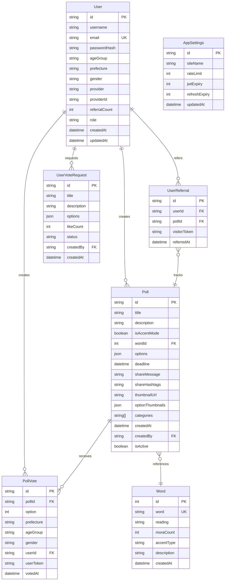

# データベース詳細設計書

## 1. データベース設計概要

### 1.1 設計方針
- **正規化**: 第3正規形を基本とし、パフォーマンスが必要な部分で意図的な非正規化
- **スケーラビリティ**: パーティショニングやインデックス戦略により大量データに対応
- **整合性**: 外部キー制約と適切なトランザクション設計
- **パフォーマンス**: クエリパターンに基づいたインデックス設計
- **拡張性**: 将来の機能追加に柔軟に対応できるスキーマ設計

### 1.2 使用技術
- **RDBMS**: PostgreSQL 15+
- **ORM**: Prisma 5.x
- **接続**: Connection Pooling (PgBouncer)
- **バックアップ**: 自動バックアップ + WAL-E
- **監視**: pg_stat_statements, pg_stat_user_tables

## 2. ER図



## 3. テーブル詳細設計

### 3.1 Users テーブル

#### 3.1.1 テーブル定義
```sql
CREATE TABLE "User" (
    "id" VARCHAR(36) NOT NULL DEFAULT gen_random_uuid(),
    "username" VARCHAR(50),
    "email" VARCHAR(255) UNIQUE,
    "passwordHash" VARCHAR(255),
    "ageGroup" VARCHAR(10) NOT NULL,
    "prefecture" VARCHAR(10) NOT NULL,
    "gender" VARCHAR(10) NOT NULL,
    "provider" VARCHAR(20),
    "providerId" VARCHAR(100),
    "referralCount" INTEGER NOT NULL DEFAULT 0,
    "role" VARCHAR(20) NOT NULL DEFAULT 'user',
    "createdAt" TIMESTAMP(3) NOT NULL DEFAULT CURRENT_TIMESTAMP,
    "updatedAt" TIMESTAMP(3) NOT NULL,

    CONSTRAINT "User_pkey" PRIMARY KEY ("id")
);
```

#### 3.1.2 インデックス設計
```sql
-- 一意制約
CREATE UNIQUE INDEX "User_email_key" ON "User"("email");

-- 検索用インデックス
CREATE INDEX "idx_user_prefecture" ON "User"("prefecture");
CREATE INDEX "idx_user_agegroup" ON "User"("ageGroup");
CREATE INDEX "idx_user_gender" ON "User"("gender");
CREATE INDEX "idx_user_provider" ON "User"("provider", "providerId");
CREATE INDEX "idx_user_referral_count" ON "User"("referralCount" DESC);
CREATE INDEX "idx_user_created_at" ON "User"("createdAt" DESC);
```

#### 3.1.3 制約とバリデーション
```sql
-- チェック制約
ALTER TABLE "User" ADD CONSTRAINT "chk_user_age_group"
CHECK ("ageGroup" IN ('10代', '20代', '30代', '40代', '50代', '60代以上'));

ALTER TABLE "User" ADD CONSTRAINT "chk_user_gender"
CHECK ("gender" IN ('male', 'female', 'other'));

ALTER TABLE "User" ADD CONSTRAINT "chk_user_role"
CHECK ("role" IN ('user', 'admin'));

ALTER TABLE "User" ADD CONSTRAINT "chk_user_provider"
CHECK ("provider" IN ('twitter', 'instagram', 'tiktok') OR "provider" IS NULL);

-- 複合制約
ALTER TABLE "User" ADD CONSTRAINT "chk_user_auth_method"
CHECK (
    ("email" IS NOT NULL AND "passwordHash" IS NOT NULL AND "provider" IS NULL) OR
    ("provider" IS NOT NULL AND "providerId" IS NOT NULL AND "email" IS NULL AND "passwordHash" IS NULL)
);
```

### 3.2 Poll テーブル

#### 3.2.1 テーブル定義
```sql
CREATE TABLE "Poll" (
    "id" VARCHAR(36) NOT NULL DEFAULT gen_random_uuid(),
    "title" VARCHAR(200) NOT NULL,
    "description" TEXT NOT NULL,
    "isAccentMode" BOOLEAN NOT NULL DEFAULT false,
    "wordId" INTEGER,
    "options" JSONB NOT NULL,
    "deadline" TIMESTAMP(3) NOT NULL,
    "shareMessage" TEXT,
    "shareHashtags" VARCHAR(200),
    "thumbnailUrl" VARCHAR(500),
    "optionThumbnails" JSONB,
    "categories" TEXT[] NOT NULL DEFAULT '{}',
    "createdAt" TIMESTAMP(3) NOT NULL DEFAULT CURRENT_TIMESTAMP,
    "createdBy" VARCHAR(36) NOT NULL,
    "isActive" BOOLEAN NOT NULL DEFAULT true,

    CONSTRAINT "Poll_pkey" PRIMARY KEY ("id")
);
```

#### 3.2.2 インデックス設計
```sql
-- パフォーマンス用インデックス
CREATE INDEX "idx_poll_active_deadline" ON "Poll"("isActive", "deadline" DESC);
CREATE INDEX "idx_poll_created_at" ON "Poll"("createdAt" DESC);
CREATE INDEX "idx_poll_categories" ON "Poll" USING gin("categories");
CREATE INDEX "idx_poll_accent_mode" ON "Poll"("isAccentMode");
CREATE INDEX "idx_poll_word_id" ON "Poll"("wordId");
CREATE INDEX "idx_poll_created_by" ON "Poll"("createdBy");

-- 全文検索用インデックス
CREATE INDEX "idx_poll_text_search" ON "Poll" USING gin(
    to_tsvector('japanese', "title" || ' ' || "description")
);
```

#### 3.2.3 JSONスキーマ
```sql
-- options フィールドのスキーマ
/*
{
  "type": "array",
  "minItems": 2,
  "maxItems": 4,
  "items": {
    "type": "object",
    "properties": {
      "label": {"type": "string", "maxLength": 100},
      "thumbnailUrl": {"type": "string", "format": "uri"},
      "pitchPattern": {
        "type": "array",
        "items": {"type": "integer", "minimum": 0, "maximum": 2}
      },
      "voiceSampleUrl": {"type": "string", "format": "uri"}
    },
    "required": ["label"]
  }
}
*/

-- optionThumbnails フィールドのスキーマ
/*
{
  "type": "array",
  "maxItems": 4,
  "items": {
    "type": "string",
    "format": "uri"
  }
}
*/
```

### 3.3 PollVote テーブル

#### 3.3.1 テーブル定義
```sql
CREATE TABLE "PollVote" (
    "id" VARCHAR(36) NOT NULL DEFAULT gen_random_uuid(),
    "pollId" VARCHAR(36) NOT NULL,
    "option" INTEGER NOT NULL,
    "prefecture" VARCHAR(10) NOT NULL,
    "ageGroup" VARCHAR(10),
    "gender" VARCHAR(10),
    "userId" VARCHAR(36),
    "userToken" VARCHAR(100) NOT NULL,
    "votedAt" TIMESTAMP(3) NOT NULL DEFAULT CURRENT_TIMESTAMP,

    CONSTRAINT "PollVote_pkey" PRIMARY KEY ("id")
);
```

#### 3.3.2 インデックス設計
```sql
-- 重複投票防止
CREATE UNIQUE INDEX "idx_pollvote_unique" ON "PollVote"("pollId", "userToken");

-- 集計用インデックス
CREATE INDEX "idx_pollvote_poll_option" ON "PollVote"("pollId", "option");
CREATE INDEX "idx_pollvote_poll_prefecture" ON "PollVote"("pollId", "prefecture");
CREATE INDEX "idx_pollvote_poll_demographics" ON "PollVote"("pollId", "ageGroup", "gender");
CREATE INDEX "idx_pollvote_user_id" ON "PollVote"("userId");
CREATE INDEX "idx_pollvote_voted_at" ON "PollVote"("votedAt" DESC);

-- パーティション用インデックス (将来的な大量データ対応)
CREATE INDEX "idx_pollvote_partition" ON "PollVote"("votedAt", "pollId");
```

#### 3.3.3 制約
```sql
ALTER TABLE "PollVote" ADD CONSTRAINT "chk_pollvote_option"
CHECK ("option" >= 0 AND "option" <= 3);

ALTER TABLE "PollVote" ADD CONSTRAINT "chk_pollvote_age_group"
CHECK ("ageGroup" IN ('10代', '20代', '30代', '40代', '50代', '60代以上') OR "ageGroup" IS NULL);

ALTER TABLE "PollVote" ADD CONSTRAINT "chk_pollvote_gender"
CHECK ("gender" IN ('male', 'female', 'other') OR "gender" IS NULL);
```

### 3.4 UserVoteRequest テーブル

#### 3.4.1 テーブル定義
```sql
CREATE TABLE "UserVoteRequest" (
    "id" VARCHAR(36) NOT NULL DEFAULT gen_random_uuid(),
    "title" VARCHAR(200) NOT NULL,
    "description" TEXT NOT NULL,
    "options" JSONB NOT NULL,
    "likeCount" INTEGER NOT NULL DEFAULT 0,
    "status" VARCHAR(20) NOT NULL DEFAULT 'pending',
    "createdBy" VARCHAR(36),
    "createdAt" TIMESTAMP(3) NOT NULL DEFAULT CURRENT_TIMESTAMP,

    CONSTRAINT "UserVoteRequest_pkey" PRIMARY KEY ("id")
);
```

#### 3.4.2 インデックス設計
```sql
CREATE INDEX "idx_uservoterequest_status" ON "UserVoteRequest"("status");
CREATE INDEX "idx_uservoterequest_like_count" ON "UserVoteRequest"("likeCount" DESC);
CREATE INDEX "idx_uservoterequest_created_by" ON "UserVoteRequest"("createdBy");
CREATE INDEX "idx_uservoterequest_created_at" ON "UserVoteRequest"("createdAt" DESC);
```

### 3.5 UserReferral テーブル

#### 3.5.1 テーブル定義
```sql
CREATE TABLE "UserReferral" (
    "id" VARCHAR(36) NOT NULL DEFAULT gen_random_uuid(),
    "userId" VARCHAR(36) NOT NULL,
    "pollId" VARCHAR(36) NOT NULL,
    "visitorToken" VARCHAR(100) NOT NULL,
    "referredAt" TIMESTAMP(3) NOT NULL DEFAULT CURRENT_TIMESTAMP,

    CONSTRAINT "UserReferral_pkey" PRIMARY KEY ("id")
);
```

#### 3.5.2 インデックス設計
```sql
-- 重複防止
CREATE UNIQUE INDEX "idx_userreferral_unique" ON "UserReferral"("userId", "visitorToken", "pollId");

-- 集計用インデックス
CREATE INDEX "idx_userreferral_user_id" ON "UserReferral"("userId");
CREATE INDEX "idx_userreferral_poll_id" ON "UserReferral"("pollId");
CREATE INDEX "idx_userreferral_referred_at" ON "UserReferral"("referredAt" DESC);
```

### 3.6 Word テーブル

#### 3.6.1 テーブル定義
```sql
CREATE TABLE "Word" (
    "id" SERIAL PRIMARY KEY,
    "word" VARCHAR(50) NOT NULL UNIQUE,
    "reading" VARCHAR(100) NOT NULL,
    "moraCount" INTEGER NOT NULL,
    "accentType" VARCHAR(50) NOT NULL,
    "description" TEXT,
    "createdAt" TIMESTAMP(3) NOT NULL DEFAULT CURRENT_TIMESTAMP
);
```

#### 3.6.2 インデックス設計
```sql
CREATE UNIQUE INDEX "Word_word_key" ON "Word"("word");
CREATE INDEX "idx_word_mora_count" ON "Word"("moraCount");
CREATE INDEX "idx_word_accent_type" ON "Word"("accentType");
CREATE INDEX "idx_word_reading" ON "Word"("reading");
```

### 3.7 AppSettings テーブル

#### 3.7.1 テーブル定義
```sql
CREATE TABLE "AppSettings" (
    "id" VARCHAR(20) NOT NULL DEFAULT 'default',
    "siteName" VARCHAR(100) NOT NULL DEFAULT 'みんなの投票',
    "rateLimit" INTEGER NOT NULL DEFAULT 60,
    "jwtExpiry" INTEGER NOT NULL DEFAULT 900,
    "refreshExpiry" INTEGER NOT NULL DEFAULT 604800,
    "updatedAt" TIMESTAMP(3) NOT NULL,

    CONSTRAINT "AppSettings_pkey" PRIMARY KEY ("id")
);
```

## 4. 外部キー制約

```sql
-- Poll テーブル
ALTER TABLE "Poll" ADD CONSTRAINT "Poll_createdBy_fkey"
FOREIGN KEY ("createdBy") REFERENCES "User"("id") ON DELETE CASCADE;

ALTER TABLE "Poll" ADD CONSTRAINT "Poll_wordId_fkey"
FOREIGN KEY ("wordId") REFERENCES "Word"("id") ON DELETE SET NULL;

-- PollVote テーブル
ALTER TABLE "PollVote" ADD CONSTRAINT "PollVote_pollId_fkey"
FOREIGN KEY ("pollId") REFERENCES "Poll"("id") ON DELETE CASCADE;

ALTER TABLE "PollVote" ADD CONSTRAINT "PollVote_userId_fkey"
FOREIGN KEY ("userId") REFERENCES "User"("id") ON DELETE SET NULL;

-- UserVoteRequest テーブル
ALTER TABLE "UserVoteRequest" ADD CONSTRAINT "UserVoteRequest_createdBy_fkey"
FOREIGN KEY ("createdBy") REFERENCES "User"("id") ON DELETE SET NULL;

-- UserReferral テーブル
ALTER TABLE "UserReferral" ADD CONSTRAINT "UserReferral_userId_fkey"
FOREIGN KEY ("userId") REFERENCES "User"("id") ON DELETE CASCADE;

ALTER TABLE "UserReferral" ADD CONSTRAINT "UserReferral_pollId_fkey"
FOREIGN KEY ("pollId") REFERENCES "Poll"("id") ON DELETE CASCADE;
```

## 5. ビュー定義

### 5.1 投票統計ビュー
```sql
CREATE VIEW poll_statistics AS
SELECT
    p.id,
    p.title,
    p.deadline,
    p.categories,
    COUNT(pv.id) as total_votes,
    COUNT(DISTINCT pv.prefecture) as prefecture_count,
    JSON_AGG(
        JSON_BUILD_OBJECT(
            'option', pv.option,
            'count', COUNT(*),
            'percentage', ROUND(COUNT(*) * 100.0 / SUM(COUNT(*)) OVER (PARTITION BY p.id), 2)
        )
    ) as option_stats
FROM "Poll" p
LEFT JOIN "PollVote" pv ON p.id = pv."pollId"
WHERE p."isActive" = true
GROUP BY p.id, p.title, p.deadline, p.categories;
```

### 5.2 地域別投票統計ビュー
```sql
CREATE VIEW prefecture_vote_stats AS
SELECT
    pv."pollId",
    pv.prefecture,
    pv.option,
    COUNT(*) as vote_count,
    RANK() OVER (PARTITION BY pv."pollId", pv.prefecture ORDER BY COUNT(*) DESC) as option_rank
FROM "PollVote" pv
GROUP BY pv."pollId", pv.prefecture, pv.option;
```

### 5.3 ユーザー紹介ランキングビュー
```sql
CREATE VIEW user_referral_ranking AS
SELECT
    u.id,
    u.username,
    u."referralCount",
    RANK() OVER (ORDER BY u."referralCount" DESC) as ranking,
    CASE
        WHEN u."referralCount" >= 100 THEN 'プラチナ'
        WHEN u."referralCount" >= 50 THEN 'ゴールド'
        WHEN u."referralCount" >= 20 THEN 'シルバー'
        WHEN u."referralCount" >= 5 THEN 'ブロンズ'
        ELSE 'なし'
    END as rank_badge
FROM "User" u
WHERE u."referralCount" > 0
ORDER BY u."referralCount" DESC;
```

## 6. トリガー定義

### 6.1 参照カウント更新トリガー
```sql
-- UserReferral 追加時にUser.referralCountを自動更新
CREATE OR REPLACE FUNCTION update_referral_count()
RETURNS TRIGGER AS $$
BEGIN
    IF TG_OP = 'INSERT' THEN
        UPDATE "User"
        SET "referralCount" = "referralCount" + 1
        WHERE id = NEW."userId";
        RETURN NEW;
    ELSIF TG_OP = 'DELETE' THEN
        UPDATE "User"
        SET "referralCount" = "referralCount" - 1
        WHERE id = OLD."userId";
        RETURN OLD;
    END IF;
    RETURN NULL;
END;
$$ LANGUAGE plpgsql;

CREATE TRIGGER trigger_update_referral_count
    AFTER INSERT OR DELETE ON "UserReferral"
    FOR EACH ROW EXECUTE FUNCTION update_referral_count();
```

### 6.2 投票締切時自動無効化トリガー
```sql
CREATE OR REPLACE FUNCTION auto_deactivate_expired_polls()
RETURNS void AS $$
BEGIN
    UPDATE "Poll"
    SET "isActive" = false
    WHERE "deadline" < NOW() AND "isActive" = true;
END;
$$ LANGUAGE plpgsql;

-- 定期実行用 (cron job で実行)
SELECT cron.schedule('deactivate-expired-polls', '0 * * * *', 'SELECT auto_deactivate_expired_polls();');
```

## 7. パーティショニング戦略

### 7.1 PollVote テーブルのパーティショニング
```sql
-- 月別パーティショニング（大量データ対応）
CREATE TABLE "PollVote_partitioned" (
    LIKE "PollVote" INCLUDING ALL
) PARTITION BY RANGE ("votedAt");

-- 月別パーティション例
CREATE TABLE "PollVote_2025_01" PARTITION OF "PollVote_partitioned"
FOR VALUES FROM ('2025-01-01') TO ('2025-02-01');

CREATE TABLE "PollVote_2025_02" PARTITION OF "PollVote_partitioned"
FOR VALUES FROM ('2025-02-01') TO ('2025-03-01');

-- 自動パーティション作成関数
CREATE OR REPLACE FUNCTION create_monthly_partition(table_date date)
RETURNS void AS $$
DECLARE
    partition_name text;
    start_date date;
    end_date date;
BEGIN
    start_date := date_trunc('month', table_date);
    end_date := start_date + interval '1 month';
    partition_name := 'PollVote_' || to_char(start_date, 'YYYY_MM');

    EXECUTE format('CREATE TABLE %I PARTITION OF "PollVote_partitioned"
                    FOR VALUES FROM (%L) TO (%L)',
                   partition_name, start_date, end_date);
END;
$$ LANGUAGE plpgsql;
```

## 8. インデックス最適化戦略

### 8.1 複合インデックス設計
```sql
-- 投票検索用複合インデックス
CREATE INDEX "idx_poll_search_optimized" ON "Poll"(
    "isActive",
    "deadline" DESC,
    "createdAt" DESC
) WHERE "isActive" = true;

-- 統計計算用複合インデックス
CREATE INDEX "idx_pollvote_analytics" ON "PollVote"(
    "pollId",
    "option",
    "prefecture",
    "ageGroup",
    "gender"
);

-- 部分インデックス（アクティブな投票のみ）
CREATE INDEX "idx_poll_active_trending" ON "Poll"("createdAt" DESC)
WHERE "isActive" = true AND "deadline" > NOW();
```

### 8.2 インデックス使用状況監視
```sql
-- インデックス使用率確認クエリ
SELECT
    schemaname,
    tablename,
    indexname,
    idx_scan as index_scans,
    idx_tup_read as tuples_read,
    idx_tup_fetch as tuples_fetched
FROM pg_stat_user_indexes
ORDER BY idx_scan DESC;

-- 未使用インデックス検出
SELECT
    schemaname,
    tablename,
    indexname,
    idx_scan
FROM pg_stat_user_indexes
WHERE idx_scan = 0;
```

## 9. パフォーマンス最適化

### 9.1 クエリ最適化
```sql
-- 投票一覧取得の最適化クエリ例
EXPLAIN (ANALYZE, BUFFERS)
SELECT
    p.id,
    p.title,
    p.deadline,
    p.categories,
    COUNT(pv.id) as vote_count
FROM "Poll" p
LEFT JOIN "PollVote" pv ON p.id = pv."pollId"
WHERE p."isActive" = true
    AND p."deadline" > NOW()
GROUP BY p.id, p.title, p.deadline, p.categories
ORDER BY COUNT(pv.id) DESC
LIMIT 20;
```

### 9.2 集計テーブル（マテリアライズドビュー）
```sql
-- 投票統計の事前集計
CREATE MATERIALIZED VIEW mv_poll_statistics AS
SELECT
    p.id as poll_id,
    p.title,
    COUNT(pv.id) as total_votes,
    JSON_OBJECT_AGG(pv.option, option_count) as option_distribution
FROM "Poll" p
LEFT JOIN (
    SELECT
        "pollId",
        option,
        COUNT(*) as option_count
    FROM "PollVote"
    GROUP BY "pollId", option
) pv ON p.id = pv."pollId"
WHERE p."isActive" = true
GROUP BY p.id, p.title;

-- インデックス作成
CREATE UNIQUE INDEX ON mv_poll_statistics (poll_id);

-- 定期更新
CREATE OR REPLACE FUNCTION refresh_poll_statistics()
RETURNS void AS $$
BEGIN
    REFRESH MATERIALIZED VIEW CONCURRENTLY mv_poll_statistics;
END;
$$ LANGUAGE plpgsql;
```

## 10. バックアップ・復旧戦略

### 10.1 バックアップ設定
```sql
-- 継続的アーカイブ設定
-- postgresql.conf
archive_mode = on
archive_command = 'test ! -f /backup/archive/%f && cp %p /backup/archive/%f'
wal_level = replica

-- 定期バックアップスクリプト
-- pg_dump の自動実行
pg_dump -Fc -h localhost -U postgres votesite > /backup/daily/votesite_$(date +%Y%m%d).dump

-- ポイントインタイム復旧用
pg_basebackup -D /backup/base -Ft -z -P -U postgres
```

### 10.2 復旧手順
```bash
# 1. データベース停止
sudo systemctl stop postgresql

# 2. データディレクトリのバックアップ
mv /var/lib/postgresql/15/main /var/lib/postgresql/15/main.backup

# 3. ベースバックアップから復元
tar -xzf /backup/base/base.tar.gz -C /var/lib/postgresql/15/main

# 4. recovery.conf設定
echo "restore_command = 'cp /backup/archive/%f %p'" > /var/lib/postgresql/15/main/recovery.conf
echo "recovery_target_time = '2025-01-15 14:30:00'" >> /var/lib/postgresql/15/main/recovery.conf

# 5. PostgreSQL開始
sudo systemctl start postgresql
```

## 11. セキュリティ設定

### 11.1 Row Level Security (RLS)
```sql
-- ユーザーは自分のデータのみアクセス可能
ALTER TABLE "UserVoteRequest" ENABLE ROW LEVEL SECURITY;

CREATE POLICY user_own_requests ON "UserVoteRequest"
    FOR ALL
    TO authenticated_user
    USING ("createdBy" = current_setting('app.current_user_id')::uuid);

-- 管理者は全データアクセス可能
CREATE POLICY admin_all_access ON "UserVoteRequest"
    FOR ALL
    TO admin_user
    USING (true);
```

### 11.2 データ暗号化
```sql
-- 機密データの暗号化
CREATE EXTENSION IF NOT EXISTS pgcrypto;

-- パスワードハッシュ化
CREATE OR REPLACE FUNCTION hash_password(password text)
RETURNS text AS $$
BEGIN
    RETURN crypt(password, gen_salt('bf', 12));
END;
$$ LANGUAGE plpgsql;

-- パスワード検証
CREATE OR REPLACE FUNCTION verify_password(password text, hash text)
RETURNS boolean AS $$
BEGIN
    RETURN (crypt(password, hash) = hash);
END;
$$ LANGUAGE plpgsql;
```

## 12. 監視・メトリクス

### 12.1 性能監視クエリ
```sql
-- スロークエリ検出
SELECT
    query,
    mean_time,
    calls,
    total_time
FROM pg_stat_statements
WHERE mean_time > 1000
ORDER BY mean_time DESC
LIMIT 10;

-- テーブルサイズ監視
SELECT
    tablename,
    pg_size_pretty(pg_total_relation_size(schemaname||'.'||tablename)) as size
FROM pg_tables
WHERE schemaname = 'public'
ORDER BY pg_total_relation_size(schemaname||'.'||tablename) DESC;

-- 接続数監視
SELECT
    state,
    COUNT(*) as connection_count
FROM pg_stat_activity
GROUP BY state;
```

### 12.2 アラート設定
```sql
-- 長時間実行クエリの検出
SELECT
    pid,
    now() - pg_stat_activity.query_start AS duration,
    query
FROM pg_stat_activity
WHERE (now() - pg_stat_activity.query_start) > interval '5 minutes'
    AND state = 'active';

-- デッドロック検出
SELECT
    blocked_locks.pid AS blocked_pid,
    blocked_activity.usename AS blocked_user,
    blocking_locks.pid AS blocking_pid,
    blocking_activity.usename AS blocking_user,
    blocked_activity.query AS blocked_statement,
    blocking_activity.query AS current_statement_in_blocking_process
FROM pg_catalog.pg_locks blocked_locks
JOIN pg_catalog.pg_stat_activity blocked_activity ON blocked_activity.pid = blocked_locks.pid
JOIN pg_catalog.pg_locks blocking_locks ON blocking_locks.locktype = blocked_locks.locktype
    AND blocking_locks.database IS NOT DISTINCT FROM blocked_locks.database
    AND blocking_locks.relation IS NOT DISTINCT FROM blocked_locks.relation
    AND blocking_locks.page IS NOT DISTINCT FROM blocked_locks.page
    AND blocking_locks.tuple IS NOT DISTINCT FROM blocked_locks.tuple
    AND blocking_locks.virtualxid IS NOT DISTINCT FROM blocked_locks.virtualxid
    AND blocking_locks.transactionid IS NOT DISTINCT FROM blocked_locks.transactionid
    AND blocking_locks.classid IS NOT DISTINCT FROM blocked_locks.classid
    AND blocking_locks.objid IS NOT DISTINCT FROM blocked_locks.objid
    AND blocking_locks.objsubid IS NOT DISTINCT FROM blocked_locks.objsubid
    AND blocking_locks.pid != blocked_locks.pid
JOIN pg_catalog.pg_stat_activity blocking_activity ON blocking_activity.pid = blocking_locks.pid
WHERE NOT blocked_locks.granted;
```

## 13. マイグレーション戦略

### 13.1 Prisma マイグレーション
```typescript
// prisma/schema.prisma の例
generator client {
  provider = "prisma-client-js"
}

datasource db {
  provider = "postgresql"
  url      = env("DATABASE_URL")
}

model User {
  id            String   @id @default(uuid())
  username      String?
  email         String?  @unique
  passwordHash  String?
  ageGroup      String
  prefecture    String
  gender        String
  provider      String?
  providerId    String?
  referralCount Int      @default(0)
  role          String   @default("user")
  createdAt     DateTime @default(now())
  updatedAt     DateTime @updatedAt

  votes         PollVote[]
  referrals     UserReferral[]
  requests      UserVoteRequest[]
  polls         Poll[]

  @@index([prefecture])
  @@index([ageGroup])
  @@index([gender])
  @@index([provider, providerId])
}
```

### 13.2 データ移行手順
```bash
# 1. 開発環境でマイグレーション作成
npx prisma migrate dev --name add_new_feature

# 2. マイグレーションファイル確認
cat prisma/migrations/20250116120000_add_new_feature/migration.sql

# 3. 本番環境適用前のバックアップ
pg_dump -Fc votesite > backup_before_migration.dump

# 4. 本番環境にマイグレーション適用
npx prisma migrate deploy

# 5. マイグレーション確認
npx prisma migrate status
```

## 14. まとめ

本データベース設計は以下の特徴を持ちます：

### 14.1 設計の特徴
1. **スケーラビリティ**: パーティショニングとインデックス最適化
2. **パフォーマンス**: マテリアライズドビューと適切なインデックス
3. **整合性**: 外部キー制約とトリガーによる自動更新
4. **セキュリティ**: RLSとデータ暗号化
5. **監視**: 包括的なメトリクス収集

### 14.2 運用上の考慮事項
- **バックアップ**: 継続的アーカイブとポイントインタイム復旧
- **監視**: スロークエリとリソース使用量の監視
- **メンテナンス**: 定期的なVACUUMとANALYZE
- **パフォーマンス**: クエリプランの定期確認

この設計により、投票プラットフォームに必要な機能を効率的に提供し、将来の拡張にも対応できるデータベースシステムを構築できます。