# 詳細設計書: 日本語アクセント投票サイト

**バージョン**: 1.0  
**最終更新日**: 2025-08-28  
**対象システム**: 日本語アクセント投票サイト

## 1. 概要

本設計書では、日本語アクセント投票サイトの各機能における処理フロー、クラス設計、データベース設計の詳細を記述します。フローチャート、シーケンス図、クラス図を用いて、実装チームが効率的に開発を進められるよう詳細化しています。

## 2. 主要機能の処理フロー設計

### 2.1 語検索・一覧表示機能 (F-01)

#### 2.1.1 処理フローチャート

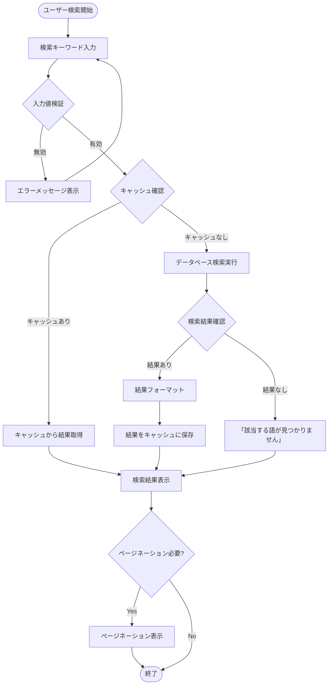

#### 2.1.2 シーケンス図

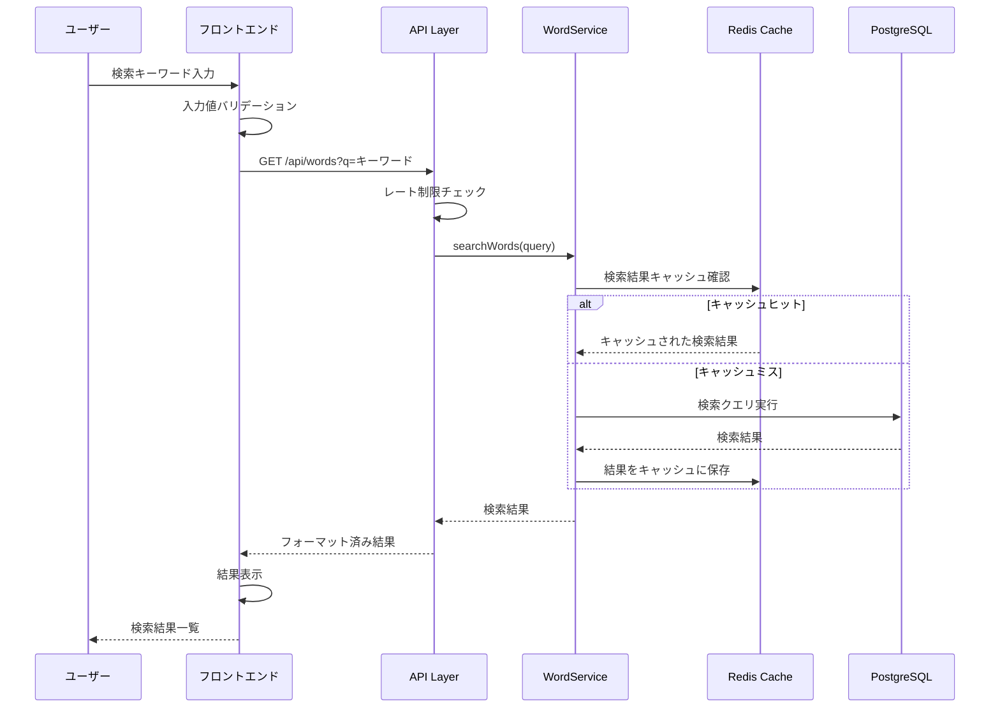

### 2.2 アクセント投票機能 (F-02)

#### 2.2.1 処理フローチャート

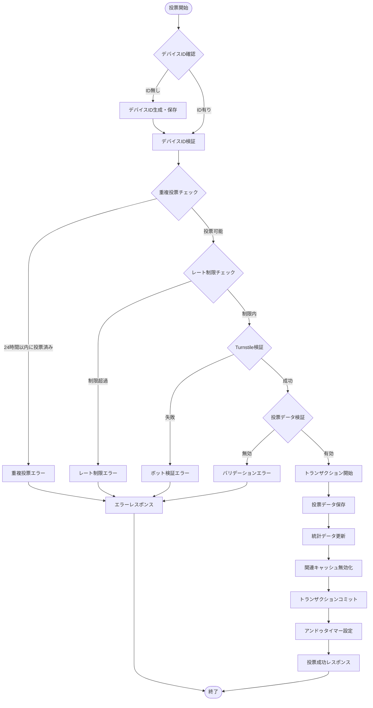

#### 2.2.2 シーケンス図

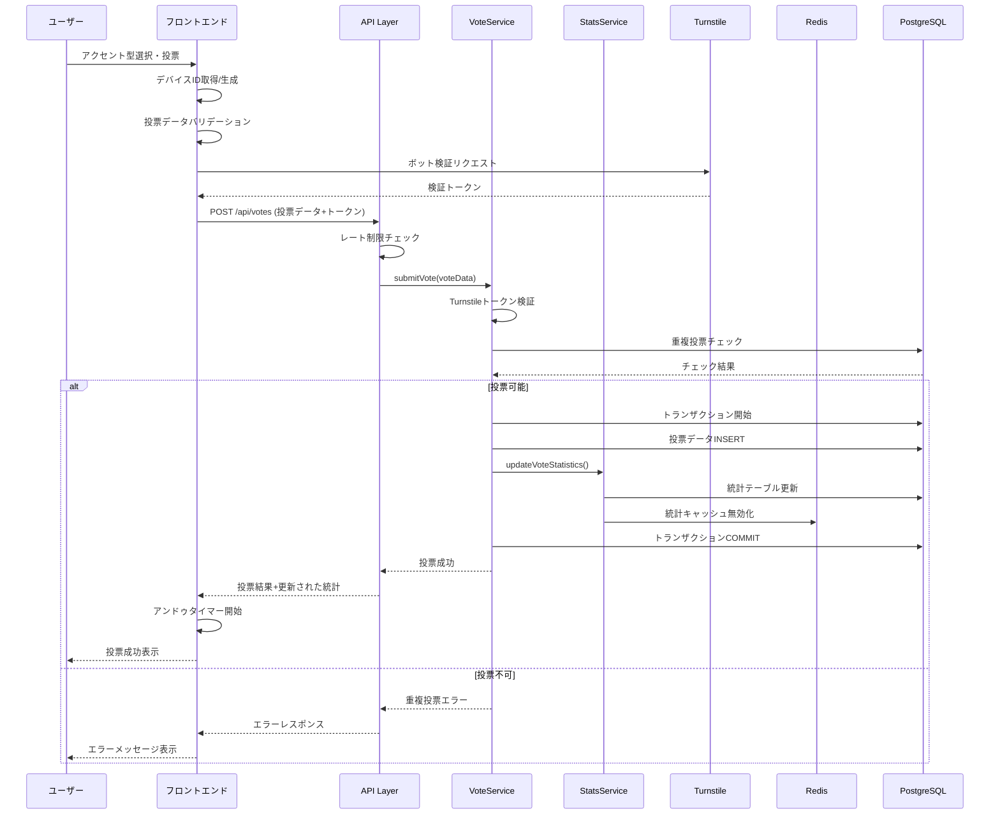

### 2.3 アクセント分布可視化機能 (F-03)

#### 2.3.1 処理フローチャート

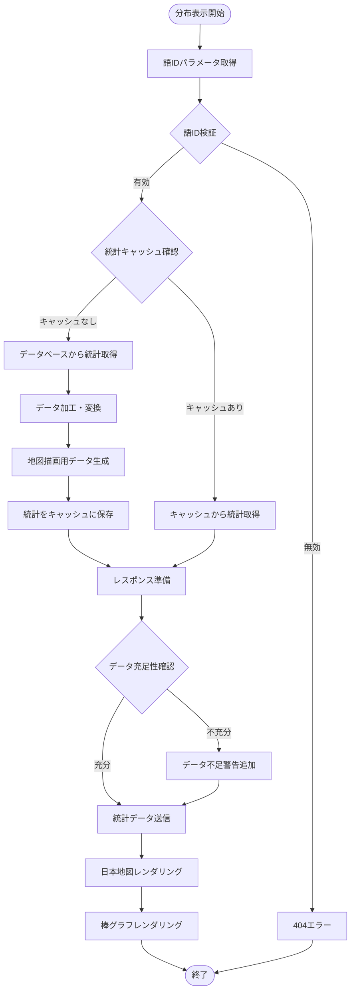

#### 2.3.2 シーケンス図

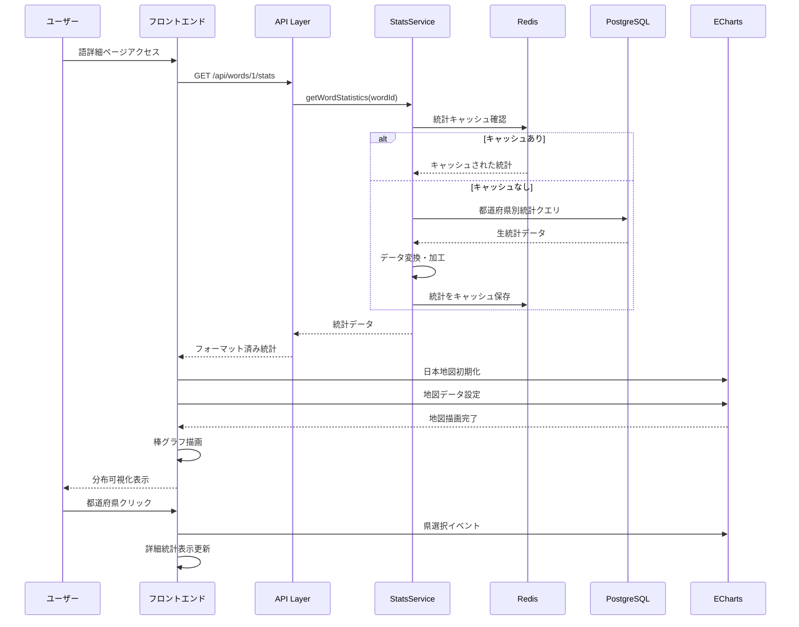

### 2.4 新語投稿機能 (F-06)

#### 2.4.1 処理フローチャート

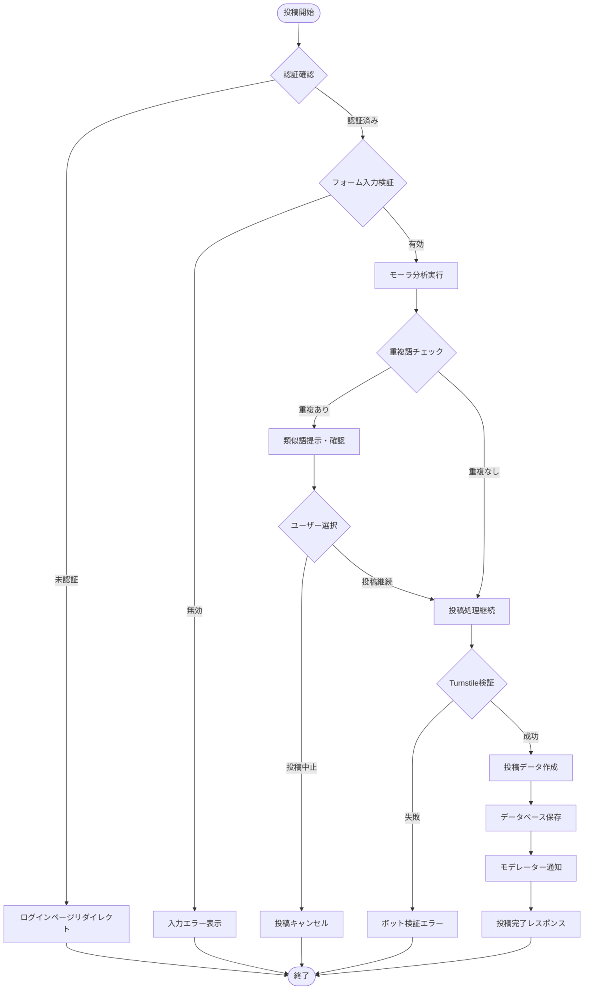

#### 2.4.2 シーケンス図

```mermaid
sequenceDiagram
    participant User as 投稿者
    participant Frontend as フロントエンド
    participant API as API Layer
    participant AuthService as AuthService
    parameter WordService as WordService
    participant MoraAnalyzer as モーラ分析
    participant Turnstile as Turnstile
    participant DB as PostgreSQL
    participant EmailService as EmailService

    User->>Frontend: 新語投稿フォーム入力
    Frontend->>Frontend: クライアントサイド検証
    Frontend->>API: POST /api/words (投稿データ)
    
    API->>AuthService: ユーザー認証確認
    AuthService-->>API: 認証ユーザー情報
    
    API->>WordService: submitNewWord(submission)
    WordService->>MoraAnalyzer: analyzeWord(reading)
    MoraAnalyzer-->>WordService: モーラ分析結果
    
    WordService->>DB: 重複語検索
    DB-->>WordService: 類似語リスト
    
    alt 重複語あり
        WordService-->>API: 類似語情報
        API-->>Frontend: 重複警告
        Frontend-->>User: 類似語表示・確認
        User->>Frontend: 投稿継続選択
        Frontend->>API: 投稿継続リクエスト
        API->>WordService: 投稿処理再開
    end
    
    WordService->>WordService: Turnstileトークン検証
    WordService->>DB: submissionsテーブルINSERT
    DB-->>WordService: 投稿ID
    
    WordService->>EmailService: モデレーター通知メール送信
    EmailService-->>WordService: 送信完了
    
    WordService-->>API: 投稿完了
    API-->>Frontend: 投稿成功レスポンス
    Frontend-->>User: 投稿完了メッセージ
```

## 3. クラス設計

### 3.1 ドメインモデル設計

#### 3.1.1 語（Word）ドメイン

```typescript
// Word Aggregate Root
export class Word {
  private constructor(
    private readonly _id: WordId,
    private _headword: string,
    private _reading: string,
    private _category: WordCategory,
    private _moraCount: number,
    private _moraSegments: string[],
    private _status: WordStatus,
    private _aliases: string[],
    private _createdAt: Date,
    private _updatedAt: Date
  ) {}

  // Factory Method
  static create(props: CreateWordProps): Word {
    const moraSegments = MoraAnalyzer.splitIntoMora(props.reading);
    const moraCount = moraSegments.length;
    
    return new Word(
      WordId.generate(),
      props.headword,
      props.reading,
      props.category,
      moraCount,
      moraSegments,
      WordStatus.PENDING,
      props.aliases || [],
      new Date(),
      new Date()
    );
  }

  // Business Logic
  approve(approvedBy: UserId): void {
    if (this._status !== WordStatus.PENDING) {
      throw new DomainError('Only pending words can be approved');
    }
    this._status = WordStatus.APPROVED;
    this._updatedAt = new Date();
  }

  reject(rejectedBy: UserId, reason: string): void {
    if (this._status !== WordStatus.PENDING) {
      throw new DomainError('Only pending words can be rejected');
    }
    this._status = WordStatus.REJECTED;
    this._updatedAt = new Date();
  }

  // Getters
  get id(): WordId { return this._id; }
  get headword(): string { return this._headword; }
  get reading(): string { return this._reading; }
  get category(): WordCategory { return this._category; }
  get moraCount(): number { return this._moraCount; }
  get moraSegments(): string[] { return [...this._moraSegments]; }
  get status(): WordStatus { return this._status; }
  get aliases(): string[] { return [...this._aliases]; }
  get isApproved(): boolean { return this._status === WordStatus.APPROVED; }
}

// Value Objects
export class WordId {
  constructor(private readonly value: number) {
    if (value <= 0) {
      throw new DomainError('WordId must be positive');
    }
  }

  static generate(): WordId {
    // In actual implementation, this would be handled by DB auto-increment
    return new WordId(Math.floor(Math.random() * 1000000));
  }

  equals(other: WordId): boolean {
    return this.value === other.value;
  }

  toString(): string {
    return this.value.toString();
  }
}

export enum WordStatus {
  PENDING = 'pending',
  APPROVED = 'approved',
  REJECTED = 'rejected'
}

export enum WordCategory {
  GENERAL = 'general',
  TECHNICAL = 'technical',
  DIALECT = 'dialect',
  PROPER_NOUN = 'proper_noun'
}
```

#### 3.1.2 投票（Vote）ドメイン

```typescript
// Vote Aggregate Root
export class Vote {
  private constructor(
    private readonly _id: VoteId,
    private readonly _wordId: WordId,
    private readonly _accentType: AccentType,
    private readonly _deviceId: DeviceId,
    private readonly _prefecture: Prefecture,
    private readonly _ageGroup: AgeGroup | null,
    private readonly _votedAt: Date
  ) {}

  static create(props: CreateVoteProps): Vote {
    return new Vote(
      VoteId.generate(),
      props.wordId,
      props.accentType,
      props.deviceId,
      props.prefecture,
      props.ageGroup,
      new Date()
    );
  }

  // Business Logic
  canBeUndoneBy(deviceId: DeviceId, currentTime: Date): boolean {
    const UNDO_TIME_LIMIT_MS = 5 * 1000; // 5秒
    const timeDiff = currentTime.getTime() - this._votedAt.getTime();
    
    return this._deviceId.equals(deviceId) && timeDiff <= UNDO_TIME_LIMIT_MS;
  }

  isWithin24Hours(currentTime: Date): boolean {
    const HOURS_24_MS = 24 * 60 * 60 * 1000;
    const timeDiff = currentTime.getTime() - this._votedAt.getTime();
    
    return timeDiff < HOURS_24_MS;
  }

  // Getters
  get id(): VoteId { return this._id; }
  get wordId(): WordId { return this._wordId; }
  get accentType(): AccentType { return this._accentType; }
  get deviceId(): DeviceId { return this._deviceId; }
  get prefecture(): Prefecture { return this._prefecture; }
  get ageGroup(): AgeGroup | null { return this._ageGroup; }
  get votedAt(): Date { return new Date(this._votedAt); }
}

// Value Objects
export class DeviceId {
  constructor(private readonly value: string) {
    if (!value || value.length < 10) {
      throw new DomainError('DeviceId must be at least 10 characters');
    }
  }

  static generate(): DeviceId {
    const uuid = crypto.randomUUID();
    const timestamp = Date.now().toString();
    const fingerprint = this.generateFingerprint();
    
    return new DeviceId(`${uuid}-${timestamp}-${fingerprint}`);
  }

  private static generateFingerprint(): string {
    // Browser fingerprinting logic
    const canvas = document.createElement('canvas');
    const ctx = canvas.getContext('2d');
    ctx!.textBaseline = 'top';
    ctx!.font = '14px Arial';
    ctx!.fillText('Device fingerprint', 2, 2);
    
    return canvas.toDataURL().slice(-10);
  }

  equals(other: DeviceId): boolean {
    return this.value === other.value;
  }
}

export enum AccentType {
  ATAMADAKA = 'atamadaka',
  HEIBAN = 'heiban', 
  NAKADAKA = 'nakadaka',
  ODAKA = 'odaka'
}

export enum Prefecture {
  HOKKAIDO = '01',
  AOMORI = '02',
  // ... 47都道府県
}

export enum AgeGroup {
  TEENS = '10s',
  TWENTIES = '20s',
  THIRTIES = '30s',
  FORTIES = '40s',
  FIFTIES = '50s',
  SIXTIES = '60s',
  SEVENTIES_PLUS = '70s+'
}
```

#### 3.1.3 統計（Statistics）ドメイン

```typescript
// Statistics Aggregate Root
export class WordStatistics {
  private constructor(
    private readonly _wordId: WordId,
    private readonly _nationalStats: Map<AccentType, AccentStat>,
    private readonly _prefectureStats: Map<Prefecture, PrefectureStat>,
    private readonly _totalVotes: number,
    private readonly _lastUpdatedAt: Date
  ) {}

  static create(
    wordId: WordId, 
    votes: Vote[]
  ): WordStatistics {
    const nationalStats = this.calculateNationalStats(votes);
    const prefectureStats = this.calculatePrefectureStats(votes);
    const totalVotes = votes.length;
    
    return new WordStatistics(
      wordId,
      nationalStats,
      prefectureStats,
      totalVotes,
      new Date()
    );
  }

  private static calculateNationalStats(votes: Vote[]): Map<AccentType, AccentStat> {
    const stats = new Map<AccentType, AccentStat>();
    const totalVotes = votes.length;
    
    if (totalVotes === 0) return stats;
    
    // Count votes by accent type
    const accentCounts = new Map<AccentType, number>();
    for (const vote of votes) {
      const current = accentCounts.get(vote.accentType) || 0;
      accentCounts.set(vote.accentType, current + 1);
    }
    
    // Calculate percentages
    for (const [accentType, count] of accentCounts) {
      const percentage = (count / totalVotes) * 100;
      stats.set(accentType, new AccentStat(count, percentage));
    }
    
    return stats;
  }

  private static calculatePrefectureStats(votes: Vote[]): Map<Prefecture, PrefectureStat> {
    const stats = new Map<Prefecture, PrefectureStat>();
    
    // Group votes by prefecture
    const prefectureVotes = new Map<Prefecture, Vote[]>();
    for (const vote of votes) {
      const current = prefectureVotes.get(vote.prefecture) || [];
      current.push(vote);
      prefectureVotes.set(vote.prefecture, current);
    }
    
    // Calculate stats for each prefecture
    for (const [prefecture, votes] of prefectureVotes) {
      const accentStats = this.calculateNationalStats(votes);
      const totalVotes = votes.length;
      const dominantAccent = this.getDominantAccent(accentStats);
      
      stats.set(prefecture, new PrefectureStat(
        prefecture,
        totalVotes,
        accentStats,
        dominantAccent
      ));
    }
    
    return stats;
  }

  private static getDominantAccent(accentStats: Map<AccentType, AccentStat>): AccentType {
    let maxCount = 0;
    let dominantAccent = AccentType.HEIBAN; // デフォルト
    
    for (const [accentType, stat] of accentStats) {
      if (stat.count > maxCount) {
        maxCount = stat.count;
        dominantAccent = accentType;
      }
    }
    
    return dominantAccent;
  }

  // Business Logic
  addVote(vote: Vote): WordStatistics {
    // Create new statistics with the added vote
    // This is immutable - returns new instance
    const allVotes = this.getAllVotes();
    allVotes.push(vote);
    
    return WordStatistics.create(this._wordId, allVotes);
  }

  getDominantAccentForPrefecture(prefecture: Prefecture): AccentType | null {
    const stat = this._prefectureStats.get(prefecture);
    return stat?.dominantAccent || null;
  }

  hasEnoughDataForPrefecture(prefecture: Prefecture, minVotes: number = 10): boolean {
    const stat = this._prefectureStats.get(prefecture);
    return (stat?.totalVotes || 0) >= minVotes;
  }

  // Getters
  get wordId(): WordId { return this._wordId; }
  get nationalStats(): Map<AccentType, AccentStat> { return new Map(this._nationalStats); }
  get prefectureStats(): Map<Prefecture, PrefectureStat> { return new Map(this._prefectureStats); }
  get totalVotes(): number { return this._totalVotes; }
  get lastUpdatedAt(): Date { return new Date(this._lastUpdatedAt); }

  private getAllVotes(): Vote[] {
    // This is a simplified approach - in reality, you'd need to store votes
    // or reconstruct from the statistics. This method is for illustration.
    return [];
  }
}

// Value Objects
export class AccentStat {
  constructor(
    private readonly _count: number,
    private readonly _percentage: number
  ) {
    if (count < 0) throw new DomainError('Count must be non-negative');
    if (percentage < 0 || percentage > 100) {
      throw new DomainError('Percentage must be between 0 and 100');
    }
  }

  get count(): number { return this._count; }
  get percentage(): number { return this._percentage; }
}

export class PrefectureStat {
  constructor(
    private readonly _prefecture: Prefecture,
    private readonly _totalVotes: number,
    private readonly _accentDistribution: Map<AccentType, AccentStat>,
    private readonly _dominantAccent: AccentType
  ) {}

  get prefecture(): Prefecture { return this._prefecture; }
  get totalVotes(): number { return this._totalVotes; }
  get accentDistribution(): Map<AccentType, AccentStat> { return new Map(this._accentDistribution); }
  get dominantAccent(): AccentType { return this._dominantAccent; }
}
```

### 3.2 サービス層設計

#### 3.2.1 WordService クラス

```typescript
export class WordService {
  constructor(
    private readonly wordRepository: WordRepository,
    private readonly submissionRepository: SubmissionRepository,
    private readonly voteRepository: VoteRepository,
    private readonly cacheService: CacheService,
    private readonly moraAnalyzer: MoraAnalyzer,
    private readonly duplicateChecker: DuplicateChecker
  ) {}

  async searchWords(query: SearchWordsQuery): Promise<SearchWordsResult> {
    // Input validation
    this.validateSearchQuery(query);

    // Check cache first
    const cacheKey = `search:${JSON.stringify(query)}`;
    const cached = await this.cacheService.get<SearchWordsResult>(cacheKey);
    if (cached) {
      return cached;
    }

    // Execute search
    const words = await this.wordRepository.searchWords(query);
    
    // Calculate additional data
    const wordsWithStats = await Promise.all(
      words.map(async (word) => {
        const voteCount = await this.voteRepository.countVotesByWord(word.id);
        const prefectureCount = await this.voteRepository.countPrefecturesByWord(word.id);
        
        return {
          ...word,
          totalVotes: voteCount,
          prefectureCount: prefectureCount
        };
      })
    );

    // Pagination
    const paginatedResult = this.paginateResults(wordsWithStats, query.page, query.limit);

    // Cache the result
    await this.cacheService.set(cacheKey, paginatedResult, 300); // 5 minutes

    return paginatedResult;
  }

  async getWordDetail(wordId: WordId): Promise<WordDetailResult> {
    // Check cache
    const cacheKey = `word:detail:${wordId.toString()}`;
    const cached = await this.cacheService.get<WordDetailResult>(cacheKey);
    if (cached) {
      return cached;
    }

    // Get word
    const word = await this.wordRepository.findById(wordId);
    if (!word || !word.isApproved) {
      throw new NotFoundError('Word not found or not approved');
    }

    // Get accent options
    const accentOptions = await this.generateAccentOptions(word);
    
    // Get aliases
    const aliases = word.aliases;

    // Build result
    const result: WordDetailResult = {
      word: this.mapWordToResponse(word),
      accentOptions,
      aliases,
      canVote: true // Will be determined by client-side device check
    };

    // Cache result
    await this.cacheService.set(cacheKey, result, 300); // 5 minutes

    return result;
  }

  async submitNewWord(submission: NewWordSubmission): Promise<SubmissionResult> {
    // Validate submission
    await this.validateNewWordSubmission(submission);

    // Analyze mora
    const moraSegments = this.moraAnalyzer.splitIntoMora(submission.reading);
    const moraCount = moraSegments.length;

    // Check for duplicates
    const similarWords = await this.duplicateChecker.findSimilarWords(
      submission.headword, 
      submission.reading
    );

    if (similarWords.length > 0) {
      return {
        status: 'duplicate_found',
        similarWords: similarWords.map(w => this.mapWordToResponse(w))
      };
    }

    // Create submission
    const submissionEntity = WordSubmission.create({
      headword: submission.headword,
      reading: submission.reading,
      category: submission.category,
      aliases: submission.aliases || [],
      moraCount,
      moraSegments,
      submittedBy: submission.submittedBy,
      initialAccentType: submission.initialAccentType,
      prefecture: submission.prefecture,
      ageGroup: submission.ageGroup
    });

    // Save submission
    const savedSubmission = await this.submissionRepository.save(submissionEntity);

    // Notify moderators (async)
    this.notifyModerators(savedSubmission).catch(console.error);

    return {
      status: 'submitted',
      submissionId: savedSubmission.id.value,
      estimatedReviewTime: this.calculateEstimatedReviewTime()
    };
  }

  async approveSubmission(
    submissionId: SubmissionId, 
    approvedBy: UserId
  ): Promise<void> {
    const submission = await this.submissionRepository.findById(submissionId);
    if (!submission) {
      throw new NotFoundError('Submission not found');
    }

    // Create approved word
    const word = Word.create({
      headword: submission.headword,
      reading: submission.reading,
      category: submission.category,
      aliases: submission.aliases
    });

    word.approve(approvedBy);

    // Save word and update submission
    await this.wordRepository.save(word);
    submission.approve(approvedBy);
    await this.submissionRepository.save(submission);

    // Add initial vote if provided
    if (submission.initialAccentType) {
      const initialVote = Vote.create({
        wordId: word.id,
        accentType: submission.initialAccentType,
        deviceId: DeviceId.generate(), // Special device for initial submissions
        prefecture: submission.prefecture,
        ageGroup: submission.ageGroup
      });
      
      await this.voteRepository.save(initialVote);
    }

    // Invalidate caches
    await this.invalidateWordCaches(word.id);

    // Send notification to submitter (async)
    this.notifySubmitter(submission, 'approved').catch(console.error);
  }

  private async validateSearchQuery(query: SearchWordsQuery): Promise<void> {
    if (query.q && query.q.length > 50) {
      throw new ValidationError('Search query too long');
    }
    
    if (query.page && query.page < 1) {
      throw new ValidationError('Page number must be positive');
    }
    
    if (query.limit && (query.limit < 1 || query.limit > 100)) {
      throw new ValidationError('Limit must be between 1 and 100');
    }
  }

  private async generateAccentOptions(word: Word): Promise<AccentOption[]> {
    const options: AccentOption[] = [];

    for (const accentType of Object.values(AccentType)) {
      const pattern = AccentPatternGenerator.generate(
        word.moraSegments,
        accentType
      );

      options.push({
        id: this.generateAccentOptionId(word.id, accentType),
        accentType: {
          code: accentType,
          name: this.getAccentTypeName(accentType)
        },
        pattern: pattern.pitchPattern,
        dropPosition: pattern.dropPosition
      });
    }

    return options;
  }

  private mapWordToResponse(word: Word): WordResponse {
    return {
      id: word.id.value,
      headword: word.headword,
      reading: word.reading,
      category: word.category,
      moraCount: word.moraCount,
      moraSegments: word.moraSegments,
      totalVotes: 0, // Will be filled by caller
      prefectureCount: 0, // Will be filled by caller
      createdAt: word.createdAt.toISOString()
    };
  }

  // Additional helper methods...
}
```

#### 3.2.2 VoteService クラス

```typescript
export class VoteService {
  constructor(
    private readonly voteRepository: VoteRepository,
    private readonly wordRepository: WordRepository,
    private readonly deviceRepository: DeviceRepository,
    private readonly statisticsService: StatisticsService,
    private readonly rateLimitService: RateLimitService,
    private readonly turnstileValidator: TurnstileValidator
  ) {}

  async submitVote(voteData: SubmitVoteRequest): Promise<VoteResult> {
    // Rate limiting check
    await this.rateLimitService.checkVoteRateLimit(voteData.ipAddress);

    // Turnstile validation
    const isTurnstileValid = await this.turnstileValidator.verify(voteData.turnstileToken);
    if (!isTurnstileValid) {
      throw new SecurityError('Bot verification failed');
    }

    // Validate vote data
    await this.validateVoteData(voteData);

    // Get or create device
    const device = await this.getOrCreateDevice(voteData.deviceFingerprint);

    // Check for duplicate votes
    const existingVote = await this.voteRepository.findByDeviceAndWord(
      device.id,
      voteData.wordId
    );

    if (existingVote && existingVote.isWithin24Hours(new Date())) {
      throw new BusinessRuleError('Already voted for this word within 24 hours');
    }

    // Create and save vote
    const vote = Vote.create({
      wordId: voteData.wordId,
      accentType: voteData.accentType,
      deviceId: device.id,
      prefecture: voteData.prefecture,
      ageGroup: voteData.ageGroup
    });

    // Use transaction for consistency
    await this.voteRepository.transaction(async (trx) => {
      // Delete old vote if exists (for vote updating)
      if (existingVote) {
        await this.voteRepository.delete(existingVote.id, trx);
      }

      // Save new vote
      const savedVote = await this.voteRepository.save(vote, trx);

      // Update statistics
      await this.statisticsService.updateVoteStatistics(savedVote, trx);
    });

    // Invalidate related caches
    await this.invalidateVoteCaches(voteData.wordId);

    // Get updated statistics for response
    const updatedStats = await this.statisticsService.getWordStatistics(voteData.wordId);

    return {
      voteId: vote.id.value,
      wordId: voteData.wordId.value,
      accentType: voteData.accentType,
      canUndo: true,
      undoExpiresAt: new Date(Date.now() + 5000).toISOString(), // 5 seconds
      updatedStats: {
        national: updatedStats.nationalStats,
        prefecture: updatedStats.getPrefectureStat(voteData.prefecture)
      }
    };
  }

  async undoVote(voteId: VoteId, deviceId: DeviceId): Promise<UndoVoteResult> {
    const vote = await this.voteRepository.findById(voteId);
    if (!vote) {
      throw new NotFoundError('Vote not found');
    }

    if (!vote.canBeUndoneBy(deviceId, new Date())) {
      throw new BusinessRuleError('Vote cannot be undone (time limit exceeded or different device)');
    }

    // Use transaction for consistency
    await this.voteRepository.transaction(async (trx) => {
      // Delete vote
      await this.voteRepository.delete(voteId, trx);

      // Update statistics (subtract the vote)
      await this.statisticsService.subtractVoteFromStatistics(vote, trx);
    });

    // Invalidate related caches
    await this.invalidateVoteCaches(vote.wordId);

    // Get updated statistics for response
    const updatedStats = await this.statisticsService.getWordStatistics(vote.wordId);

    return {
      message: 'Vote successfully undone',
      updatedStats: {
        national: updatedStats.nationalStats,
        prefecture: updatedStats.getPrefectureStat(vote.prefecture)
      }
    };
  }

  async canUserVote(wordId: WordId, deviceId: DeviceId): Promise<CanVoteResult> {
    const existingVote = await this.voteRepository.findByDeviceAndWord(deviceId, wordId);
    
    if (!existingVote) {
      return { canVote: true };
    }

    const canVoteAgain = !existingVote.isWithin24Hours(new Date());
    
    return {
      canVote: canVoteAgain,
      lastVote: canVoteAgain ? null : {
        accentType: existingVote.accentType,
        votedAt: existingVote.votedAt.toISOString(),
        canVoteAgainAt: new Date(existingVote.votedAt.getTime() + 24 * 60 * 60 * 1000).toISOString()
      }
    };
  }

  private async validateVoteData(voteData: SubmitVoteRequest): Promise<void> {
    // Check if word exists and is approved
    const word = await this.wordRepository.findById(voteData.wordId);
    if (!word || !word.isApproved) {
      throw new NotFoundError('Word not found or not approved');
    }

    // Validate accent type
    if (!Object.values(AccentType).includes(voteData.accentType)) {
      throw new ValidationError('Invalid accent type');
    }

    // Validate prefecture
    if (!Object.values(Prefecture).includes(voteData.prefecture)) {
      throw new ValidationError('Invalid prefecture code');
    }

    // Validate age group if provided
    if (voteData.ageGroup && !Object.values(AgeGroup).includes(voteData.ageGroup)) {
      throw new ValidationError('Invalid age group');
    }
  }

  private async getOrCreateDevice(fingerprint: string): Promise<Device> {
    const existingDevice = await this.deviceRepository.findByFingerprint(fingerprint);
    
    if (existingDevice) {
      // Update last seen
      existingDevice.updateLastSeen();
      await this.deviceRepository.save(existingDevice);
      return existingDevice;
    }

    // Create new device
    const newDevice = Device.create(fingerprint);
    return await this.deviceRepository.save(newDevice);
  }

  private async invalidateVoteCaches(wordId: WordId): Promise<void> {
    const cacheKeys = [
      `word:detail:${wordId.toString()}`,
      `word:stats:${wordId.toString()}`,
      'ranking:*',
      'stats:summary'
    ];

    await Promise.all(
      cacheKeys.map(key => this.cacheService.delete(key))
    );
  }
}
```

## 4. 状態遷移図

### 4.1 語の状態遷移

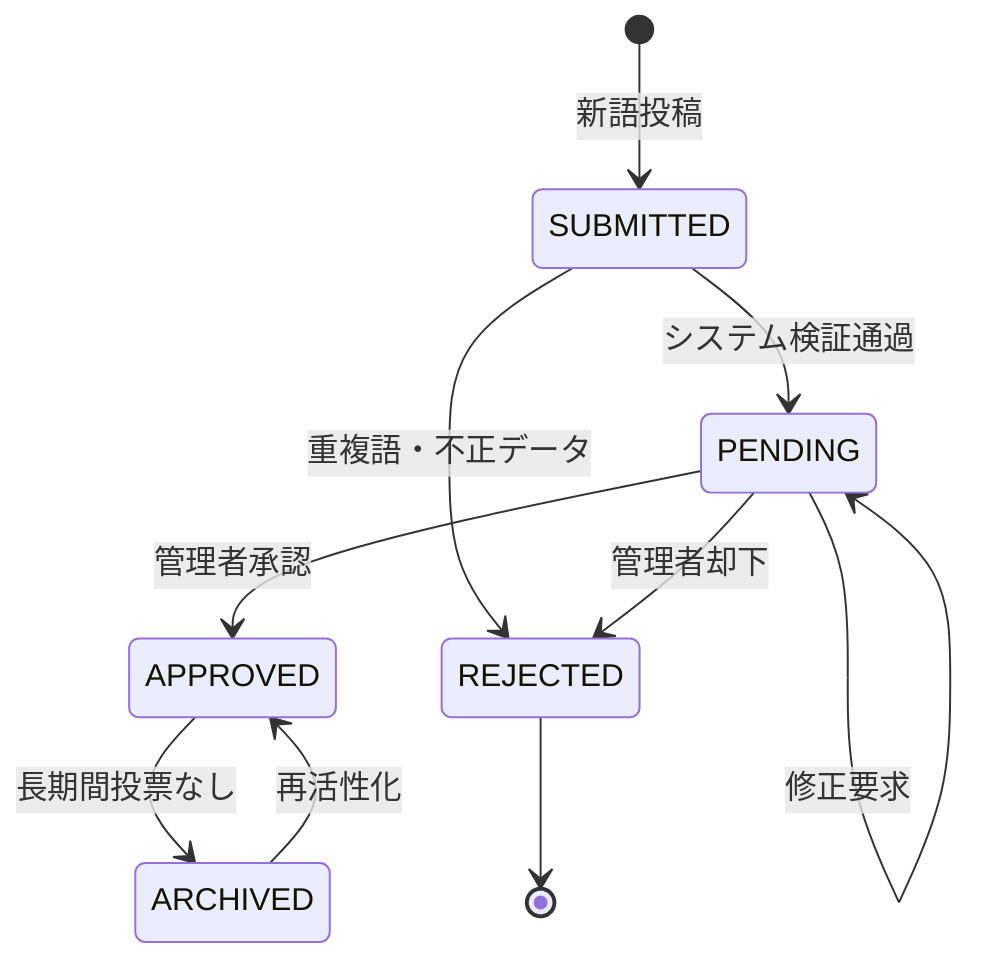

### 4.2 投票の状態遷移

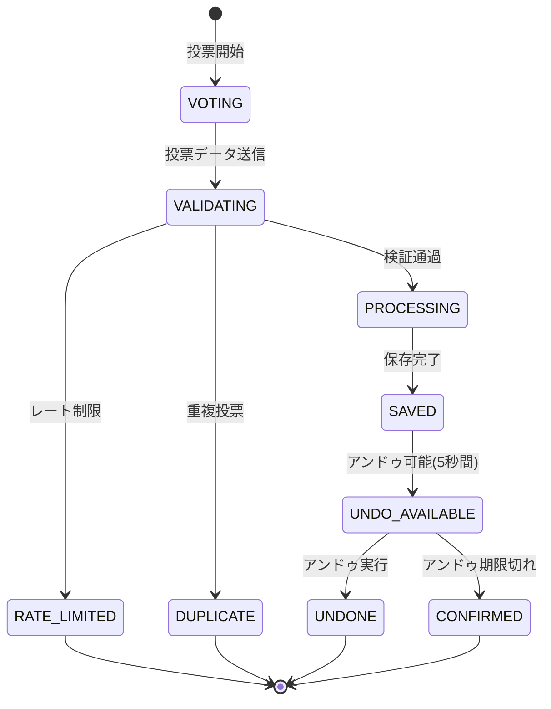

### 4.3 統計更新の状態遷移

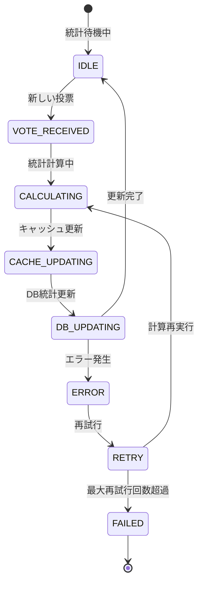

## 5. シーケンス図（主要処理）

### 5.1 管理者による新語承認処理

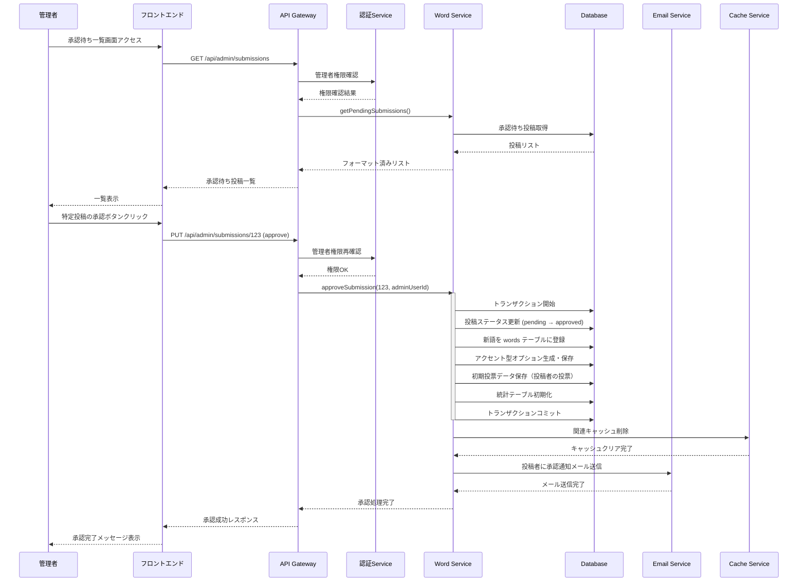

### 5.2 統計データリアルタイム更新処理

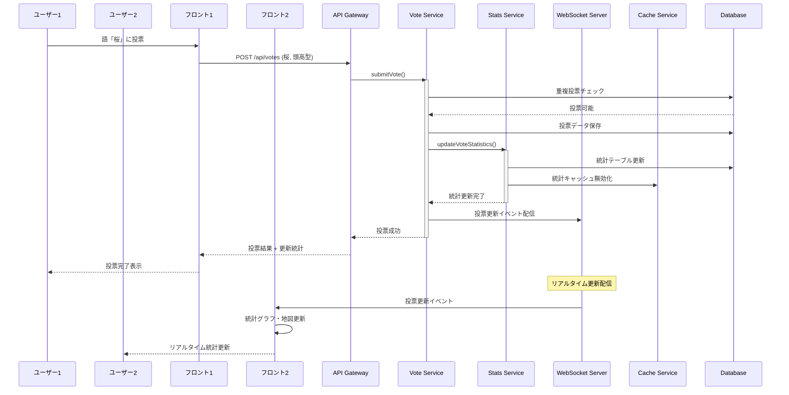

## 6. エラーハンドリング設計

### 6.1 エラー階層構造

```typescript
// Base Error Classes
export abstract class DomainError extends Error {
  abstract readonly code: string;
  abstract readonly statusCode: number;
}

export class ValidationError extends DomainError {
  readonly code = 'VALIDATION_ERROR';
  readonly statusCode = 400;
  
  constructor(message: string, public readonly field?: string) {
    super(message);
    this.name = 'ValidationError';
  }
}

export class NotFoundError extends DomainError {
  readonly code = 'NOT_FOUND';
  readonly statusCode = 404;
  
  constructor(message: string) {
    super(message);
    this.name = 'NotFoundError';
  }
}

export class BusinessRuleError extends DomainError {
  readonly code = 'BUSINESS_RULE_VIOLATION';
  readonly statusCode = 400;
  
  constructor(message: string) {
    super(message);
    this.name = 'BusinessRuleError';
  }
}

export class SecurityError extends DomainError {
  readonly code = 'SECURITY_ERROR';
  readonly statusCode = 403;
  
  constructor(message: string) {
    super(message);
    this.name = 'SecurityError';
  }
}

export class RateLimitError extends DomainError {
  readonly code = 'RATE_LIMIT_EXCEEDED';
  readonly statusCode = 429;
  
  constructor(message: string, public readonly retryAfter?: number) {
    super(message);
    this.name = 'RateLimitError';
  }
}
```

### 6.2 エラーハンドリングフロー

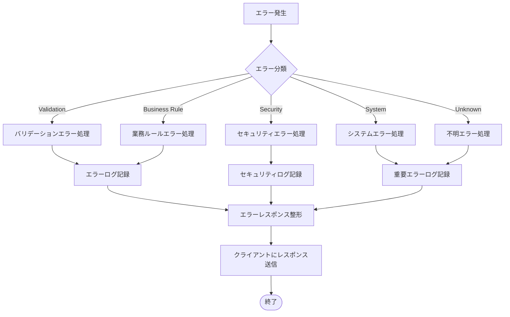

## 7. パフォーマンス考慮事項

### 7.1 データベースクエリ最適化

```sql
-- 語検索の最適化クエリ
EXPLAIN ANALYZE
SELECT 
    w.id,
    w.headword,
    w.reading,
    wc.name as category_name,
    COUNT(v.id) as vote_count,
    COUNT(DISTINCT v.prefecture_code) as prefecture_count
FROM words w
LEFT JOIN word_categories wc ON w.category_id = wc.id
LEFT JOIN votes v ON w.id = v.word_id
WHERE 
    w.status = 'approved'
    AND (
        w.headword ILIKE $1 OR 
        w.reading ILIKE $1 OR
        EXISTS (
            SELECT 1 FROM word_aliases wa 
            WHERE wa.word_id = w.id 
            AND wa.alias ILIKE $1
        )
    )
GROUP BY w.id, w.headword, w.reading, wc.name
ORDER BY vote_count DESC, w.created_at DESC
LIMIT $2 OFFSET $3;

-- 統計取得の最適化クエリ（マテリアライズドビュー使用）
SELECT 
    p.name as prefecture_name,
    at.name as accent_name,
    wps.vote_count,
    wps.vote_percentage
FROM word_pref_stats wps
JOIN prefectures p ON wps.prefecture_code = p.code
JOIN accent_types at ON wps.accent_type_id = at.id
WHERE wps.word_id = $1
    AND wps.vote_count > 0
ORDER BY p.code, at.sort_order;
```

### 7.2 キャッシュ戦略

```typescript
export class CacheService {
  private readonly redis: Redis;
  
  constructor(redisClient: Redis) {
    this.redis = redisClient;
  }

  // 階層的キャッシュ設計
  async getWordDetail(wordId: WordId): Promise<WordDetail | null> {
    // L1: アプリケーションメモリキャッシュ
    const memoryCache = this.memoryCache.get(`word:${wordId}`);
    if (memoryCache) return memoryCache;
    
    // L2: Redis キャッシュ
    const redisCache = await this.redis.get(`word:${wordId}`);
    if (redisCache) {
      const parsed = JSON.parse(redisCache);
      this.memoryCache.set(`word:${wordId}`, parsed, 60); // 1分間
      return parsed;
    }
    
    return null;
  }

  async setWordDetail(wordId: WordId, data: WordDetail): Promise<void> {
    // L1: メモリキャッシュ
    this.memoryCache.set(`word:${wordId}`, data, 60); // 1分間
    
    // L2: Redis キャッシュ
    await this.redis.setex(
      `word:${wordId}`, 
      300, // 5分間
      JSON.stringify(data)
    );
  }

  // キャッシュ無効化パターン
  async invalidateWordCaches(wordId: WordId): Promise<void> {
    const patterns = [
      `word:${wordId}`,
      `word:detail:${wordId}`,
      `word:stats:${wordId}`,
      'search:*', // 検索結果キャッシュ
      'ranking:*', // ランキングキャッシュ
    ];

    await Promise.all(
      patterns.map(pattern => this.redis.del(pattern))
    );
  }
}
```

この詳細設計書により、開発チームは具体的な実装に着手できる詳細なガイドラインを得ることができます。