# 開発計画書: 日本語アクセント投票サイト

**バージョン**: 1.0  
**最終更新日**: 2025-08-28  
**プロジェクト期間**: 6週間  
**対象システム**: 日本語アクセント投票サイト

## 1. プロジェクト概要

### 1.1 プロジェクト目標
- 日本語のアクセント分布を調査・可視化するWebアプリケーションの開発
- 6週間での MVP (Minimum Viable Product) 完成
- 並列開発による効率的な開発進行
- 高品質・高セキュリティなシステムの構築

### 1.2 開発方針
- **アジャイル開発**: 2週間スプリント × 3回
- **並列開発**: 機能モジュール別チーム編成
- **継続的インテグレーション**: 品質保証の自動化
- **ドキュメントファースト**: 設計書ベースの開発
- **テスト駆動開発**: 品質重視の開発プロセス

## 2. プロジェクト体制

### 2.1 チーム構成

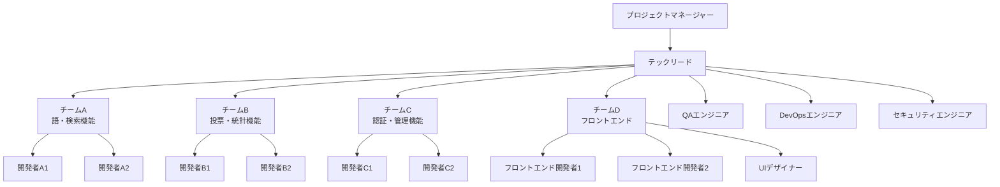

### 2.2 役割分担表

| 役割 | 担当者 | 主要責任 | チーム |
|------|--------|-----------|---------|
| **プロジェクトマネージャー** | PM | 全体進捗管理、スケジュール調整、リスク管理 | - |
| **テックリード** | TechLead | 技術方針決定、アーキテクチャ設計、コードレビュー | - |
| **語・検索担当** | DevA1, DevA2 | 語管理機能、検索機能、新語投稿 | チームA |
| **投票・統計担当** | DevB1, DevB2 | 投票機能、統計処理、データ可視化 | チームB |
| **認証・管理担当** | DevC1, DevC2 | ユーザー認証、管理画面、セキュリティ | チームC |
| **フロントエンド担当** | DevD1, DevD2 | UI実装、レスポンシブ対応、UX改善 | チームD |
| **UIデザイナー** | Designer | UI設計、デザインシステム、ユーザビリティ | チームD |
| **QAエンジニア** | QA | テスト計画、品質保証、バグ検証 | 横断 |
| **DevOpsエンジニア** | DevOps | インフラ構築、CI/CD、運用準備 | 横断 |
| **セキュリティエンジニア** | Security | セキュリティ監査、脆弱性診断 | 横断 |

## 3. タスク分解構造（WBS）

### 3.1 WBS全体図

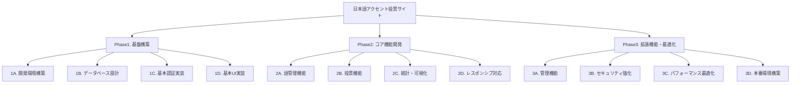

### 3.2 詳細タスク分解

#### Phase 1: 基盤構築（Week 1-2）

##### 1A. 開発環境構築（4日）
| タスクID | タスク名 | 担当 | 工数 | 依存関係 |
|----------|----------|------|------|----------|
| 1A-01 | プロジェクト構造作成 | TechLead | 0.5日 | - |
| 1A-02 | Next.js 14 セットアップ | DevD1 | 0.5日 | 1A-01 |
| 1A-03 | TypeScript設定 | DevD1 | 0.5日 | 1A-02 |
| 1A-04 | Tailwind CSS設定 | DevD2 | 0.5日 | 1A-02 |
| 1A-05 | ESLint/Prettier設定 | TechLead | 0.5日 | 1A-03 |
| 1A-06 | Husky/lint-staged設定 | TechLead | 0.5日 | 1A-05 |
| 1A-07 | Vitest設定 | QA | 0.5日 | 1A-05 |
| 1A-08 | Storybook設定 | DevD1 | 0.5日 | 1A-04 |

##### 1B. データベース設計・構築（5日）
| タスクID | タスク名 | 担当 | 工数 | 依存関係 |
|----------|----------|------|------|----------|
| 1B-01 | PostgreSQL環境構築 | DevOps | 1日 | - |
| 1B-02 | Prismaセットアップ | DevA1 | 0.5日 | 1B-01 |
| 1B-03 | データベーススキーマ実装 | DevA1 | 2日 | 1B-02 |
| 1B-04 | マイグレーション作成 | DevA1 | 1日 | 1B-03 |
| 1B-05 | シードデータ作成 | DevA2 | 0.5日 | 1B-04 |

##### 1C. 基本認証実装（5日）
| タスクID | タスク名 | 担当 | 工数 | 依存関係 |
|----------|----------|------|------|----------|
| 1C-01 | Supabase Auth設定 | DevC1 | 1日 | - |
| 1C-02 | JWT認証ミドルウェア | DevC1 | 1.5日 | 1C-01 |
| 1C-03 | ユーザー登録API | DevC2 | 1日 | 1C-02 |
| 1C-04 | ログインAPI | DevC2 | 1日 | 1C-02 |
| 1C-05 | 認証状態管理（フロント） | DevD1 | 0.5日 | 1C-04 |

##### 1D. 基本UI実装（5日）
| タスクID | タスク名 | 担当 | 工数 | 依存関係 |
|----------|----------|------|------|----------|
| 1D-01 | デザインシステム構築 | Designer | 2日 | - |
| 1D-02 | 基本UIコンポーネント | DevD1 | 2日 | 1D-01 |
| 1D-03 | レイアウトコンポーネント | DevD2 | 1.5日 | 1D-02 |
| 1D-04 | ルーティング設定 | DevD1 | 0.5日 | 1D-03 |

#### Phase 2: コア機能開発（Week 3-4）

##### 2A. 語管理機能（6日）
| タスクID | タスク名 | 担当 | 工数 | 依存関係 |
|----------|----------|------|------|----------|
| 2A-01 | 語検索API実装 | DevA1 | 1.5日 | 1B-05 |
| 2A-02 | 語詳細API実装 | DevA1 | 1日 | 2A-01 |
| 2A-03 | モーラ分割機能実装 | DevA2 | 2日 | 1B-05 |
| 2A-04 | 新語投稿API実装 | DevA2 | 1.5日 | 2A-03 |

##### 2B. 投票機能（6日）
| タスクID | タスク名 | 担当 | 工数 | 依存関係 |
|----------|----------|------|------|----------|
| 2B-01 | デバイス識別機能 | DevB1 | 1日 | 1B-05 |
| 2B-02 | 投票API実装 | DevB1 | 2日 | 2B-01 |
| 2B-03 | 重複投票チェック | DevB1 | 1日 | 2B-02 |
| 2B-04 | Turnstile統合 | DevB2 | 1日 | 2B-02 |
| 2B-05 | 投票統計更新機能 | DevB2 | 1日 | 2B-03 |

##### 2C. 統計・可視化（6日）
| タスクID | タスク名 | 担当 | 工数 | 依存関係 |
|----------|----------|------|------|----------|
| 2C-01 | 統計データ取得API | DevB1 | 1日 | 2B-05 |
| 2C-02 | ECharts地図実装 | DevD1 | 2日 | 2C-01 |
| 2C-03 | アクセント型可視化 | DevD2 | 2日 | 2C-01 |
| 2C-04 | レスポンシブ統計表示 | DevD2 | 1日 | 2C-03 |

##### 2D. フロントエンド統合（6日）
| タスクID | タスク名 | 担当 | 工数 | 依存関係 |
|----------|----------|------|------|----------|
| 2D-01 | 検索画面実装 | DevD1 | 1.5日 | 2A-02 |
| 2D-02 | 語詳細画面実装 | DevD1 | 2日 | 2C-02 |
| 2D-03 | 投票UI実装 | DevD2 | 2日 | 2B-04 |
| 2D-04 | レスポンシブ対応 | DevD2 | 0.5日 | 2D-03 |

#### Phase 3: 拡張機能・最適化（Week 5-6）

##### 3A. 管理機能（5日）
| タスクID | タスク名 | 担当 | 工数 | 依存関係 |
|----------|----------|------|------|----------|
| 3A-01 | 投稿承認API | DevC1 | 1.5日 | 2A-04 |
| 3A-02 | 管理画面UI | DevD1 | 2日 | 3A-01 |
| 3A-03 | ユーザー管理機能 | DevC2 | 1.5日 | 3A-01 |

##### 3B. セキュリティ強化（4日）
| タスクID | タスク名 | 担当 | 工数 | 依存関係 |
|----------|----------|------|------|----------|
| 3B-01 | レート制限実装 | Security | 1日 | 2B-05 |
| 3B-02 | セキュリティヘッダー | Security | 0.5日 | 3B-01 |
| 3B-03 | 入力サニタイゼーション強化 | Security | 1日 | 3B-01 |
| 3B-04 | セキュリティテスト | Security | 1.5日 | 3B-03 |

##### 3C. パフォーマンス最適化（4日）
| タスクID | タスク名 | 担当 | 工数 | 依存関係 |
|----------|----------|------|------|----------|
| 3C-01 | Redis キャッシュ実装 | DevB2 | 1.5日 | 2C-04 |
| 3C-02 | 画像最適化 | DevD2 | 0.5日 | 3C-01 |
| 3C-03 | バンドルサイズ最適化 | DevD1 | 1日 | 3C-02 |
| 3C-04 | パフォーマンステスト | QA | 1日 | 3C-03 |

##### 3D. 本番環境構築（5日）
| タスクID | タスク名 | 担当 | 工数 | 依存関係 |
|----------|----------|------|------|----------|
| 3D-01 | 本番インフラ構築 | DevOps | 2日 | - |
| 3D-02 | CI/CD パイプライン | DevOps | 1.5日 | 3D-01 |
| 3D-03 | 監視・ログ設定 | DevOps | 1日 | 3D-02 |
| 3D-04 | 本番デプロイテスト | DevOps | 0.5日 | 3D-03 |

## 4. 開発スケジュール

### 4.1 ガントチャート

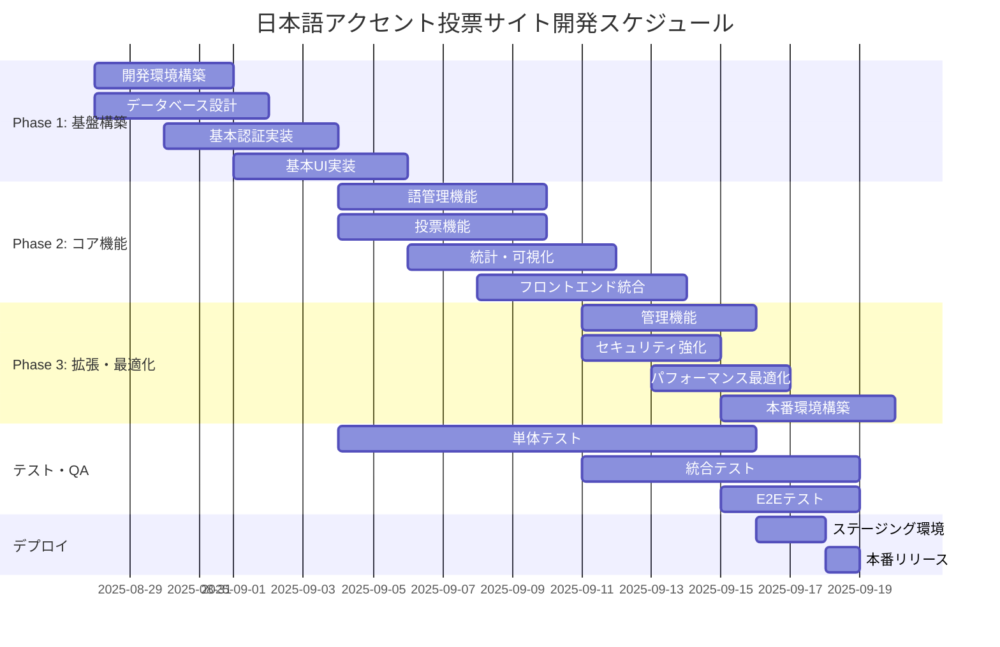

### 4.2 マイルストーン

| マイルストーン | 日付 | 成果物 | 担当 |
|---------------|------|--------|------|
| **MS1: 基盤完成** | 2025-09-03 | 開発環境、DB、基本認証、基本UI | 全チーム |
| **MS2: MVP完成** | 2025-09-10 | 語検索、投票、統計表示の基本機能 | チームA,B,D |
| **MS3: 機能完成** | 2025-09-16 | 管理機能、セキュリティ強化、最適化 | 全チーム |
| **MS4: リリース** | 2025-09-18 | 本番環境での完全なシステム稼働 | DevOps |

### 4.3 スプリント計画

#### スプリント1（Week 1-2）: 基盤構築
**目標**: 開発基盤の構築と基本機能の土台作り

**主要成果物**:
- 開発環境の完全セットアップ
- データベーススキーマの実装
- 基本認証システムの構築
- 基本UIコンポーネントの実装

**Definition of Done**:
- [ ] 全開発者がローカル環境で開発可能
- [ ] データベースマイグレーションが正常実行される
- [ ] ユーザー登録・ログインが機能する
- [ ] 基本的な画面遷移が動作する
- [ ] 単体テストカバレッジ70%以上

#### スプリント2（Week 3-4）: コア機能開発
**目標**: 投票サイトとしての核となる機能の実装

**主要成果物**:
- 語検索・詳細表示機能
- 投票機能とボット対策
- 統計データの可視化
- レスポンシブ対応

**Definition of Done**:
- [ ] 語の検索・表示が正常動作する
- [ ] アクセント型への投票が機能する
- [ ] 重複投票チェックが動作する
- [ ] 都道府県別統計が地図で表示される
- [ ] スマートフォンで正常表示される
- [ ] E2Eテストが成功する

#### スプリント3（Week 5-6）: 拡張機能・公開準備
**目標**: 管理機能の実装とシステムの本番準備

**主要成果物**:
- 管理者機能の実装
- セキュリティの強化
- パフォーマンスの最適化
- 本番環境の構築

**Definition of Done**:
- [ ] 新語投稿の承認フローが動作する
- [ ] 管理画面で投稿管理が可能
- [ ] セキュリティテストをクリア
- [ ] パフォーマンステストをクリア
- [ ] 本番環境でシステムが稼働する

## 5. 依存関係管理

### 5.1 依存関係図

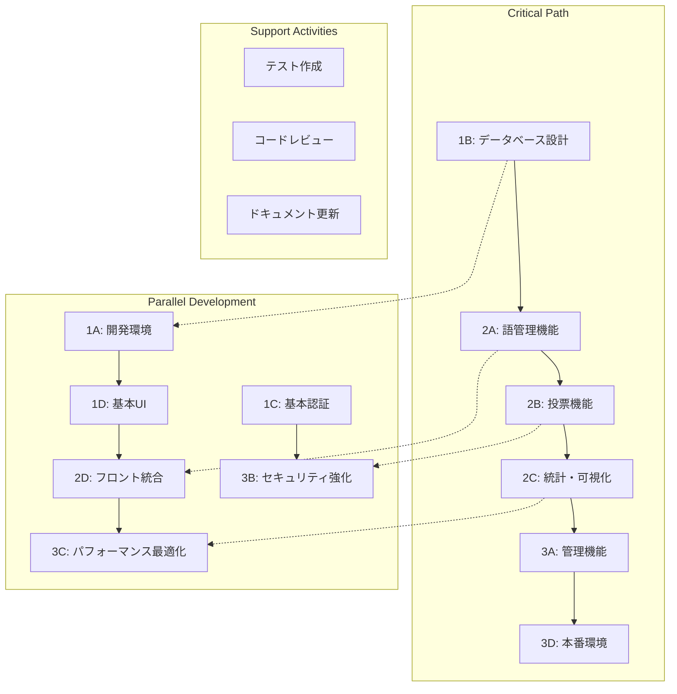

### 5.2 リスク・依存関係

| 依存関係 | リスク | 影響度 | 対策 |
|----------|--------|--------|------|
| Supabase Auth設定 → 認証機能 | 高 | 大 | 早期POC実施、代替手段検討 |
| ECharts統合 → 地図表示 | 中 | 中 | 代替ライブラリ調査済み |
| モーラ分割アルゴリズム → 語登録 | 中 | 中 | 段階的実装、手動登録併用 |
| Cloudflare Turnstile → ボット対策 | 低 | 小 | 他のボット対策手段併用 |

## 6. 品質保証計画

### 6.1 テスト戦略

#### 6.1.1 テストピラミッド
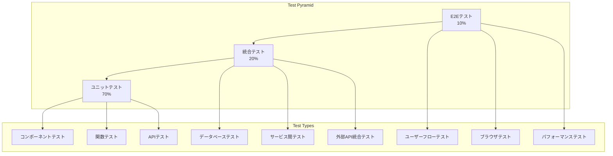

#### 6.1.2 テスト計画表

| テスト種別 | 実施タイミング | 担当 | ツール | カバレッジ目標 |
|-----------|---------------|------|--------|---------------|
| **ユニットテスト** | 開発中（継続） | 各開発者 | Vitest | 80%以上 |
| **コンポーネントテスト** | 開発中（継続） | フロントエンド | Storybook+Test | 90%以上 |
| **API統合テスト** | スプリント終了時 | QA | Jest+Supertest | 95%以上 |
| **E2Eテスト** | 週次 | QA | Playwright | 主要フロー100% |
| **セキュリティテスト** | スプリント2以降 | Security | OWASP ZAP | 脆弱性0件 |
| **パフォーマンステスト** | スプリント3 | QA | Lighthouse | スコア90以上 |

### 6.2 継続的品質管理

#### 6.2.1 CI/CD パイプライン
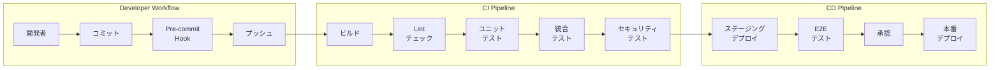

#### 6.2.2 品質ゲート設定

| ゲート | 条件 | 担当 | 通過条件 |
|--------|------|------|----------|
| **開発者ゲート** | コミット前 | 各開発者 | Lint通過、ローカルテスト成功 |
| **プルリクエストゲート** | マージ前 | TechLead | コードレビュー承認、CI通過 |
| **スプリントゲート** | スプリント終了時 | QA | 全テスト通過、品質基準達成 |
| **リリースゲート** | 本番デプロイ前 | PM | セキュリティテスト、パフォーマンステスト通過 |

## 7. リスク管理

### 7.1 リスクマトリックス

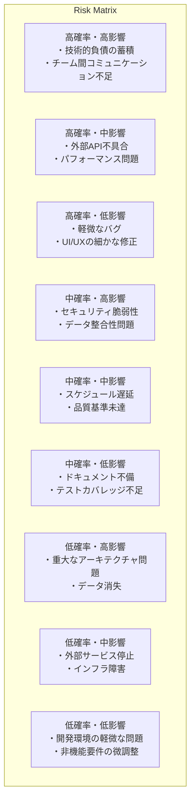

### 7.2 主要リスクと対策

#### 7.2.1 技術リスク

| リスク | 確率 | 影響度 | 対策 | 責任者 |
|--------|------|--------|------|--------|
| **モーラ分割アルゴリズムの複雑性** | 高 | 中 | 段階的実装、既存ライブラリ調査 | DevA2 |
| **EChartsと日本地図データの統合問題** | 中 | 中 | 早期POC、代替手段準備 | DevD1 |
| **Supabase Authの制限** | 中 | 高 | 早期検証、自前実装の準備 | DevC1 |
| **パフォーマンスボトルネック** | 中 | 中 | 継続的監視、最適化計画 | TechLead |

#### 7.2.2 プロジェクトリスク

| リスク | 確率 | 影響度 | 対策 | 責任者 |
|--------|------|--------|------|--------|
| **チーム間の依存関係による遅延** | 高 | 高 | 明確なインターフェース定義、並列開発 | PM |
| **要件変更の発生** | 中 | 中 | アジャイル対応、変更管理プロセス | PM |
| **チームメンバーの離脱** | 低 | 高 | 知識の共有、ドキュメント化 | TechLead |
| **外部サービスの仕様変更** | 低 | 中 | 定期的な仕様確認、代替手段の準備 | DevOps |

### 7.3 リスク監視・対応プロセス

#### 7.3.1 週次リスクレビュー
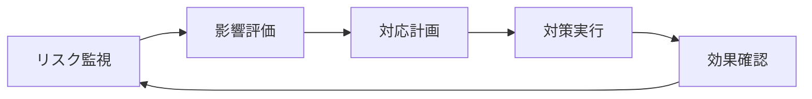

#### 7.3.2 エスカレーションルール

| リスク レベル | 対応者 | 対応時間 | エスカレーション |
|--------------|--------|----------|-----------------|
| **レベル1（低）** | 開発者 | 即座 | チームリーダー報告 |
| **レベル2（中）** | チームリーダー | 4時間以内 | テックリード報告 |
| **レベル3（高）** | テックリード | 2時間以内 | プロジェクトマネージャー報告 |
| **レベル4（重大）** | プロジェクトマネージャー | 1時間以内 | ステークホルダー報告 |

## 8. コミュニケーション計画

### 8.1 定期ミーティング

#### 8.1.1 ミーティング構成
| ミーティング | 頻度 | 参加者 | 時間 | 目的 |
|-------------|------|--------|------|------|
| **デイリースタンドアップ** | 毎日 | 全開発者 | 15分 | 進捗共有、ブロッカー特定 |
| **チーム内同期** | 週2回 | チーム内 | 30分 | 詳細技術討議、タスク調整 |
| **全体同期ミーティング** | 週1回 | 全員 | 60分 | 全体進捗、依存関係調整 |
| **スプリントプランニング** | スプリント開始時 | 全員 | 120分 | スプリント計画、タスク見積もり |
| **スプリントレビュー** | スプリント終了時 | 全員 | 90分 | 成果物レビュー、フィードバック |
| **レトロスペクティブ** | スプリント終了時 | 全員 | 60分 | プロセス改善、問題解決 |

#### 8.1.2 コミュニケーションチャネル

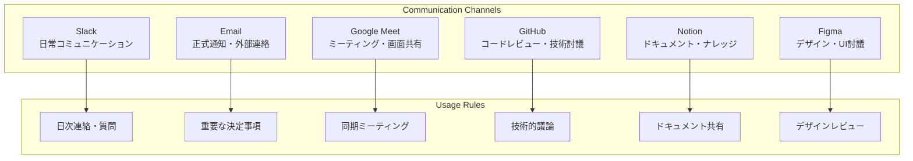

### 8.2 進捗管理・報告

#### 8.2.1 進捗トラッキング

**使用ツール**: GitHub Projects + Notion

**進捗指標**:
- **ベロシティ**: スプリントあたりの完了ストーリーポイント
- **バーンダウンチャート**: 残タスクの日次推移
- **品質メトリクス**: テストカバレッジ、バグ密度
- **技術的負債**: コード品質スコア、未解決の技術課題

#### 8.2.2 報告体制

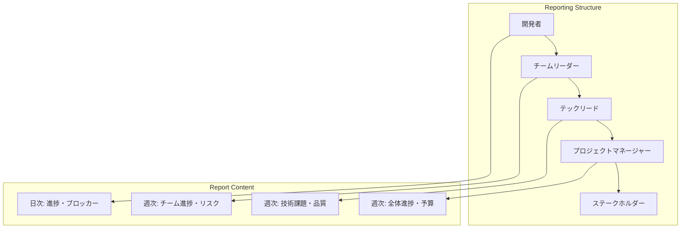

## 9. 並列開発戦略

### 9.1 チーム分割と責任範囲

#### 9.1.1 機能別チーム構成
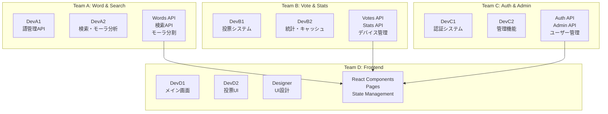

### 9.2 インターフェース管理

#### 9.2.1 API契約管理
```typescript
// api-contracts/word.interface.ts - チーム間で共有される契約
export interface WordSearchRequest {
  q?: string;
  category?: string;
  page?: number;
  limit?: number;
  sort?: 'latest' | 'popular' | 'alphabetic';
}

export interface WordSearchResponse {
  words: WordSummary[];
  pagination: PaginationInfo;
}

export interface WordDetailResponse {
  word: WordDetail;
  accentOptions: AccentOption[];
  aliases: string[];
  nationalStats: NationalStat[];
  canVote: boolean;
  userVote?: UserVote;
}

// 各チームはこの契約に基づいて並列開発
```

#### 9.2.2 モックサーバー戦略
```typescript
// フロントエンドチーム用のモックサーバー
// チームAの実装完了前でもフロントエンド開発を継続可能

// mock-server/handlers/words.ts
export const wordHandlers = [
  rest.get('/api/words', (req, res, ctx) => {
    return res(
      ctx.json({
        words: [
          {
            id: 1,
            headword: '桜',
            reading: 'サクラ',
            category: '一般語',
            totalVotes: 150,
            prefectureCount: 23,
            createdAt: '2025-08-28T00:00:00Z'
          }
          // ... モックデータ
        ],
        pagination: {
          page: 1,
          limit: 20,
          total: 1,
          totalPages: 1
        }
      })
    );
  }),
  
  rest.get('/api/words/:id', (req, res, ctx) => {
    return res(
      ctx.json({
        word: mockWordDetail,
        accentOptions: mockAccentOptions,
        aliases: ['さくら', '櫻'],
        nationalStats: mockNationalStats,
        canVote: true
      })
    );
  })
];
```

### 9.3 統合テスト戦略

#### 9.3.1 段階的統合アプローチ
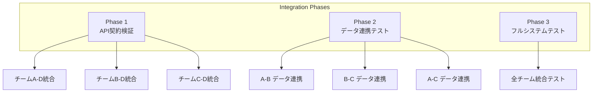

#### 9.3.2 継続的統合環境

**開発環境**: 各チーム独立
- チームA: `dev-a.accent-vote-site.local`
- チームB: `dev-b.accent-vote-site.local`
- チームC: `dev-c.accent-vote-site.local`
- チームD: `dev-d.accent-vote-site.local`

**統合環境**: 毎日夜間に統合
- `integration.accent-vote-site.local`

**ステージング環境**: 週次統合
- `staging.accent-vote-site.com`

## 10. 運用準備計画

### 10.1 インフラ構成

#### 10.1.1 本番環境アーキテクチャ
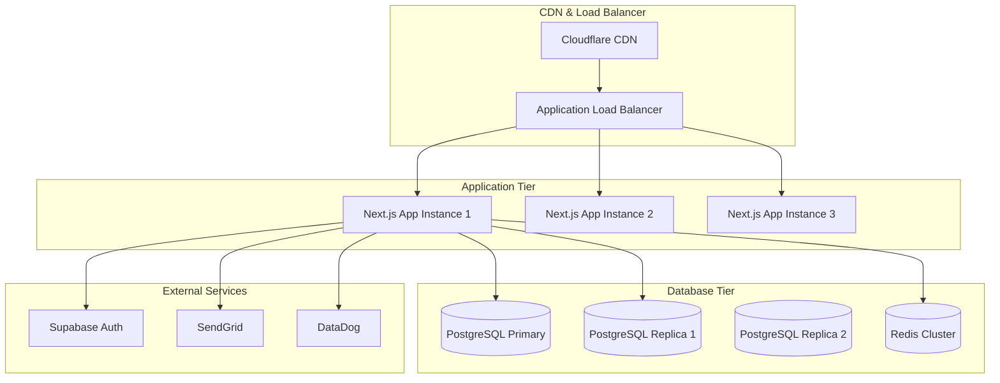

#### 10.1.2 インフラ構築計画

| コンポーネント | プロバイダー | スペック | 担当 | 期限 |
|---------------|-------------|----------|------|------|
| **Application Server** | Vercel | Pro Plan | DevOps | Week 5 |
| **Database** | Supabase | Pro Plan | DevOps | Week 1 |
| **Cache** | Redis Labs | Standard | DevOps | Week 3 |
| **CDN** | Cloudflare | Pro Plan | DevOps | Week 5 |
| **Monitoring** | DataDog | Startup | DevOps | Week 5 |
| **DNS** | Cloudflare | Pro Plan | DevOps | Week 5 |

### 10.2 セキュリティ対策

#### 10.2.1 本番セキュリティチェックリスト
- [ ] HTTPS証明書の設定・自動更新
- [ ] セキュリティヘッダーの設定
- [ ] OWASP Top 10対策の実装
- [ ] データベースアクセス権限の最小化
- [ ] 環境変数の暗号化保存
- [ ] ログ出力のサニタイズ
- [ ] DDoS対策の設定
- [ ] バックアップの暗号化設定

#### 10.2.2 セキュリティ監視

| 監視項目 | ツール | アラート設定 | 担当 |
|----------|--------|-------------|------|
| **不正ログイン試行** | DataDog | 10回/分超過 | Security |
| **異常なトラフィック** | Cloudflare | 通常の5倍超過 | DevOps |
| **SQLインジェクション** | WAF | 検知即座 | Security |
| **大量データアクセス** | Database | 100MB/分超過 | DevOps |

### 10.3 運用手順

#### 10.3.1 デプロイ手順
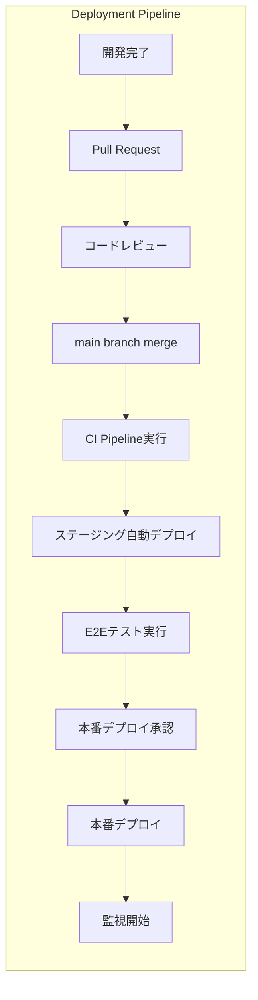

#### 10.3.2 緊急対応手順

**障害レベル定義**:
- **P0 (Critical)**: サービス完全停止
- **P1 (High)**: 主機能に重大な影響
- **P2 (Medium)**: 一部機能に影響
- **P3 (Low)**: 軽微な問題

**対応体制**:
| レベル | 対応時間 | 対応者 | エスカレーション |
|--------|----------|--------|-----------------|
| P0 | 15分以内 | DevOps + TechLead | 即座にPM報告 |
| P1 | 1時間以内 | 担当チーム | 2時間後PM報告 |
| P2 | 4時間以内 | 担当開発者 | 翌営業日報告 |
| P3 | 24時間以内 | 担当開発者 | 週次報告 |

## 11. 成功指標と評価基準

### 11.1 プロジェクト成功指標

#### 11.1.1 開発効率指標
| 指標 | 目標値 | 測定方法 | 責任者 |
|------|--------|----------|--------|
| **スケジュール遵守率** | 90%以上 | マイルストーン達成率 | PM |
| **品質目標達成率** | 95%以上 | 品質ゲート通過率 | QA |
| **バグ密度** | 1件/KLOC以下 | コード行数あたりのバグ数 | TechLead |
| **テストカバレッジ** | 80%以上 | 自動計測 | QA |
| **コードレビュー率** | 100% | GitHub PR統計 | TechLead |

#### 11.1.2 技術品質指標
| 指標 | 目標値 | 測定方法 | 責任者 |
|------|--------|----------|--------|
| **応答速度** | 2秒以内 | Lighthouse測定 | DevOps |
| **可用性** | 99.9% | アップタイム監視 | DevOps |
| **セキュリティスコア** | A評価 | Mozilla Observatory | Security |
| **アクセシビリティ** | AA準拠 | axe-core検証 | Designer |

### 11.2 ビジネス成功指標

#### 11.2.1 リリース後KPI
| 指標 | 初期目標 | 測定期間 | 測定方法 |
|------|----------|----------|----------|
| **日次アクティブユーザー** | 100人 | リリース後1ヶ月 | Google Analytics |
| **投票完了率** | 80% | リリース後1ヶ月 | 内部分析 |
| **新語投稿数** | 10件/月 | リリース後1ヶ月 | データベース集計 |
| **地域カバレッジ** | 30都道府県 | リリース後1ヶ月 | 投票統計 |

## 12. 学習・改善計画

### 12.1 ナレッジ共有計画

#### 12.1.1 技術ドキュメント作成
| ドキュメント | 担当者 | 期限 | 用途 |
|-------------|--------|------|------|
| **APIドキュメント** | 各チームリーダー | Week 4 | 統合開発・保守 |
| **デプロイメントガイド** | DevOps | Week 5 | 運用・障害対応 |
| **トラブルシューティングガイド** | TechLead | Week 6 | 保守・サポート |
| **コーディング規約** | TechLead | Week 1 | 開発品質統一 |

#### 12.1.2 技術共有セッション
- **週次技術共有会**: 各チームの技術的発見・学びを共有
- **アーキテクチャレビュー**: 重要な設計決定の全体レビュー
- **ポストモーテム**: 問題発生時の原因分析・改善策検討
- **ベストプラクティス共有**: 効率的な開発手法・ツールの共有

### 12.2 継続改善計画

#### 12.2.1 プロセス改善
- **スプリントレトロスペクティブ**: 開発プロセスの継続改善
- **コードレビューガイドライン**: レビュー効率・品質の向上
- **自動化推進**: 手動作業の自動化による効率向上
- **ツール改善**: 開発ツール・環境の継続的改善

#### 12.2.2 技術的負債管理
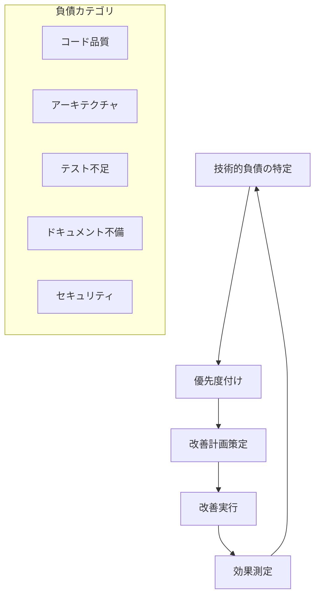

## 13. 成果物・納品物一覧

### 13.1 開発成果物

| カテゴリ | 成果物 | 担当チーム | 形式 |
|----------|--------|-----------|------|
| **ソースコード** | Webアプリケーション | 全チーム | GitHub Repository |
| **データベース** | スキーマ・マイグレーション | チームA | SQL Files |
| **API仕様書** | OpenAPI specification | 各チーム | Swagger/JSON |
| **フロントエンド** | React Components | チームD | TypeScript/TSX |
| **テストコード** | 自動テストスイート | 全チーム | Jest/Playwright |
| **設定ファイル** | 環境設定・CI/CD | DevOps | YAML/JSON |

### 13.2 ドキュメント成果物

| ドキュメント | 担当者 | 目的 | 形式 |
|-------------|--------|------|------|
| **要求仕様書** | PM | 機能要件の明確化 | Markdown |
| **アーキテクチャ設計書** | TechLead | システム設計の記録 | Markdown + 図 |
| **API設計書** | 各チーム | インターフェース仕様 | OpenAPI |
| **データベース設計書** | チームA | データ構造の記録 | ERD + Markdown |
| **運用手順書** | DevOps | 運用・保守手順 | Markdown |
| **セキュリティドキュメント** | Security | セキュリティ対策・手順 | Markdown |
| **テスト計画書** | QA | テスト戦略・手順 | Markdown |
| **ユーザーマニュアル** | Designer | エンドユーザー向け | Markdown + 画像 |

### 13.3 運用成果物

| 成果物 | 担当者 | 目的 | 形式 |
|--------|--------|------|------|
| **本番環境** | DevOps | サービス提供基盤 | Infrastructure |
| **監視システム** | DevOps | システム監視・アラート | DataDog Setup |
| **バックアップシステム** | DevOps | データ保護・復旧 | 自動バックアップ |
| **CI/CDパイプライン** | DevOps | 自動デプロイ・テスト | GitHub Actions |
| **セキュリティ設定** | Security | セキュリティ対策 | WAF + 監視 |

## 14. プロジェクト完了基準

### 14.1 完了判定基準

#### 14.1.1 機能完成基準
- [ ] 全ての必須機能が仕様通りに動作する
- [ ] 全てのAPI エンドポイントが正常に応答する
- [ ] フロントエンドが全デバイスで正常表示される
- [ ] 管理機能が正常に動作する
- [ ] セキュリティ要件を全て満たしている

#### 14.1.2 品質基準
- [ ] 自動テストカバレッジ 80%以上
- [ ] セキュリティテスト全通過
- [ ] パフォーマンステスト全通過
- [ ] アクセシビリティテスト AA準拠
- [ ] 重大バグ0件、軽微バグ5件以下

#### 14.1.3 運用準備基準
- [ ] 本番環境構築完了
- [ ] 監視・アラート設定完了
- [ ] バックアップ・復旧手順テスト完了
- [ ] 運用マニュアル作成完了
- [ ] 緊急対応体制確立完了

### 14.2 プロジェクト終了処理

#### 14.2.1 最終レビュー
1. **成果物レビュー**: 全成果物の品質・完成度確認
2. **目標達成度評価**: KPI・成功指標の達成度確認
3. **品質評価**: 品質ゲート・基準の達成確認
4. **運用準備確認**: 本番運用開始可能性の確認

#### 14.2.2 ナレッジ移転
1. **技術移転セッション**: 開発チームから運用チームへの移転
2. **ドキュメント引継ぎ**: 全ドキュメントの引継ぎ・更新
3. **トレーニング実施**: 運用担当者向けトレーニング
4. **Q&Aセッション**: 疑問点・不明点の解決

#### 14.2.3 プロジェクト総括
1. **成果報告書作成**: プロジェクト成果・学びのまとめ
2. **反省会実施**: プロセス改善点・今後の活用方法
3. **表彰・評価**: チーム・個人の貢献度評価
4. **次期プロジェクト計画**: 学びを活かした次期計画策定

---

この開発計画書により、6週間での効率的かつ高品質な日本語アクセント投票サイト開発が可能になります。並列開発による生産性向上と、継続的な品質管理により、ユーザーに価値あるサービスを提供できるシステムを構築します。

I will also generate the following answer based on CLAUDE.md