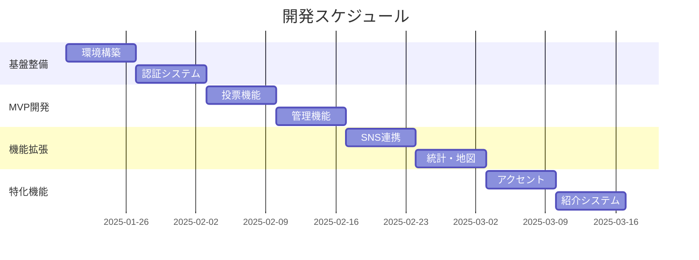

# 実装計画書

## 1. 実装計画概要

### 1.1 開発方針
- **アジャイル開発**: 2週間スプリント制での段階的開発
- **MVP優先**: Phase 1で最小限の機能を実装し、段階的に拡張
- **並行開発**: フロントエンドとバックエンドの並行開発体制
- **継続的インテグレーション**: 自動テスト・デプロイによる品質保証
- **ユーザーフィードバック**: 各フェーズでユーザーテストを実施

### 1.2 開発チーム構成
| 役割 | 人数 | 担当範囲 |
|------|------|----------|
| プロジェクトマネージャー | 1名 | 全体進行管理、要件調整 |
| フロントエンド開発者 | 2名 | React/Next.js、UI/UX実装 |
| バックエンド開発者 | 2名 | Node.js/Express、API開発 |
| QAエンジニア | 1名 | テスト計画・実行、品質管理 |
| デザイナー | 1名 | UI/UXデザイン、素材作成 |

### 1.3 開発期間・工数
- **総開発期間**: 8週間
- **Phase 1 (MVP)**: 4週間 (160時間)
- **Phase 2**: 2週間 (80時間)
- **Phase 3**: 2週間 (80時間)
- **総工数**: 320時間 (約7人月)

## 2. WBS（作業分解構造）

### 2.1 Phase 1: MVP開発 (4週間)

#### 2.1.1 環境構築・基盤整備 (Week 1)
```
1. 開発環境構築
   ├── 1.1 フロントエンド環境セットアップ (8h)
   │   ├── Next.js 14プロジェクト初期化
   │   ├── TypeScript設定
   │   ├── Tailwind CSS + shadcn/ui導入
   │   ├── ESLint/Prettier設定
   │   └── Vercel連携設定
   ├── 1.2 バックエンド環境セットアップ (8h)
   │   ├── Express.js プロジェクト初期化
   │   ├── TypeScript設定
   │   ├── Prisma ORM導入
   │   ├── JWT認証基盤
   │   └── Railway/Supabase設定
   ├── 1.3 データベース設計・構築 (16h)
   │   ├── Prismaスキーマ定義
   │   ├── マイグレーション実行
   │   ├── シードデータ作成
   │   └── インデックス設定
   └── 1.4 CI/CD構築 (8h)
       ├── GitHub Actions設定
       ├── テスト自動化
       ├── デプロイ自動化
       └── 環境変数管理
```

#### 2.1.2 認証機能実装 (Week 1-2)
```
2. 認証・認可システム
   ├── 2.1 バックエンド認証API (16h)
   │   ├── ユーザー登録API
   │   ├── ログインAPI
   │   ├── トークンリフレッシュAPI
   │   ├── ユーザー情報取得API
   │   └── JWT ミドルウェア
   ├── 2.2 フロントエンド認証UI (16h)
   │   ├── ログインフォーム
   │   ├── 新規登録フォーム
   │   ├── ユーザーメニュー
   │   ├── 認証状態管理 (Zustand)
   │   └── 認証ガード
   └── 2.3 テスト実装 (8h)
       ├── 認証APIテスト
       ├── フォームバリデーションテスト
       └── E2Eテスト (登録・ログイン)
```

#### 2.1.3 基本投票機能実装 (Week 2-3)
```
3. 投票システム核心機能
   ├── 3.1 投票API開発 (20h)
   │   ├── 投票一覧取得API
   │   ├── 投票詳細取得API
   │   ├── 投票実行API
   │   ├── 重複投票チェック
   │   └── 結果集計ロジック
   ├── 3.2 投票UI実装 (20h)
   │   ├── トップページ（投票一覧）
   │   ├── 投票詳細ページ
   │   ├── 投票フォーム
   │   ├── 結果表示コンポーネント
   │   └── ゲストユーザー属性入力
   └── 3.3 テスト・デバッグ (12h)
       ├── 投票APIテスト
       ├── UIコンポーネントテスト
       ├── 統合テスト
       └── バグ修正
```

#### 2.1.4 管理機能実装 (Week 3-4)
```
4. 管理画面開発
   ├── 4.1 管理API開発 (16h)
   │   ├── 投票作成API
   │   ├── 投票編集API
   │   ├── 投票削除API
   │   ├── 管理ダッシュボードAPI
   │   └── 管理者認可ミドルウェア
   ├── 4.2 管理画面UI実装 (20h)
   │   ├── 管理画面レイアウト
   │   ├── 投票作成フォーム
   │   ├── 投票一覧・編集画面
   │   ├── ダッシュボード
   │   └── 統計表示
   └── 4.3 テスト・デバッグ (8h)
       ├── 管理APIテスト
       ├── 管理画面UIテスト
       └── 権限制御テスト
```

#### 2.1.5 MVP統合・デプロイ (Week 4)
```
5. MVP完成・リリース
   ├── 5.1 統合テスト (12h)
   │   ├── E2Eテスト全機能
   │   ├── パフォーマンステスト
   │   ├── セキュリティテスト
   │   └── ブラウザ互換性テスト
   ├── 5.2 本番デプロイ準備 (8h)
   │   ├── 本番環境設定
   │   ├── ドメイン・SSL設定
   │   ├── 監視・ログ設定
   │   └── バックアップ設定
   ├── 5.3 ドキュメント整備 (8h)
   │   ├── API仕様書更新
   │   ├── 運用マニュアル作成
   │   ├── ユーザーガイド作成
   │   └── 開発者向けREADME
   └── 5.4 MVP リリース (4h)
       ├── 本番デプロイ実行
       ├── 動作確認
       ├── 初期データ投入
       └── リリース告知
```

### 2.2 Phase 2: SNS連携・統計機能 (2週間)

#### 2.2.1 SNS連携機能 (Week 5)
```
6. SNS認証・シェア機能
   ├── 6.1 X(Twitter) OAuth連携 (12h)
   │   ├── OAuth 2.0実装
   │   ├── 連携登録・ログイン
   │   ├── プロフィール情報取得
   │   └── 連携解除機能
   ├── 6.2 シェア機能実装 (12h)
   │   ├── シェアメッセージ生成API
   │   ├── シェアボタンコンポーネント
   │   ├── 動的メッセージ生成
   │   └── シェア追跡機能
   └── 6.3 テスト・改善 (8h)
       ├── OAuth連携テスト
       ├── シェア機能テスト
       └── UX改善
```

#### 2.2.2 統計・地図機能 (Week 6)
```
7. 詳細統計・地図表示
   ├── 7.1 統計API開発 (12h)
   │   ├── 詳細統計計算API
   │   ├── 地域別集計API
   │   ├── 年代・性別別集計API
   │   └── 統計キャッシュ機能
   ├── 7.2 地図表示機能 (12h)
   │   ├── React Simple Maps導入
   │   ├── 日本地図データ統合
   │   ├── 都道府県別色分け
   │   └── インタラクティブ機能
   └── 7.3 統計UI実装 (8h)
       ├── 統計ページレイアウト
       ├── チャート表示
       ├── フィルター機能
       └── データ可視化
```

### 2.3 Phase 3: アクセント機能・紹介システム (2週間)

#### 2.3.1 アクセント投票機能 (Week 7)
```
8. アクセント特化機能
   ├── 8.1 音声合成システム (16h)
   │   ├── Web Speech API統合
   │   ├── 音高パターン実装
   │   ├── イントネーション制御
   │   └── 音声再生UI
   ├── 8.2 アクセント投票UI (12h)
   │   ├── 音高グラフ表示
   │   ├── アクセント選択肢
   │   ├── 音声再生ボタン
   │   └── アクセント結果表示
   └── 8.3 単語データベース (4h)
       ├── アクセント辞典データ
       ├── 音高パターンデータ
       └── 音声サンプルデータ
```

#### 2.3.2 紹介・ランキング機能 (Week 8)
```
9. 紹介システム・ランキング
   ├── 9.1 紹介機能API (12h)
   │   ├── 紹介リンク生成API
   │   ├── 訪問追跡API
   │   ├── 紹介カウント更新
   │   └── ランキング計算API
   ├── 9.2 紹介UI実装 (12h)
   │   ├── 紹介リンク生成
   │   ├── 紹介実績表示
   │   ├── ランキング表示
   │   └── バッジシステム
   └── 9.3 最終調整・リリース (8h)
       ├── 全機能統合テスト
       ├── パフォーマンス最適化
       ├── 最終デバッグ
       └── 正式リリース
```

## 3. 実装順序と依存関係

### 3.1 開発フロー図


### 3.2 並行開発戦略
```
週次並行作業計画:

Week 1:
├── バックエンド: 環境構築 + 認証API開発
└── フロントエンド: 環境構築 + 基本レイアウト

Week 2:
├── バックエンド: 投票API開発
└── フロントエンド: 認証UI + 投票UI開発開始

Week 3:
├── バックエンド: 管理API開発
└── フロントエンド: 投票UI完成 + 管理UI開発

Week 4:
├── バックエンド: 統合テスト・最適化
└── フロントエンド: 管理UI完成 + E2Eテスト

Week 5-8: 同様の並行開発継続
```

## 4. 技術的実装詳細

### 4.1 フロントエンド実装順序

#### 4.1.1 基盤コンポーネント実装
```typescript
// 実装順序: 1週目
1. レイアウトコンポーネント
   - Header.tsx
   - Footer.tsx
   - Navigation.tsx
   - LoadingSpinner.tsx

2. UIコンポーネント (shadcn/ui)
   - Button, Card, Dialog等のカスタマイズ
   - Form コンポーネント統合
   - Toast/Notification システム

3. 状態管理セットアップ
   - Zustand ストア初期化
   - TanStack Query 設定
   - 認証状態管理
```

#### 4.1.2 ページ実装順序
```typescript
// 実装順序: 2-3週目
1. 認証ページ
   - /login
   - /register
   - /auth/callback (SNS用)

2. メインページ
   - / (トップページ)
   - /polls/[id] (投票詳細)
   - /polls/[id]/stats (統計)

3. 管理ページ
   - /admin (ダッシュボード)
   - /admin/polls/new (投票作成)
   - /admin/polls/[id]/edit (投票編集)
```

### 4.2 バックエンド実装順序

#### 4.2.1 API実装順序
```typescript
// 実装順序: 1-2週目
1. 認証関連API
   - POST /api/auth/register
   - POST /api/auth/login
   - POST /api/auth/refresh
   - GET /api/auth/me

2. 投票関連API
   - GET /api/polls
   - GET /api/polls/:id
   - POST /api/polls/:id/votes
   - GET /api/polls/:id/stats

3. 管理関連API
   - POST /api/admin/polls
   - PUT /api/admin/polls/:id
   - DELETE /api/admin/polls/:id
   - GET /api/admin/dashboard
```

#### 4.2.2 データベース実装順序
```sql
-- 実装順序: 1週目
1. 基本テーブル作成
   - User
   - Poll
   - PollVote
   - AppSettings

2. インデックス設定
   - パフォーマンス用インデックス
   - 一意制約インデックス
   - 検索用インデックス

3. シードデータ投入
   - 管理者ユーザー
   - サンプル投票
   - 都道府県マスタ
```

## 5. テスト計画

### 5.1 テスト戦略
| テスト種別 | 対象 | ツール | 担当 | 実施タイミング |
|-----------|------|-------|------|---------------|
| 単体テスト | 関数・コンポーネント | Jest, RTL | 各開発者 | 開発と並行 |
| 統合テスト | API・データベース | Supertest | バックエンド開発者 | 各週末 |
| E2Eテスト | ユーザーフロー | Playwright | QAエンジニア | 各スプリント末 |
| パフォーマンステスト | システム全体 | Lighthouse, K6 | QAエンジニア | Phase完了時 |
| セキュリティテスト | 脆弱性 | OWASP ZAP | QAエンジニア | 本番前 |

### 5.2 テストケース設計

#### 5.2.1 ユニットテスト
```typescript
// フロントエンド例
describe('VoteForm', () => {
  it('選択肢を選択できる', () => {
    render(<VoteForm poll={mockPoll} onVote={mockOnVote} />);
    fireEvent.click(screen.getByText('選択肢A'));
    expect(screen.getByRole('button', { name: '投票する' })).toBeEnabled();
  });

  it('未選択時は投票ボタンが無効', () => {
    render(<VoteForm poll={mockPoll} onVote={mockOnVote} />);
    expect(screen.getByRole('button', { name: '投票する' })).toBeDisabled();
  });
});

// バックエンド例
describe('POST /api/polls/:id/votes', () => {
  it('正常な投票を受け付ける', async () => {
    const response = await request(app)
      .post('/api/polls/test-poll/votes')
      .send({ option: 0, prefecture: '13', ageGroup: '20代', gender: 'male' })
      .expect(200);

    expect(response.body.success).toBe(true);
    expect(response.body.data.userToken).toBeDefined();
  });

  it('重複投票を拒否する', async () => {
    // 1回目の投票
    await request(app)
      .post('/api/polls/test-poll/votes')
      .send({ option: 0, userToken: 'existing-token' });

    // 2回目の投票（重複）
    const response = await request(app)
      .post('/api/polls/test-poll/votes')
      .send({ option: 1, userToken: 'existing-token' })
      .expect(409);

    expect(response.body.error.code).toBe('ALREADY_VOTED');
  });
});
```

#### 5.2.2 E2Eテスト
```typescript
// Playwright例
test.describe('投票フロー', () => {
  test('ゲストユーザーが投票できる', async ({ page }) => {
    // トップページにアクセス
    await page.goto('/');

    // 投票カードをクリック
    await page.click('[data-testid="poll-card"]:first-child');

    // 選択肢を選択
    await page.click('[data-testid="vote-option-0"]');

    // 投票ボタンをクリック
    await page.click('[data-testid="vote-button"]');

    // 属性入力モーダルが表示される
    await expect(page.locator('[data-testid="demographics-modal"]')).toBeVisible();

    // 属性を入力
    await page.selectOption('[data-testid="prefecture-select"]', '東京都');
    await page.selectOption('[data-testid="age-select"]', '20代');
    await page.selectOption('[data-testid="gender-select"]', 'male');

    // 投票実行
    await page.click('[data-testid="submit-vote"]');

    // 結果が表示される
    await expect(page.locator('[data-testid="vote-results"]')).toBeVisible();
  });

  test('管理者が投票を作成できる', async ({ page }) => {
    // 管理者でログイン
    await page.goto('/admin/login');
    await page.fill('[name="email"]', 'admin@example.com');
    await page.fill('[name="password"]', 'password');
    await page.click('[type="submit"]');

    // 投票作成ページへ
    await page.goto('/admin/polls/new');

    // 投票情報を入力
    await page.fill('[name="title"]', 'テスト投票');
    await page.fill('[name="description"]', 'テスト用の投票です');
    await page.fill('[name="options.0.label"]', '選択肢1');
    await page.fill('[name="options.1.label"]', '選択肢2');

    // 締切日を設定
    const tomorrow = new Date();
    tomorrow.setDate(tomorrow.getDate() + 1);
    await page.fill('[name="deadline"]', tomorrow.toISOString().split('T')[0]);

    // 投票を作成
    await page.click('[type="submit"]');

    // 成功メッセージを確認
    await expect(page.locator('.toast-success')).toBeVisible();
  });
});
```

## 6. 品質管理

### 6.1 コード品質基準
| 項目 | 基準 | ツール | チェックタイミング |
|------|------|-------|--------------------|
| TypeScript | エラー0件 | tsc | commit時 |
| ESLint | エラー0件、warning5件以下 | ESLint | commit時 |
| テストカバレッジ | 80%以上 | Jest | PR時 |
| パフォーマンス | Lighthouse Score 90以上 | Lighthouse CI | deploy時 |
| アクセシビリティ | WCAG 2.1 AA準拠 | axe-core | PR時 |

### 6.2 コードレビュー基準
```markdown
## コードレビューチェックリスト

### 機能性
- [ ] 要件通りに動作するか
- [ ] エラーハンドリングが適切か
- [ ] エッジケースを考慮しているか

### コード品質
- [ ] 命名が適切か
- [ ] 関数・コンポーネントが適切なサイズか
- [ ] 重複コードがないか
- [ ] TypeScriptの型定義が適切か

### パフォーマンス
- [ ] 不要な再レンダリングがないか
- [ ] メモリリークの可能性がないか
- [ ] データベースクエリが最適化されているか

### セキュリティ
- [ ] 入力値検証が適切か
- [ ] 認証・認可が正しく実装されているか
- [ ] 機密情報の漏洩がないか

### テスト
- [ ] 適切なテストが書かれているか
- [ ] テストケースが十分か
- [ ] モックが適切に使われているか
```

## 7. リスク管理

### 7.1 技術的リスク
| リスク | 発生確率 | 影響度 | 対策 |
|--------|----------|--------|------|
| Web Speech API対応ブラウザの制限 | 中 | 中 | フォールバック機能実装 |
| SNS API仕様変更 | 低 | 高 | 抽象化レイヤー実装 |
| 大量アクセスによる性能問題 | 中 | 高 | 負荷分散・キャッシュ強化 |
| セキュリティ脆弱性 | 低 | 高 | 定期的なセキュリティ監査 |

### 7.2 スケジュールリスク
| リスク | 発生確率 | 影響度 | 対策 |
|--------|----------|--------|------|
| 要件変更・追加 | 高 | 中 | 要件凍結期間の設定 |
| 開発者の体調不良 | 中 | 中 | クロストレーニング実施 |
| 外部API制限 | 低 | 高 | 代替API準備 |
| 予期しない技術的課題 | 中 | 高 | バッファ期間の確保 |

### 7.3 リスク対応計画
```
リスク発生時の対応フロー:

1. リスク検知
   - 毎日の進捗確認で早期発見
   - 技術的課題は即座にエスカレーション

2. 影響度評価
   - スケジュール影響: 1日以上の遅延で中リスク
   - 品質影響: 機能削減を伴う場合は高リスク

3. 対応策実行
   - 高リスク: PMと全員で対応策検討
   - 中リスク: 担当チームで対応策実行
   - 低リスク: 担当者レベルで対応

4. フォローアップ
   - 対応策の効果測定
   - 同様リスクの予防策検討
```

## 8. デプロイ・運用計画

### 8.1 デプロイ戦略
```
デプロイフロー:

1. 開発環境 (Development)
   - 機能開発・単体テスト
   - 自動デプロイ (feature/* ブランチ)

2. ステージング環境 (Staging)
   - 統合テスト・E2Eテスト
   - 自動デプロイ (develop ブランチ)
   - 本番同等の環境設定

3. 本番環境 (Production)
   - 手動承認後の自動デプロイ
   - main ブランチのみ
   - Blue-Green デプロイ

ブランチ戦略:
- main: 本番環境
- develop: ステージング環境
- feature/*: 機能開発ブランチ
```

### 8.2 監視・アラート設定
```yaml
# 監視項目例 (監視ツール設定)
monitoring:
  performance:
    - api_response_time > 3s
    - page_load_time > 5s
    - database_query_time > 1s

  availability:
    - uptime < 99.9%
    - error_rate > 5%
    - failed_requests > 10/min

  business_metrics:
    - daily_votes < 100 (異常な減少)
    - new_user_registration = 0 (24h)
    - admin_login_failures > 5/h

alerts:
  slack_channel: "#vote-site-alerts"
  email: "dev-team@example.com"
  escalation: 30分応答なしでPM連絡
```

### 8.3 バックアップ・復旧計画
```
バックアップ計画:

1. データベース
   - 毎日自動バックアップ (3:00 AM JST)
   - 7日間のローテーション保持
   - 月次フルバックアップ (長期保存)

2. ファイルシステム
   - 毎日差分バックアップ
   - 画像・音声ファイルの複製保存

3. 設定ファイル
   - Git管理による自動バックアップ
   - 環境変数の暗号化保存

復旧手順:
1. 障害検知・影響範囲確認 (5分以内)
2. 代替システム起動 (15分以内)
3. データ復旧作業 (1時間以内)
4. 正常性確認・復旧完了 (2時間以内)
```

## 9. パフォーマンス最適化計画

### 9.1 初期パフォーマンス目標
| メトリクス | 目標値 | 測定方法 |
|-----------|--------|----------|
| First Contentful Paint | < 1.5s | Lighthouse |
| Largest Contentful Paint | < 2.5s | Lighthouse |
| Time to Interactive | < 3.0s | Lighthouse |
| API Response Time | < 1.0s | 自動監視 |
| Database Query Time | < 100ms | APM |

### 9.2 最適化実装計画
```
Week 1-2: 基本最適化
- Next.js Image最適化
- 静的アセット圧縮
- CSS/JS minification
- HTTP/2対応

Week 3-4: 高度な最適化
- Redis キャッシュ導入
- Database クエリ最適化
- CDN設定（Cloudflare）
- Code Splitting実装

Week 5-6: 監視・改善
- Real User Monitoring導入
- パフォーマンス監視ダッシュボード
- 継続的最適化計画
```

## 10. ユーザーテスト計画

### 10.1 ユーザビリティテスト
```
テスト計画:

Phase 1 MVP完成時:
- 対象: 社内メンバー10名
- 期間: 3日間
- フォーカス: 基本機能の使いやすさ

Phase 2 機能拡張時:
- 対象: 外部モニター20名
- 期間: 1週間
- フォーカス: SNS連携・統計機能

Phase 3 正式リリース前:
- 対象: ベータユーザー50名
- 期間: 2週間
- フォーカス: 全機能・パフォーマンス

テスト項目:
1. タスク完了率
2. タスク完了時間
3. エラー発生率
4. ユーザー満足度
5. 改善提案
```

### 10.2 A/Bテスト計画
```
リリース後のA/Bテスト:

1. 投票UI最適化
   - 投票ボタンの色・サイズ
   - 選択肢の表示順序
   - 結果表示のタイミング

2. シェア機能最適化
   - シェアボタンの配置
   - シェアメッセージの内容
   - SNSプラットフォームの優先順位

3. コンバージョン最適化
   - 新規登録フローの簡素化
   - ゲストから登録への誘導
   - 再訪問の促進

測定指標:
- 投票参加率
- シェア実行率
- 新規登録率
- リテンション率
```

## 11. ドキュメント作成計画

### 11.1 技術ドキュメント
```
作成予定ドキュメント:

Week 1-2:
- API仕様書 (OpenAPI)
- データベース設計書
- 環境構築手順書

Week 3-4:
- コンポーネント設計書
- 状態管理仕様書
- テスト戦略書

Week 5-8:
- 運用マニュアル
- トラブルシューティングガイド
- パフォーマンス監視手順書
```

### 11.2 ユーザー向けドキュメント
```
Week 6-8作成:
- ユーザーガイド
- 管理者マニュアル
- FAQ
- プライバシーポリシー
- 利用規約
```

## 12. 成功指標・KPI

### 12.1 技術的KPI
| 指標 | 目標 | 測定期間 |
|------|------|----------|
| サイトアップタイム | 99.9%以上 | 月次 |
| API平均レスポンス時間 | 1秒以下 | 日次 |
| エラー率 | 1%以下 | 日次 |
| セキュリティインシデント | 0件 | 月次 |

### 12.2 ビジネスKPI
| 指標 | Phase 1目標 | Phase 3目標 | 測定期間 |
|------|-------------|-------------|----------|
| 月間アクティブユーザー | 1,000人 | 10,000人 | 月次 |
| 日次投票数 | 100票 | 1,000票 | 日次 |
| ユーザー登録率 | 20% | 30% | 週次 |
| SNSシェア率 | - | 15% | 週次 |

## 13. 今後の拡張計画

### 13.1 Phase 4以降の機能 (リリース後3-6ヶ月)
```
予定機能:
1. Instagram・TikTok OAuth連携
2. リアルタイム投票更新 (WebSocket)
3. AI投票予測機能
4. 投票テンプレート機能
5. 多言語対応 (英語)
6. モバイルアプリ (PWA → ネイティブ)
7. 企業向けプレミアム機能
8. 詳細分析ダッシュボード
```

### 13.2 技術的改善計画
```
インフラ強化:
- Kubernetes移行検討
- マイクロサービス分割
- GraphQL API導入
- ElasticSearch導入

品質向上:
- 自動化テスト充実
- セキュリティ監査強化
- パフォーマンス監視高度化
- ユーザビリティ継続改善
```

## 14. まとめ

### 14.1 実装計画の要点
1. **段階的開発**: MVP → 機能拡張 → 特化機能の順序で確実に進める
2. **並行開発**: フロントエンド・バックエンドの効率的な並行作業
3. **品質重視**: 各段階でのテスト・レビューを徹底
4. **リスク管理**: 技術的・スケジュール的リスクの事前対策
5. **継続改善**: リリース後の監視・最適化・機能拡張

### 14.2 成功のための重要ポイント
- **コミュニケーション**: 日次スタンドアップ、週次レビューの徹底
- **ドキュメント**: 実装と並行したドキュメント整備
- **ユーザーフィードバック**: 各フェーズでのユーザーテスト実施
- **技術的負債**: 短期的な妥協と長期的な品質のバランス

この実装計画により、安定性と拡張性を備えた投票プラットフォームを効率的に構築できます。

I will also generate the following answer based on CLAUDE.md