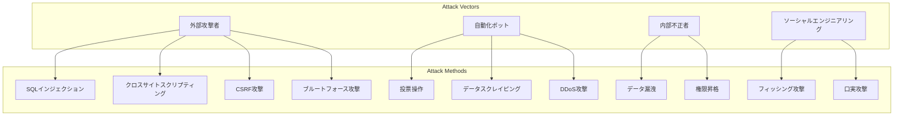
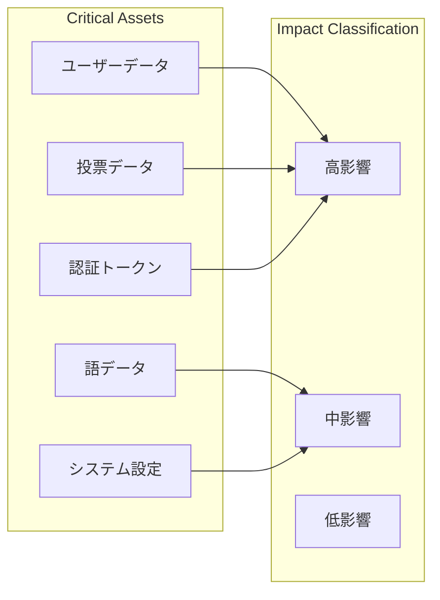
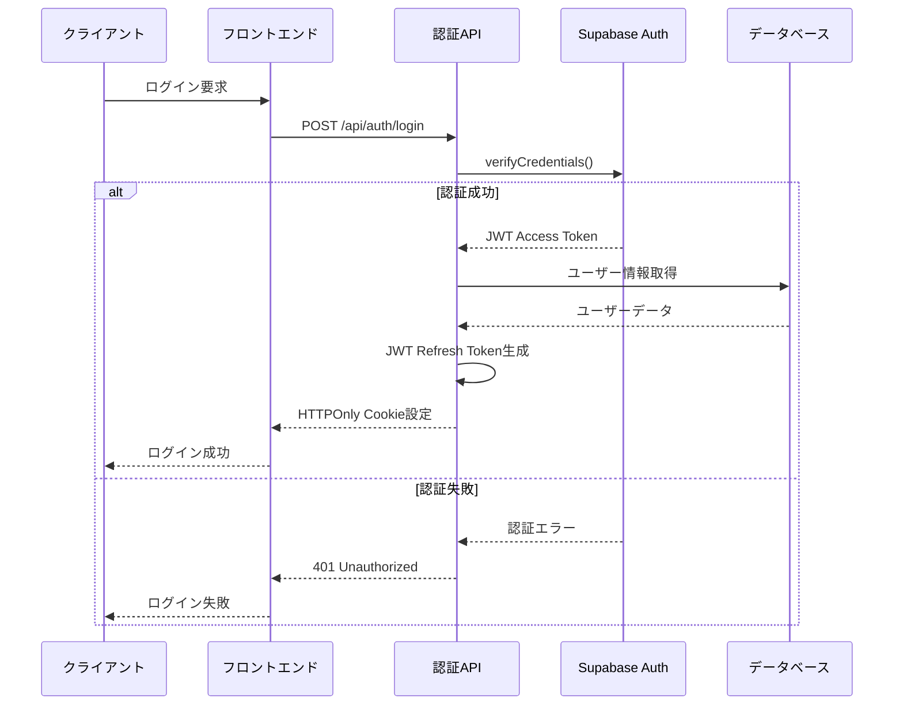
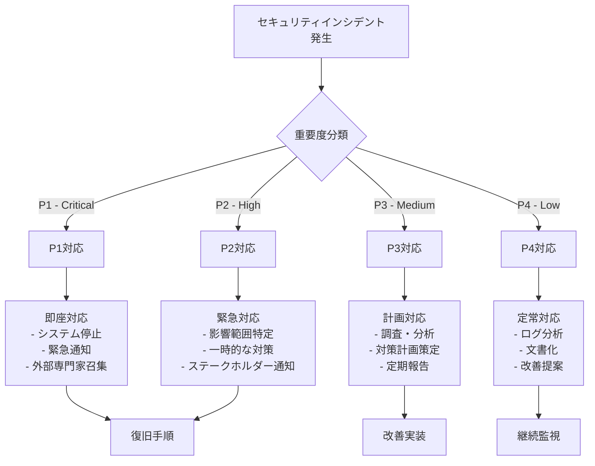

# セキュリティ設計書: 日本語アクセント投票サイト

**バージョン**: 1.0  
**最終更新日**: 2025-08-28  
**対象システム**: 日本語アクセント投票サイト

## 1. 概要とセキュリティ方針

### 1.1 セキュリティ基本方針
- **多層防御（Defense in Depth）**: 複数のセキュリティ層による包括的保護
- **最小権限の原則（Principle of Least Privilege）**: 必要最小限の権限のみ付与
- **ゼロトラスト（Zero Trust）**: すべてのアクセスを検証・認証
- **データ保護優先**: 個人情報・投票データの厳格な保護
- **透明性**: セキュリティ対策の適切な情報開示

### 1.2 脅威モデリング

#### 1.2.1 想定される攻撃者


#### 1.2.2 保護対象アセット


### 1.3 セキュリティ要件

#### 1.3.1 機密性（Confidentiality）
- ユーザーの個人情報保護
- 投票データの匿名性確保
- 管理者情報の厳格な保護
- 認証情報の暗号化保存

#### 1.3.2 完全性（Integrity）
- 投票データの改ざん防止
- データベース整合性の保証
- アプリケーション改ざんの検知
- 通信データの改ざん検知

#### 1.3.3 可用性（Availability）
- DDoS攻撃からの保護
- システム障害時の迅速な復旧
- 負荷分散によるパフォーマンス維持
- データバックアップの確実な実行

## 2. 認証・認可システム設計

### 2.1 認証フロー設計

#### 2.1.1 JWT認証フロー


#### 2.1.2 セッション管理
```typescript
// セッション設定
interface SessionConfig {
  accessTokenTTL: number;    // 15分
  refreshTokenTTL: number;   // 7日間
  absoluteTimeout: number;   // 30日間
  slidingTimeout: number;    // 24時間非活動でタイムアウト
}

// セキュアなCookie設定
const cookieOptions: CookieOptions = {
  httpOnly: true,           // XSS攻撃防止
  secure: true,            // HTTPS必須
  sameSite: 'strict',      // CSRF攻撃防止
  maxAge: 15 * 60 * 1000,  // 15分
  domain: process.env.COOKIE_DOMAIN,
  path: '/'
};

// JWT設定
const jwtConfig = {
  algorithm: 'RS256',      // RSA-SHA256署名
  issuer: 'accent-vote-site',
  audience: 'accent-vote-users',
  keyRotation: '90d'       // 90日でキーローテーション
};
```

### 2.2 認可システム設計

#### 2.2.1 ロールベースアクセス制御（RBAC）
```typescript
// ロール定義
enum UserRole {
  ANONYMOUS = 'anonymous',      // 匿名ユーザー
  USER = 'user',               // 登録ユーザー
  MODERATOR = 'moderator',     // モデレーター
  ADMIN = 'admin'              // 管理者
}

// 権限定義
enum Permission {
  // 語関連
  WORD_READ = 'word:read',
  WORD_SUBMIT = 'word:submit',
  WORD_APPROVE = 'word:approve',
  WORD_DELETE = 'word:delete',
  
  // 投票関連
  VOTE_CAST = 'vote:cast',
  VOTE_VIEW = 'vote:view',
  VOTE_UNDO = 'vote:undo',
  
  // 管理関連
  USER_MANAGE = 'user:manage',
  SYSTEM_CONFIG = 'system:config',
  AUDIT_VIEW = 'audit:view'
}

// ロール-権限マッピング
const RolePermissions: Record<UserRole, Permission[]> = {
  [UserRole.ANONYMOUS]: [
    Permission.WORD_READ,
    Permission.VOTE_CAST,
    Permission.VOTE_VIEW,
    Permission.VOTE_UNDO
  ],
  
  [UserRole.USER]: [
    ...RolePermissions[UserRole.ANONYMOUS],
    Permission.WORD_SUBMIT
  ],
  
  [UserRole.MODERATOR]: [
    ...RolePermissions[UserRole.USER],
    Permission.WORD_APPROVE,
    Permission.AUDIT_VIEW
  ],
  
  [UserRole.ADMIN]: [
    ...RolePermissions[UserRole.MODERATOR],
    Permission.WORD_DELETE,
    Permission.USER_MANAGE,
    Permission.SYSTEM_CONFIG
  ]
};
```

#### 2.2.2 認可チェック実装
```typescript
// 認可ミドルウェア
export function requirePermission(permission: Permission) {
  return async (req: NextApiRequest, res: NextApiResponse, next: NextFunction) => {
    try {
      // JWTトークン検証
      const token = extractTokenFromCookie(req);
      if (!token) {
        return res.status(401).json({ error: 'Authentication required' });
      }

      // トークン検証・デコード
      const payload = await verifyJWT(token);
      const user = await getUserById(payload.sub);

      if (!user) {
        return res.status(401).json({ error: 'Invalid user' });
      }

      // 権限チェック
      const hasPermission = checkUserPermission(user.role, permission);
      if (!hasPermission) {
        return res.status(403).json({ 
          error: 'Insufficient permissions',
          required: permission 
        });
      }

      // リクエストオブジェクトにユーザー情報を追加
      (req as any).user = user;
      next();

    } catch (error) {
      logger.error('Authorization error', { error, permission });
      return res.status(401).json({ error: 'Invalid token' });
    }
  };
}

// 権限チェック関数
function checkUserPermission(role: UserRole, permission: Permission): boolean {
  const rolePermissions = RolePermissions[role] || [];
  return rolePermissions.includes(permission);
}

// リソースベース認可（投稿者のみ編集可能など）
export function requireResourceOwnership(resourceType: 'word' | 'vote' | 'submission') {
  return async (req: NextApiRequest, res: NextApiResponse, next: NextFunction) => {
    try {
      const user = (req as any).user;
      const resourceId = req.query.id as string;

      const isOwner = await checkResourceOwnership(user.id, resourceType, resourceId);
      
      if (!isOwner && !['admin', 'moderator'].includes(user.role)) {
        return res.status(403).json({ error: 'Not resource owner' });
      }

      next();
    } catch (error) {
      logger.error('Resource ownership check error', { error });
      return res.status(500).json({ error: 'Authorization check failed' });
    }
  };
}
```

## 3. 投票セキュリティ設計

### 3.1 重複投票防止システム

#### 3.1.1 デバイス識別システム
```typescript
// デバイスフィンガープリンティング
export class DeviceFingerprinter {
  generateFingerprint(): string {
    const components = [
      this.getScreenInfo(),
      this.getTimezoneInfo(),
      this.getLanguageInfo(),
      this.getCanvasFingerprint(),
      this.getWebGLFingerprint(),
      this.getAudioFingerprint()
    ];

    // SHA-256ハッシュで一意識別子生成
    const fingerprint = this.hashComponents(components);
    
    // プライバシー保護のため、元データは保存しない
    return fingerprint;
  }

  private getScreenInfo(): string {
    return `${screen.width}x${screen.height}x${screen.colorDepth}`;
  }

  private getTimezoneInfo(): string {
    return Intl.DateTimeFormat().resolvedOptions().timeZone;
  }

  private getCanvasFingerprint(): string {
    const canvas = document.createElement('canvas');
    const ctx = canvas.getContext('2d')!;
    
    // 一意なパターンを描画
    ctx.textBaseline = 'top';
    ctx.font = '14px Arial';
    ctx.fillStyle = '#f60';
    ctx.fillRect(125, 1, 62, 20);
    ctx.fillStyle = '#069';
    ctx.fillText('Device fingerprint test', 2, 15);
    ctx.fillStyle = 'rgba(102, 204, 0, 0.7)';
    ctx.fillText('Device fingerprint test', 4, 17);

    return canvas.toDataURL();
  }

  private hashComponents(components: string[]): string {
    const combined = components.join('|');
    return crypto.subtle.digest('SHA-256', new TextEncoder().encode(combined))
      .then(buffer => Array.from(new Uint8Array(buffer))
        .map(b => b.toString(16).padStart(2, '0'))
        .join(''));
  }
}
```

#### 3.1.2 重複投票検証システム
```typescript
export class VoteDuplicationChecker {
  async checkVotingEligibility(
    deviceId: string, 
    wordId: number,
    ipAddress: string
  ): Promise<VotingEligibilityResult> {
    
    // デバイス単位での重複チェック
    const deviceVote = await this.checkDeviceVote(deviceId, wordId);
    if (deviceVote && !deviceVote.isExpired()) {
      return {
        canVote: false,
        reason: 'DEVICE_ALREADY_VOTED',
        nextVoteTime: deviceVote.getNextVoteTime()
      };
    }

    // IP単位でのレート制限チェック
    const ipRateLimit = await this.checkIPRateLimit(ipAddress);
    if (ipRateLimit.isExceeded()) {
      return {
        canVote: false,
        reason: 'RATE_LIMIT_EXCEEDED',
        resetTime: ipRateLimit.getResetTime()
      };
    }

    // 疑わしい行動パターンの検出
    const behaviorCheck = await this.checkSuspiciousBehavior(deviceId, ipAddress);
    if (behaviorCheck.isSuspicious) {
      await this.flagSuspiciousActivity(deviceId, ipAddress, behaviorCheck.reason);
      
      return {
        canVote: false,
        reason: 'SUSPICIOUS_ACTIVITY',
        requiresVerification: true
      };
    }

    return {
      canVote: true,
      reason: 'ELIGIBLE'
    };
  }

  private async checkSuspiciousBehavior(
    deviceId: string, 
    ipAddress: string
  ): Promise<BehaviorCheckResult> {
    const checks = await Promise.all([
      this.checkVotingPattern(deviceId),    // 異常な投票パターン
      this.checkTimingPattern(deviceId),    // 機械的な投票間隔
      this.checkIPReputation(ipAddress),    // IP評価
      this.checkGeoLocationConsistency(ipAddress, deviceId) // 位置情報整合性
    ]);

    const suspiciousCount = checks.filter(check => check.isSuspicious).length;
    const riskScore = this.calculateRiskScore(checks);

    return {
      isSuspicious: suspiciousCount >= 2 || riskScore > 0.7,
      riskScore,
      reasons: checks.filter(check => check.isSuspicious).map(check => check.reason)
    };
  }
}
```

### 3.2 ボット対策システム

#### 3.2.1 Cloudflare Turnstile統合
```typescript
export class TurnstileVerifier {
  private readonly secretKey: string;
  private readonly endpoint = 'https://challenges.cloudflare.com/turnstile/v0/siteverify';

  async verifyTurnstileToken(token: string, remoteIP?: string): Promise<TurnstileResult> {
    try {
      const response = await fetch(this.endpoint, {
        method: 'POST',
        headers: { 'Content-Type': 'application/x-www-form-urlencoded' },
        body: new URLSearchParams({
          secret: this.secretKey,
          response: token,
          remoteip: remoteIP || ''
        })
      });

      const result = await response.json() as TurnstileResponse;
      
      if (!result.success) {
        logger.warn('Turnstile verification failed', {
          errors: result['error-codes'],
          remoteIP
        });
        
        return {
          success: false,
          errors: result['error-codes'],
          action: this.determineAction(result['error-codes'])
        };
      }

      // チャレンジ難易度の記録
      this.recordChallengeResult(result, remoteIP);

      return {
        success: true,
        challengeTime: result.challenge_ts,
        hostname: result.hostname
      };

    } catch (error) {
      logger.error('Turnstile verification error', { error, token: token.substring(0, 10) });
      
      return {
        success: false,
        errors: ['internal-error'],
        action: 'deny'
      };
    }
  }

  private determineAction(errorCodes: string[]): 'retry' | 'deny' | 'manual-review' {
    // タイムアウト・ネットワークエラーは再試行許可
    if (errorCodes.includes('timeout-or-duplicate') || errorCodes.includes('internal-error')) {
      return 'retry';
    }
    
    // 明らかな不正は拒否
    if (errorCodes.includes('invalid-input-response')) {
      return 'deny';
    }
    
    // その他は手動審査
    return 'manual-review';
  }
}
```

#### 3.2.2 行動分析システム
```typescript
export class BehaviorAnalyzer {
  async analyzeVotingBehavior(
    userId: string | null,
    deviceId: string,
    sessionData: SessionData
  ): Promise<BehaviorAnalysisResult> {
    
    const analyses = await Promise.all([
      this.analyzeClickPatterns(sessionData.mouseEvents),
      this.analyzeTypingPatterns(sessionData.keyboardEvents),
      this.analyzeScrollPatterns(sessionData.scrollEvents),
      this.analyzeTimingPatterns(sessionData.timings),
      this.analyzeBrowserFingerprint(sessionData.browserInfo)
    ]);

    const humanProbability = this.calculateHumanProbability(analyses);
    
    return {
      isHuman: humanProbability > 0.7,
      humanProbability,
      suspiciousIndicators: analyses
        .filter(analysis => analysis.suspiciousScore > 0.5)
        .map(analysis => analysis.indicator),
      recommendedAction: this.getRecommendedAction(humanProbability)
    };
  }

  private analyzeClickPatterns(mouseEvents: MouseEvent[]): PatternAnalysis {
    // マウスクリックの自然性分析
    const clickIntervals = this.calculateClickIntervals(mouseEvents);
    const movementEntropy = this.calculateMovementEntropy(mouseEvents);
    
    // 人間的でない規則性の検出
    const isRegularInterval = this.detectRegularIntervals(clickIntervals);
    const hasNaturalMovement = movementEntropy > 0.5;
    
    return {
      indicator: 'click_patterns',
      suspiciousScore: isRegularInterval || !hasNaturalMovement ? 0.8 : 0.2,
      details: {
        intervalVariance: this.calculateVariance(clickIntervals),
        movementEntropy,
        suspiciousFeatures: [
          ...(isRegularInterval ? ['regular_intervals'] : []),
          ...(!hasNaturalMovement ? ['unnatural_movement'] : [])
        ]
      }
    };
  }

  private analyzeTimingPatterns(timings: TimingData): PatternAnalysis {
    // ページ表示から投票までの時間分析
    const viewTime = timings.voteTime - timings.pageLoadTime;
    const readingSpeed = this.estimateReadingSpeed(timings.textLength, viewTime);
    
    // 異常に速い投票（1秒未満）や遅すぎる投票（10分以上）の検出
    const isTooFast = viewTime < 1000;
    const isTooSlow = viewTime > 600000;
    const isUnreasonableSpeed = readingSpeed > 1000 || readingSpeed < 50; // WPM
    
    return {
      indicator: 'timing_patterns',
      suspiciousScore: (isTooFast || isUnreasonableSpeed) ? 0.9 : (isTooSlow ? 0.3 : 0.1),
      details: {
        viewTime,
        readingSpeed,
        suspiciousFeatures: [
          ...(isTooFast ? ['too_fast'] : []),
          ...(isTooSlow ? ['too_slow'] : []),
          ...(isUnreasonableSpeed ? ['unreasonable_reading_speed'] : [])
        ]
      }
    };
  }
}
```

## 4. データ保護・プライバシー設計

### 4.1 個人情報保護設計

#### 4.1.1 データ分類と保護レベル
```typescript
// データ分類定義
enum DataClassification {
  PUBLIC = 'public',           // 公開データ
  INTERNAL = 'internal',       // 内部データ  
  CONFIDENTIAL = 'confidential', // 機密データ
  RESTRICTED = 'restricted'    // 制限データ
}

// データ保護設定
const DataProtectionRules: Record<DataClassification, ProtectionRule> = {
  [DataClassification.PUBLIC]: {
    encryption: false,
    access: 'anyone',
    retention: 'indefinite',
    backup: 'standard'
  },
  
  [DataClassification.INTERNAL]: {
    encryption: 'at_rest',
    access: 'authenticated_users',
    retention: '7_years',
    backup: 'encrypted'
  },
  
  [DataClassification.CONFIDENTIAL]: {
    encryption: 'at_rest_and_in_transit',
    access: 'authorized_personnel',
    retention: '3_years',
    backup: 'encrypted_offsite',
    audit: 'all_access'
  },
  
  [DataClassification.RESTRICTED]: {
    encryption: 'end_to_end',
    access: 'specific_authorization',
    retention: '1_year',
    backup: 'encrypted_offsite',
    audit: 'all_operations',
    dataLoss Prevention: true
  }
};

// フィールド別データ分類
const FieldClassification = {
  // ユーザー関連
  'user.email': DataClassification.CONFIDENTIAL,
  'user.password_hash': DataClassification.RESTRICTED,
  'user.display_name': DataClassification.INTERNAL,
  'user.role': DataClassification.INTERNAL,
  
  // 投票関連
  'vote.word_id': DataClassification.PUBLIC,
  'vote.accent_type': DataClassification.PUBLIC,
  'vote.prefecture': DataClassification.INTERNAL,
  'vote.age_group': DataClassification.INTERNAL,
  'vote.device_id': DataClassification.CONFIDENTIAL,
  'vote.ip_address': DataClassification.RESTRICTED,
  
  // 語関連
  'word.headword': DataClassification.PUBLIC,
  'word.reading': DataClassification.PUBLIC,
  'word.category': DataClassification.PUBLIC
};
```

#### 4.1.2 データ匿名化・仮名化システム
```typescript
export class DataAnonymizer {
  // 投票データの匿名化
  async anonymizeVoteData(voteData: RawVoteData): Promise<AnonymizedVoteData> {
    return {
      // 公開される統計用データ
      wordId: voteData.wordId,
      accentType: voteData.accentType,
      prefecture: voteData.prefecture,
      ageGroup: this.generalizeAgeGroup(voteData.ageGroup),
      region: this.prefectureToRegion(voteData.prefecture),
      
      // 匿名化された識別子（統計のみに使用）
      anonymousId: await this.generateAnonymousId(voteData.deviceId),
      
      // 時間情報の丸め（プライバシー保護）
      timeWindow: this.roundToTimeWindow(voteData.createdAt, '1hour'),
      
      // 元の個人識別情報は除外
      // deviceId: REMOVED
      // ipAddress: REMOVED
      // userAgent: REMOVED
    };
  }

  // デバイスIDの匿名化（k-匿名性保証）
  private async generateAnonymousId(deviceId: string): Promise<string> {
    // ソルト付きハッシュで元のデバイスIDとの関連を切断
    const salt = await this.getOrCreateSalt();
    const hash = await crypto.subtle.digest(
      'SHA-256',
      new TextEncoder().encode(deviceId + salt)
    );
    
    // k-匿名性を保証する調整
    return this.applyKAnonymity(hash);
  }

  // k-匿名性保証（最低k=5の集団に属するよう調整）
  private applyKAnonymity(hash: ArrayBuffer): string {
    const bytes = new Uint8Array(hash);
    
    // 下位ビットをマスクして同じグループに属する確率を上げる
    const kAnonymityMask = 0xF8; // 最下位3ビットをマスク
    bytes[0] = bytes[0] & kAnonymityMask;
    
    return Array.from(bytes)
      .slice(0, 16) // 128ビットに切り詰め
      .map(b => b.toString(16).padStart(2, '0'))
      .join('');
  }

  // 年代の一般化
  private generalizeAgeGroup(ageGroup?: string): string {
    if (!ageGroup) return 'unknown';
    
    // より大きな年代区分に一般化してプライバシーを保護
    const ageRangeMap: Record<string, string> = {
      '10s': 'young',    // 10-20代
      '20s': 'young',
      '30s': 'middle',   // 30-50代  
      '40s': 'middle',
      '50s': 'middle',
      '60s': 'senior',   // 60代以上
      '70s+': 'senior'
    };
    
    return ageRangeMap[ageGroup] || 'unknown';
  }
}
```

### 4.2 GDPR・個人情報保護法対応

#### 4.2.1 同意管理システム
```typescript
export class ConsentManager {
  // 同意取得・管理
  async recordConsent(
    userId: string | null,
    deviceId: string,
    consentData: ConsentData
  ): Promise<void> {
    
    const consent: ConsentRecord = {
      id: uuidv4(),
      userId: userId || null,
      deviceId: deviceId,
      consentType: consentData.type,
      purpose: consentData.purposes,
      consented: consentData.consented,
      consentedAt: new Date(),
      ipAddress: this.hashIP(consentData.ipAddress),
      userAgent: this.hashUserAgent(consentData.userAgent),
      consentMethod: consentData.method, // 'explicit', 'implicit', 'opt_in'
      
      // GDPR準拠のためのメタデータ
      legalBasis: consentData.legalBasis, // 'consent', 'legitimate_interest', etc.
      dataRetentionPeriod: this.calculateRetentionPeriod(consentData.purposes),
      withdrawalDate: null
    };

    await this.consentRepository.save(consent);
    
    // 同意変更の監査ログ
    await this.auditLogger.logConsentChange({
      action: 'consent_recorded',
      consentId: consent.id,
      userId: userId,
      deviceId: deviceId,
      purposes: consentData.purposes,
      timestamp: new Date()
    });
  }

  // 同意撤回処理
  async withdrawConsent(
    consentId: string,
    withdrawalReason?: string
  ): Promise<DataDeletionPlan> {
    
    const consent = await this.consentRepository.findById(consentId);
    if (!consent) {
      throw new NotFoundError('Consent record not found');
    }

    // 同意撤回の記録
    consent.withdrawalDate = new Date();
    consent.withdrawalReason = withdrawalReason;
    await this.consentRepository.update(consent);

    // データ削除計画の策定
    const deletionPlan = await this.planDataDeletion(consent);
    
    // 削除の実行（バックグラウンドで）
    this.executeDataDeletion(deletionPlan).catch(error => {
      logger.error('Data deletion failed', { error, consentId });
    });

    return deletionPlan;
  }

  // データ削除計画策定
  private async planDataDeletion(consent: ConsentRecord): Promise<DataDeletionPlan> {
    const affectedData = await this.identifyAffectedData(consent);
    
    return {
      consentId: consent.id,
      userId: consent.userId,
      deviceId: consent.deviceId,
      
      // 削除対象データ
      dataToDelete: affectedData.filter(data => 
        this.canDeleteData(data, consent.withdrawalDate!)
      ),
      
      // 匿名化対象データ（統計等で必要なもの）
      dataToAnonymize: affectedData.filter(data => 
        this.shouldAnonymizeInsteadOfDelete(data, consent)
      ),
      
      // 削除実行予定日
      scheduledDeletionDate: this.calculateDeletionDate(consent),
      
      // 削除不可データ（法的義務による保持）
      retainedData: affectedData.filter(data => 
        this.mustRetainData(data, consent)
      )
    };
  }
}
```

#### 4.2.2 データポータビリティ対応
```typescript
export class DataPortabilityService {
  // ユーザーデータエクスポート
  async exportUserData(userId: string): Promise<UserDataExport> {
    // ユーザーの同意確認
    const hasConsent = await this.verifyExportConsent(userId);
    if (!hasConsent) {
      throw new ForbiddenError('Export consent required');
    }

    // 関連データの収集
    const userData = await this.collectUserData(userId);
    
    // データの構造化・標準化
    const structuredData = this.structureDataForExport(userData);
    
    // エクスポート履歴の記録
    await this.recordExportActivity(userId, structuredData.metadata);

    return {
      requestId: uuidv4(),
      userId: userId,
      exportDate: new Date().toISOString(),
      format: 'JSON', // JSON, CSV, XML対応
      data: structuredData,
      
      // データの完全性証明
      checksum: await this.calculateDataChecksum(structuredData),
      signature: await this.signData(structuredData),
      
      // ダウンロードURL（一時的）
      downloadUrl: await this.generateSecureDownloadUrl(userId),
      expiresAt: new Date(Date.now() + 24 * 60 * 60 * 1000) // 24時間後
    };
  }

  private async collectUserData(userId: string): Promise<UserDataCollection> {
    const [profile, submissions, votes, sessions] = await Promise.all([
      this.userRepository.findById(userId),
      this.submissionRepository.findByUserId(userId),
      this.voteRepository.findByUserId(userId), // 関連付け可能な場合のみ
      this.sessionRepository.findByUserId(userId)
    ]);

    return {
      profile: {
        id: profile?.id,
        email: profile?.email,
        displayName: profile?.displayName,
        prefecture: profile?.prefecture,
        ageGroup: profile?.ageGroup,
        createdAt: profile?.createdAt,
        lastLoginAt: profile?.lastLoginAt
      },
      
      submissions: submissions?.map(s => ({
        id: s.id,
        headword: s.headword,
        reading: s.reading,
        category: s.category,
        status: s.status,
        submittedAt: s.createdAt,
        approvedAt: s.approvedAt
      })),
      
      // 投票データは匿名化されているため、個人識別は困難
      // 可能な場合のみ含める
      votingActivity: votes?.length ? {
        totalVotes: votes.length,
        firstVoteDate: Math.min(...votes.map(v => v.createdAt.getTime())),
        lastVoteDate: Math.max(...votes.map(v => v.createdAt.getTime())),
        // 個別の投票詳細は含めない（プライバシー保護）
      } : null,
      
      sessionInfo: {
        totalSessions: sessions?.length || 0,
        lastActiveDate: sessions?.[0]?.lastActiveAt
      }
    };
  }
}
```

## 5. セキュアな通信設計

### 5.1 HTTPS/TLS設定

#### 5.1.1 TLS設定
```nginx
# Nginx TLS設定例
server {
    listen 443 ssl http2;
    server_name accent-vote.example.com;

    # 現代的なTLS設定
    ssl_certificate /path/to/fullchain.pem;
    ssl_certificate_key /path/to/privkey.pem;
    ssl_session_cache shared:SSL:10m;
    ssl_session_timeout 10m;
    
    # セキュアなプロトコル・暗号スイートのみ許可
    ssl_protocols TLSv1.2 TLSv1.3;
    ssl_ciphers ECDHE-ECDSA-AES128-GCM-SHA256:ECDHE-RSA-AES128-GCM-SHA256:ECDHE-ECDSA-AES256-GCM-SHA384:ECDHE-RSA-AES256-GCM-SHA384;
    ssl_prefer_server_ciphers off;
    
    # セキュリティヘッダー
    add_header Strict-Transport-Security "max-age=31536000; includeSubDomains; preload" always;
    add_header X-Frame-Options "SAMEORIGIN" always;
    add_header X-Content-Type-Options "nosniff" always;
    add_header Referrer-Policy "strict-origin-when-cross-origin" always;
    add_header Permissions-Policy "geolocation=(), camera=(), microphone=()" always;
    
    # CSP設定（コンテンツセキュリティポリシー）
    add_header Content-Security-Policy "
        default-src 'self';
        script-src 'self' 'unsafe-inline' https://challenges.cloudflare.com;
        style-src 'self' 'unsafe-inline' https://fonts.googleapis.com;
        font-src 'self' https://fonts.gstatic.com;
        img-src 'self' data: https:;
        connect-src 'self' https://api.supabase.co;
        frame-src https://challenges.cloudflare.com;
    " always;
}
```

### 5.2 API セキュリティ

#### 5.2.1 レート制限実装
```typescript
export class RateLimiter {
  private redis: Redis;
  
  constructor(redisClient: Redis) {
    this.redis = redisClient;
  }

  // スライディングウィンドウ方式でのレート制限
  async checkRateLimit(
    identifier: string,
    windowSizeMs: number,
    maxRequests: number,
    action: string = 'default'
  ): Promise<RateLimitResult> {
    
    const key = `ratelimit:${action}:${identifier}`;
    const now = Date.now();
    const windowStart = now - windowSizeMs;
    
    // 古いエントリを削除
    await this.redis.zremrangebyscore(key, '-inf', windowStart);
    
    // 現在のリクエスト数を取得
    const currentRequests = await this.redis.zcard(key);
    
    if (currentRequests >= maxRequests) {
      // 制限超過時の情報
      const oldestRequest = await this.redis.zrange(key, 0, 0, 'WITHSCORES');
      const resetTime = oldestRequest.length > 0 
        ? parseInt(oldestRequest[1]) + windowSizeMs 
        : now + windowSizeMs;

      return {
        allowed: false,
        remaining: 0,
        resetTime,
        retryAfter: Math.ceil((resetTime - now) / 1000)
      };
    }
    
    // 新しいリクエストを記録
    await this.redis.zadd(key, now, `${now}:${Math.random()}`);
    await this.redis.expire(key, Math.ceil(windowSizeMs / 1000));
    
    return {
      allowed: true,
      remaining: maxRequests - currentRequests - 1,
      resetTime: now + windowSizeMs,
      retryAfter: 0
    };
  }

  // 階層化レート制限（IPごと、ユーザーごと、デバイスごと）
  async checkMultiLayerRateLimit(
    request: RateLimitRequest
  ): Promise<MultiLayerRateLimitResult> {
    
    const checks = await Promise.all([
      // IP単位の制限（最も厳しい）
      this.checkRateLimit(
        `ip:${request.ipAddress}`,
        60 * 1000,  // 1分間
        request.action === 'vote' ? 5 : 60,
        request.action
      ),
      
      // デバイス単位の制限
      this.checkRateLimit(
        `device:${request.deviceId}`,
        60 * 60 * 1000,  // 1時間
        request.action === 'vote' ? 10 : 100,
        request.action
      ),
      
      // ユーザー単位の制限（認証ユーザーのみ）
      ...(request.userId ? [
        this.checkRateLimit(
          `user:${request.userId}`,
          60 * 60 * 1000,  // 1時間
          request.action === 'vote' ? 20 : 200,
          request.action
        )
      ] : [])
    ]);

    const blockedBy = checks.find(check => !check.allowed);
    
    return {
      allowed: !blockedBy,
      blockedBy: blockedBy ? this.identifyLimitType(checks.indexOf(blockedBy)) : null,
      limits: checks,
      strictestLimit: Math.min(...checks.map(c => c.remaining))
    };
  }
}
```

### 5.3 入力検証・サニタイゼーション

#### 5.3.1 統合バリデーションシステム
```typescript
export class InputValidator {
  // SQL インジェクション対策
  validateSQLInput(input: string): ValidationResult {
    const sqlKeywords = [
      'SELECT', 'INSERT', 'UPDATE', 'DELETE', 'DROP', 'CREATE', 'ALTER',
      'EXEC', 'EXECUTE', 'UNION', 'SCRIPT', '--', ';', '/*', '*/'
    ];
    
    const suspiciousPatterns = [
      /(\b(SELECT|INSERT|UPDATE|DELETE)\b.*\b(FROM|INTO|SET|WHERE)\b)/i,
      /(UNION\s+ALL\s+SELECT)/i,
      /(;\s*(DROP|DELETE|UPDATE))/i,
      /('.*?'.*?(OR|AND).*?'.*?')/i
    ];

    const normalizedInput = input.toUpperCase();
    
    // キーワードベースの検出
    for (const keyword of sqlKeywords) {
      if (normalizedInput.includes(keyword)) {
        return {
          isValid: false,
          errors: [`Potentially malicious SQL keyword detected: ${keyword}`],
          riskLevel: 'HIGH'
        };
      }
    }
    
    // パターンベースの検出
    for (const pattern of suspiciousPatterns) {
      if (pattern.test(input)) {
        return {
          isValid: false,
          errors: ['Suspicious SQL pattern detected'],
          riskLevel: 'HIGH'
        };
      }
    }

    return { isValid: true, errors: [], riskLevel: 'LOW' };
  }

  // XSS 対策
  sanitizeHTMLInput(input: string): string {
    // DOMPurifyライクなサニタイゼーション
    const htmlEntities: Record<string, string> = {
      '&': '&amp;',
      '<': '&lt;',
      '>': '&gt;',
      '"': '&quot;',
      "'": '&#x27;',
      '/': '&#x2F;'
    };

    return input.replace(/[&<>"'\/]/g, char => htmlEntities[char]);
  }

  // 日本語文字列バリデーション
  validateJapaneseText(input: string, options: JapaneseValidationOptions = {}): ValidationResult {
    const {
      allowHiragana = true,
      allowKatakana = true,
      allowKanji = true,
      allowNumbers = false,
      allowPunctuation = false,
      maxLength = 100
    } = options;

    if (input.length > maxLength) {
      return {
        isValid: false,
        errors: [`Text too long (max: ${maxLength} characters)`],
        riskLevel: 'MEDIUM'
      };
    }

    const patterns = [];
    if (allowHiragana) patterns.push('\u3041-\u3096');
    if (allowKatakana) patterns.push('\u30A1-\u30F6');
    if (allowKanji) patterns.push('\u4E00-\u9FAF\u3400-\u4DBF');
    if (allowNumbers) patterns.push('0-9');
    if (allowPunctuation) patterns.push('\u3000-\u303F\uFF00-\uFFEF');

    const allowedPattern = new RegExp(`^[${patterns.join('')}]+$`);
    
    if (!allowedPattern.test(input)) {
      return {
        isValid: false,
        errors: ['Contains invalid characters for Japanese text'],
        riskLevel: 'MEDIUM'
      };
    }

    return { isValid: true, errors: [], riskLevel: 'LOW' };
  }

  // アクセント型コードバリデーション
  validateAccentType(accentType: string): ValidationResult {
    const validAccentTypes = ['atamadaka', 'heiban', 'nakadaka', 'odaka'];
    
    if (!validAccentTypes.includes(accentType)) {
      return {
        isValid: false,
        errors: [`Invalid accent type: ${accentType}`],
        riskLevel: 'HIGH'
      };
    }

    return { isValid: true, errors: [], riskLevel: 'LOW' };
  }

  // 都道府県コードバリデーション
  validatePrefectureCode(code: string): ValidationResult {
    const prefecturePattern = /^[0-4][0-9]$/;
    
    if (!prefecturePattern.test(code)) {
      return {
        isValid: false,
        errors: ['Invalid prefecture code format'],
        riskLevel: 'HIGH'
      };
    }

    const codeNum = parseInt(code);
    if (codeNum < 1 || codeNum > 47) {
      return {
        isValid: false,
        errors: ['Prefecture code out of valid range'],
        riskLevel: 'HIGH'
      };
    }

    return { isValid: true, errors: [], riskLevel: 'LOW' };
  }
}
```

## 6. 監査・ログ設計

### 6.1 セキュリティ監査システム

#### 6.1.1 監査ログ設計
```typescript
// 監査イベント定義
enum AuditEventType {
  // 認証関連
  LOGIN_SUCCESS = 'auth.login.success',
  LOGIN_FAILURE = 'auth.login.failure',
  LOGOUT = 'auth.logout',
  TOKEN_REFRESH = 'auth.token.refresh',
  PASSWORD_CHANGE = 'auth.password.change',
  
  // データアクセス
  DATA_READ = 'data.read',
  DATA_CREATE = 'data.create',
  DATA_UPDATE = 'data.update', 
  DATA_DELETE = 'data.delete',
  DATA_EXPORT = 'data.export',
  
  // セキュリティイベント
  SUSPICIOUS_ACTIVITY = 'security.suspicious.activity',
  RATE_LIMIT_EXCEEDED = 'security.rate_limit.exceeded',
  BOT_DETECTION = 'security.bot.detected',
  PERMISSION_DENIED = 'security.permission.denied',
  
  // システムイベント
  SYSTEM_START = 'system.start',
  SYSTEM_SHUTDOWN = 'system.shutdown',
  SYSTEM_ERROR = 'system.error'
}

// 監査ログエントリ
interface AuditLogEntry {
  id: string;
  timestamp: Date;
  eventType: AuditEventType;
  userId?: string;
  deviceId?: string;
  sessionId?: string;
  ipAddress: string; // ハッシュ化
  userAgent: string; // ハッシュ化
  resource?: {
    type: string;
    id: string;
  };
  action: string;
  result: 'SUCCESS' | 'FAILURE' | 'WARNING';
  details: Record<string, any>;
  riskScore: number; // 0-1
  correlationId?: string; // 関連イベントの紐付け
}

export class AuditLogger {
  async logEvent(event: AuditLogEntry): Promise<void> {
    try {
      // ログエントリの正規化
      const normalizedEntry = this.normalizeLogEntry(event);
      
      // 複数の出力先に記録
      await Promise.all([
        this.writeToDatabase(normalizedEntry),
        this.writeToSecurityLog(normalizedEntry),
        this.sendToSIEM(normalizedEntry) // Security Information and Event Management
      ]);

      // 高リスクイベントの即座の通知
      if (normalizedEntry.riskScore > 0.7) {
        await this.sendSecurityAlert(normalizedEntry);
      }

    } catch (error) {
      // 監査ログ自体の失敗をシステムログに記録
      console.error('Audit logging failed:', error);
      await this.logAuditFailure(event, error);
    }
  }

  // セキュリティイベントの相関分析
  async analyzeEventCorrelation(
    events: AuditLogEntry[],
    timeWindow: number = 3600000 // 1時間
  ): Promise<CorrelationAnalysis> {
    
    const patterns = await this.detectSuspiciousPatterns(events, timeWindow);
    
    return {
      analysisId: uuidv4(),
      timeWindow,
      eventCount: events.length,
      suspiciousPatterns: patterns,
      riskAssessment: this.calculateOverallRisk(patterns),
      recommendedActions: this.generateRecommendations(patterns)
    };
  }

  private async detectSuspiciousPatterns(
    events: AuditLogEntry[],
    timeWindow: number
  ): Promise<SuspiciousPattern[]> {
    
    const patterns: SuspiciousPattern[] = [];
    
    // パターン1: 短時間での大量ログイン試行
    const loginFailures = events.filter(e => 
      e.eventType === AuditEventType.LOGIN_FAILURE
    );
    
    if (loginFailures.length > 5) {
      patterns.push({
        type: 'brute_force_attempt',
        severity: 'HIGH',
        events: loginFailures,
        description: `${loginFailures.length} failed login attempts`,
        confidence: 0.9
      });
    }
    
    // パターン2: 異常な地理的移動
    const locationChanges = this.detectGeographicAnomalies(events);
    if (locationChanges.length > 0) {
      patterns.push({
        type: 'impossible_travel',
        severity: 'MEDIUM',
        events: locationChanges,
        description: 'Geographically impossible user activity',
        confidence: 0.8
      });
    }
    
    // パターン3: 大量の権限昇格試行
    const privilegeEscalations = events.filter(e =>
      e.eventType === AuditEventType.PERMISSION_DENIED &&
      e.details.attemptedRole && 
      e.details.attemptedRole !== e.details.currentRole
    );
    
    if (privilegeEscalations.length > 3) {
      patterns.push({
        type: 'privilege_escalation_attempt',
        severity: 'CRITICAL',
        events: privilegeEscalations,
        description: `${privilegeEscalations.length} privilege escalation attempts`,
        confidence: 0.95
      });
    }

    return patterns;
  }
}
```

### 6.2 セキュリティ監視・アラート

#### 6.2.1 リアルタイム脅威検知
```typescript
export class ThreatDetectionEngine {
  private readonly rules: DetectionRule[];
  private readonly riskScorer: RiskScorer;

  async processSecurityEvent(event: SecurityEvent): Promise<ThreatDetectionResult> {
    
    // 複数の検知ルールを並行実行
    const ruleResults = await Promise.all(
      this.rules.map(rule => this.evaluateRule(rule, event))
    );

    // リスクスコア計算
    const riskScore = this.riskScorer.calculateRisk(event, ruleResults);
    
    // 脅威レベル判定
    const threatLevel = this.determineThreatLevel(riskScore, ruleResults);
    
    const result: ThreatDetectionResult = {
      eventId: event.id,
      timestamp: new Date(),
      threatLevel,
      riskScore,
      matchedRules: ruleResults.filter(r => r.matched),
      recommendedActions: this.generateActions(threatLevel, ruleResults)
    };

    // 高脅威レベルの即座処理
    if (threatLevel === 'CRITICAL' || threatLevel === 'HIGH') {
      await this.handleHighThreatEvent(event, result);
    }

    return result;
  }

  private async handleHighThreatEvent(
    event: SecurityEvent,
    detection: ThreatDetectionResult
  ): Promise<void> {
    
    // 自動対応アクション
    const actions = await Promise.all([
      // IP アドレスの一時ブロック
      this.temporaryIPBlock(event.ipAddress, detection.threatLevel),
      
      // セッションの強制終了
      this.terminateUserSessions(event.userId),
      
      // アカウントの一時停止（CRITICAL の場合）
      ...(detection.threatLevel === 'CRITICAL' ? [
        this.suspendUserAccount(event.userId, 'security_threat')
      ] : []),
      
      // セキュリティチームへのアラート送信
      this.sendSecurityAlert(detection),
      
      // インシデント記録の作成
      this.createSecurityIncident(event, detection)
    ]);

    await this.auditLogger.logEvent({
      eventType: AuditEventType.SUSPICIOUS_ACTIVITY,
      userId: event.userId,
      deviceId: event.deviceId,
      ipAddress: event.ipAddress,
      action: 'automated_threat_response',
      result: 'SUCCESS',
      details: {
        originalEvent: event,
        detection,
        actionsPerformed: actions.map(a => a.action)
      },
      riskScore: detection.riskScore,
      timestamp: new Date()
    });
  }

  // 検知ルール例
  private createDetectionRules(): DetectionRule[] {
    return [
      // ルール1: ボット的投票パターン
      {
        id: 'bot_voting_pattern',
        name: 'Bot Voting Detection',
        category: 'automated_behavior',
        evaluate: (event: SecurityEvent) => {
          if (event.type !== 'vote_cast') return { matched: false };
          
          const timingVariance = this.calculateTimingVariance(event.metadata.timings);
          const isRegularInterval = timingVariance < 0.1; // 極めて規則的
          const isTooFast = event.metadata.actionTime < 1000; // 1秒未満
          
          return {
            matched: isRegularInterval || isTooFast,
            confidence: isRegularInterval && isTooFast ? 0.95 : 0.7,
            reason: `${isRegularInterval ? 'Regular timing pattern' : ''} ${isTooFast ? 'Too fast action' : ''}`.trim()
          };
        }
      },
      
      // ルール2: 大量データアクセス
      {
        id: 'bulk_data_access',
        name: 'Bulk Data Access Detection',
        category: 'data_exfiltration',
        evaluate: (event: SecurityEvent) => {
          const recentRequests = this.getRecentRequestsByUser(event.userId, 300000); // 5分間
          const requestCount = recentRequests.length;
          const dataVolume = recentRequests.reduce((sum, req) => sum + (req.responseSize || 0), 0);
          
          const isBulkAccess = requestCount > 100 || dataVolume > 10 * 1024 * 1024; // 10MB
          
          return {
            matched: isBulkAccess,
            confidence: requestCount > 200 ? 0.9 : 0.6,
            reason: `${requestCount} requests, ${Math.round(dataVolume / 1024)}KB transferred in 5 minutes`
          };
        }
      }
    ];
  }
}
```

## 7. 災害対策・インシデント対応

### 7.1 インシデント対応計画

#### 7.1.1 インシデント分類とエスカレーション


#### 7.1.2 インシデント対応手順
```typescript
export class IncidentResponseManager {
  // インシデント検知・初期対応
  async handleSecurityIncident(
    incident: SecurityIncident
  ): Promise<IncidentResponse> {
    
    const response = await this.createIncidentResponse(incident);
    
    try {
      // Phase 1: Preparation & Detection
      await this.detectAndClassifyIncident(incident);
      
      // Phase 2: Containment
      const containmentActions = await this.containIncident(incident);
      
      // Phase 3: Investigation & Analysis
      const forensicData = await this.conductForensicAnalysis(incident);
      
      // Phase 4: Eradication
      await this.eradicateThreats(incident, forensicData);
      
      // Phase 5: Recovery
      await this.recoverSystems(incident);
      
      // Phase 6: Lessons Learned
      await this.documentLessonsLearned(incident, response);
      
      response.status = 'RESOLVED';
      response.resolvedAt = new Date();
      
    } catch (error) {
      response.status = 'FAILED';
      response.errors.push({
        phase: response.currentPhase,
        error: error.message,
        timestamp: new Date()
      });
    }
    
    await this.saveIncidentResponse(response);
    return response;
  }

  // 脅威の封じ込め
  private async containIncident(incident: SecurityIncident): Promise<ContainmentAction[]> {
    const actions: ContainmentAction[] = [];
    
    switch (incident.type) {
      case 'sql_injection':
        actions.push(
          await this.isolateDatabase(),
          await this.blockSuspiciousIPs(incident.sourceIPs),
          await this.enableWAFRules(['sql_injection_protection'])
        );
        break;
        
      case 'data_breach':
        actions.push(
          await this.revokeAllUserTokens(),
          await this.enableEmergencyDataProtection(),
          await this.notifyDataProtectionAuthority(),
          await this.prepareUserNotifications()
        );
        break;
        
      case 'ddos_attack':
        actions.push(
          await this.enableDDoSProtection(),
          await this.scaleInfrastructure(),
          await this.routeTrafficThroughCDN()
        );
        break;
        
      case 'malware_detection':
        actions.push(
          await this.isolateInfectedSystems(),
          await this.scanAllSystems(),
          await this.updateAntimalwareDefinitions()
        );
        break;
    }
    
    return actions;
  }

  // フォレンジック分析
  private async conductForensicAnalysis(
    incident: SecurityIncident
  ): Promise<ForensicAnalysis> {
    
    return {
      incidentId: incident.id,
      analysisStart: new Date(),
      
      // システム状態の保全
      systemSnapshots: await this.captureSystemSnapshots(),
      
      // ログの収集・解析
      logAnalysis: await this.analyzeSecurityLogs(
        incident.startTime,
        incident.endTime || new Date()
      ),
      
      // ネットワークトラフィック分析
      networkAnalysis: await this.analyzeNetworkTraffic(incident),
      
      // 影響範囲の特定
      impactAssessment: await this.assessIncidentImpact(incident),
      
      // 攻撃経路の特定
      attackVector: await this.identifyAttackVector(incident),
      
      // 証拠保全
      evidenceCollection: await this.collectDigitalEvidence(incident)
    };
  }

  // システム復旧
  private async recoverSystems(incident: SecurityIncident): Promise<RecoveryResult> {
    const recovery: RecoveryResult = {
      incidentId: incident.id,
      recoveryStart: new Date(),
      steps: []
    };
    
    // 1. システムの安全性確認
    recovery.steps.push(
      await this.verifySystemIntegrity(),
      await this.validateSecurityControls(),
      await this.confirmThreatElimination()
    );
    
    // 2. データの整合性確認
    recovery.steps.push(
      await this.verifyDataIntegrity(),
      await this.restoreFromBackups(), // 必要に応じて
      await this.validateBusinessLogic()
    );
    
    // 3. システムの段階的復旧
    recovery.steps.push(
      await this.restoreInternalServices(),
      await this.restoreUserAccess(),
      await this.restorePublicAccess()
    );
    
    // 4. 監視の強化
    recovery.steps.push(
      await this.enhanceMonitoring(),
      await this.implementAdditionalControls(),
      await this.scheduleSecurityReview()
    );
    
    recovery.recoveryEnd = new Date();
    return recovery;
  }
}
```

## 8. セキュリティテスト計画

### 8.1 定期セキュリティテスト

#### 8.1.1 自動セキュリティテスト
```typescript
// セキュリティテストスイート
export class SecurityTestSuite {
  
  // SQLインジェクションテスト
  async testSQLInjection(): Promise<SecurityTestResult> {
    const testCases = [
      "'; DROP TABLE users; --",
      "1' OR '1'='1",
      "UNION SELECT * FROM users",
      "<script>alert('xss')</script>",
      "../../etc/passwd"
    ];
    
    const results = await Promise.all(
      testCases.map(async (payload) => {
        const response = await this.testEndpoint('/api/words', {
          method: 'POST',
          body: { headword: payload, reading: 'テスト' }
        });
        
        return {
          payload,
          blocked: response.status === 400 || response.status === 403,
          response: response.body
        };
      })
    );
    
    const blockedCount = results.filter(r => r.blocked).length;
    
    return {
      testType: 'SQL_INJECTION',
      passed: blockedCount === testCases.length,
      score: blockedCount / testCases.length,
      details: results
    };
  }
  
  // 認証バイパステスト
  async testAuthenticationBypass(): Promise<SecurityTestResult> {
    const tests = [
      // JWT改ざんテスト
      async () => {
        const maliciousJWT = this.createMaliciousJWT({ role: 'admin' });
        const response = await this.testProtectedEndpoint('/api/admin/users', maliciousJWT);
        return response.status === 401;
      },
      
      // セッション固定テスト
      async () => {
        const fixedSession = 'fixed-session-id-12345';
        const response = await this.testWithSessionId('/api/auth/me', fixedSession);
        return response.status === 401;
      },
      
      // CSRF テスト
      async () => {
        const csrfResponse = await this.testCSRFProtection('/api/votes', {
          wordId: 1,
          accentType: 'atamadaka'
        });
        return csrfResponse.status === 403;
      }
    ];
    
    const results = await Promise.all(tests.map(test => test()));
    const passedTests = results.filter(r => r).length;
    
    return {
      testType: 'AUTHENTICATION_BYPASS',
      passed: passedTests === tests.length,
      score: passedTests / tests.length,
      details: { passedTests, totalTests: tests.length }
    };
  }
}
```

### 8.2 ペネトレーションテスト計画

#### 8.2.1 定期ペンテスト項目
```yaml
# ペネトレーションテスト計画
penetration_tests:
  
  external_assessment:
    frequency: quarterly
    scope:
      - Web application security
      - Network perimeter testing
      - DNS and subdomain enumeration
      - SSL/TLS configuration
    
  internal_assessment:
    frequency: semi_annually
    scope:
      - Internal network segmentation
      - Database security
      - Server configuration
      - Privilege escalation paths
  
  web_application_testing:
    frequency: monthly
    automated_tools:
      - OWASP ZAP
      - Burp Suite Professional
      - Nessus
    manual_testing:
      - Business logic flaws
      - Authentication mechanisms
      - Session management
      - Input validation
  
  social_engineering:
    frequency: annually
    scope:
      - Phishing simulation
      - Physical security testing
      - Social engineering awareness
```

## 9. セキュリティ運用・維持

### 9.1 継続的セキュリティ監視

#### 9.1.1 セキュリティメトリクス
```typescript
export class SecurityMetricsCollector {
  
  async collectSecurityMetrics(): Promise<SecurityMetrics> {
    const [
      authMetrics,
      threatMetrics,
      vulnerabilityMetrics,
      complianceMetrics
    ] = await Promise.all([
      this.collectAuthenticationMetrics(),
      this.collectThreatMetrics(),
      this.collectVulnerabilityMetrics(),
      this.collectComplianceMetrics()
    ]);

    return {
      timestamp: new Date(),
      authentication: authMetrics,
      threats: threatMetrics,
      vulnerabilities: vulnerabilityMetrics,
      compliance: complianceMetrics,
      
      // 総合セキュリティスコア
      overallSecurityScore: this.calculateSecurityScore({
        authMetrics,
        threatMetrics,
        vulnerabilityMetrics,
        complianceMetrics
      })
    };
  }
  
  private async collectThreatMetrics(): Promise<ThreatMetrics> {
    const last24h = new Date(Date.now() - 24 * 60 * 60 * 1000);
    
    return {
      // 検知された脅威数
      detectedThreats: await this.countThreatsByLevel(last24h),
      
      // ブロックされた悪意のあるIP数
      blockedIPs: await this.countBlockedIPs(last24h),
      
      // ボット検知数
      botDetections: await this.countBotDetections(last24h),
      
      // 異常なアクセスパターン数
      anomalousActivities: await this.countAnomalousActivities(last24h),
      
      // 平均脅威レスポンス時間
      meanThreatResponseTime: await this.calculateMeanResponseTime(last24h)
    };
  }
}
```

### 9.2 セキュリティ教育・啓発

#### 9.2.1 開発チーム向けセキュリティガイドライン
```markdown
# 開発者セキュリティガイドライン

## コーディング規約

### 1. 入力検証
- すべての外部入力を検証・サニタイズ
- パラメータ化クエリの使用（SQLインジェクション対策）
- XSS対策のためのHTMLエスケープ

### 2. 認証・認可
- 適切な認証メカニズムの実装
- 最小権限の原則の適用
- セッション管理のベストプラクティス

### 3. データ保護
- 機密データの暗号化
- 個人情報の適切な取り扱い
- セキュアな通信の使用

### 4. エラーハンドリング
- 機密情報を含まないエラーメッセージ
- 適切なログ記録
- 攻撃に利用されうる情報の隠蔽
```

## まとめ

この設計書で定義したセキュリティ対策により、日本語アクセント投票サイトは以下の目標を達成できます：

1. **堅牢な認証・認可システム**: JWTベースの認証とRBACによる適切な権限管理
2. **投票データの整合性保証**: 重複投票防止とボット対策による公正な投票環境
3. **個人情報の適切な保護**: GDPR準拠のデータ保護とプライバシー配慮
4. **多層防御の実装**: 複数のセキュリティ層による包括的な保護
5. **継続的なセキュリティ監視**: 脅威検知と迅速なインシデント対応

これらのセキュリティ対策を適切に実装・運用することで、ユーザーが安心して利用できる信頼性の高いサービスを提供できます。

I will also generate the following answer based on CLAUDE.md