# システムアーキテクチャ設計書: 日本語アクセント投票サイト

**バージョン**: 1.0  
**最終更新日**: 2025-08-28  
**対象システム**: 日本語アクセント投票サイト

## 1. 概要とアーキテクチャ方針

### 1.1 アーキテクチャの基本方針
- **モノリシック構成**: Next.js Full-Stack架構により、フロントエンドとバックエンドを統合
- **マイクロサービス化の準備**: API層を明確に分離し、将来的なマイクロサービス化に対応
- **水平スケーラビリティ**: ステートレス設計により複数インスタンスでの並列処理を実現
- **レイヤードアーキテクチャ**: 各層の責任分離によるメンテナンス性向上
- **DDD（Domain-Driven Design）要素**: 語・投票・統計の各ドメインで境界を明確化

### 1.2 システム全体の構成概要

```
[Frontend (Next.js 14)]
        ↕ HTTP/WebSocket
[API Layer (Next.js API Routes)]
        ↕
[Business Logic Layer (Service Classes)]
        ↕
[Data Access Layer (Prisma ORM)]
        ↕
[Database (PostgreSQL)] + [Cache (Redis)] + [External Services]
```

## 2. システム全体アーキテクチャ図

### 2.1 高レベルアーキテクチャ

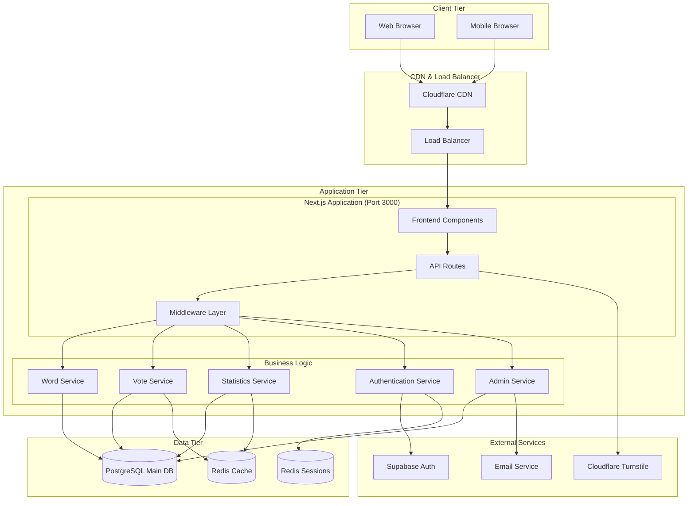

### 2.2 データフローアーキテクチャ

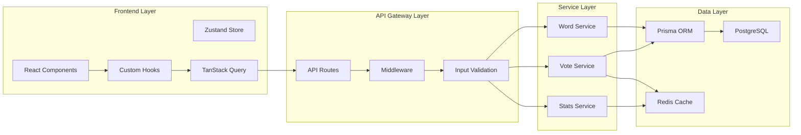

## 3. 各コンポーネントの役割と責任

### 3.1 フロントエンド層 (Frontend Tier)

#### 3.1.1 責任範囲
- **UI/UX**: ユーザーインターフェースの描画と操作
- **状態管理**: クライアント側の状態管理とキャッシュ
- **入力検証**: クライアントサイドバリデーション
- **ルーティング**: 画面遷移とページ状態管理

#### 3.1.2 主要コンポーネント
- **Pages (App Router)**: 各画面の構成とレイアウト
- **Components**: 再利用可能なUIコンポーネント
- **Hooks**: データフェッチングと状態管理ロジック
- **Store**: グローバル状態管理（Zustand）
- **Utils**: ユーティリティ関数群

### 3.2 API層 (API Gateway Tier)

#### 3.2.1 責任範囲
- **リクエスト受信**: HTTP/WebSocketリクエストの受付
- **認証・認可**: トークン検証と権限チェック  
- **入力検証**: リクエストデータの妥当性検証
- **レート制限**: API利用制限の制御
- **レスポンス整形**: 統一されたレスポンス形式での返却

#### 3.2.2 主要コンポーネント

```typescript
// API Routes 構造
/api/
├── words/
│   ├── route.ts          # GET /api/words (検索・一覧)
│   ├── [id]/
│   │   ├── route.ts      # GET /api/words/[id] (詳細)
│   │   └── stats/
│   │       └── route.ts  # GET /api/words/[id]/stats (統計)
│   └── recent/
│       └── route.ts      # GET /api/words/recent (新着)
├── votes/
│   ├── route.ts          # POST /api/votes (投票)
│   └── [id]/
│       └── route.ts      # DELETE /api/votes/[id] (取消)
├── auth/
│   ├── login/route.ts    # POST /api/auth/login
│   ├── logout/route.ts   # POST /api/auth/logout
│   └── me/route.ts       # GET /api/auth/me
├── admin/
│   └── submissions/
│       ├── route.ts      # GET /api/admin/submissions
│       └── [id]/
│           └── route.ts  # PUT /api/admin/submissions/[id]
└── stats/
    ├── summary/route.ts  # GET /api/stats/summary
    └── trends/route.ts   # GET /api/stats/trends
```

### 3.3 ビジネスロジック層 (Service Layer)

#### 3.3.1 責任範囲
- **ドメインロジック**: 業務ルールの実装
- **データ変換**: 外部データとドメインオブジェクト間の変換
- **トランザクション管理**: データ整合性の保証
- **外部サービス連携**: 認証・通知サービスとの連携

#### 3.3.2 サービスクラス設計

```typescript
// Word Service
export class WordService {
  async searchWords(query: SearchQuery): Promise<SearchResult>
  async getWordDetail(id: number): Promise<WordDetail>
  async submitNewWord(submission: WordSubmission): Promise<SubmissionResult>
  async approveSubmission(id: number, approval: ApprovalData): Promise<void>
}

// Vote Service  
export class VoteService {
  async submitVote(vote: VoteData): Promise<VoteResult>
  async undoVote(voteId: number, deviceId: string): Promise<void>
  async canUserVote(wordId: number, deviceId: string): Promise<boolean>
  async updateVoteStatistics(vote: VoteData): Promise<void>
}

// Statistics Service
export class StatisticsService {
  async getWordStatistics(wordId: number): Promise<WordStats>
  async getNationalRanking(period: RankingPeriod): Promise<RankingData>
  async getPrefectureDistribution(wordId: number): Promise<PrefectureStats>
  async refreshStatisticsCache(): Promise<void>
}

// Authentication Service
export class AuthenticationService {
  async authenticateUser(credentials: LoginCredentials): Promise<AuthResult>
  async validateToken(token: string): Promise<User>
  async authorizeAction(user: User, resource: string, action: string): Promise<boolean>
}
```

### 3.4 データアクセス層 (Data Access Layer)

#### 3.4.1 責任範囲
- **データ永続化**: データベースへの読み書き操作
- **クエリ最適化**: 効率的なSQL生成とクエリ実行
- **接続管理**: データベース接続プールの管理
- **トランザクション制御**: ACID特性の保証

#### 3.4.2 Repository パターン実装

```typescript
// Word Repository
export interface WordRepository {
  findById(id: number): Promise<Word | null>
  findByQuery(query: SearchQuery): Promise<Word[]>
  save(word: Word): Promise<Word>
  delete(id: number): Promise<void>
}

// Vote Repository
export interface VoteRepository {
  findByDeviceAndWord(deviceId: string, wordId: number): Promise<Vote | null>
  save(vote: Vote): Promise<Vote>
  countByWordAndPrefecture(wordId: number, prefecture: string): Promise<number>
}

// Statistics Repository
export interface StatisticsRepository {
  getWordStatistics(wordId: number): Promise<WordStatistics>
  updatePrefectureStats(stats: PrefectureStats): Promise<void>
  getRankingData(period: string, limit: number): Promise<RankingItem[]>
}
```

## 4. データフロー設計

### 4.1 投票処理のデータフロー

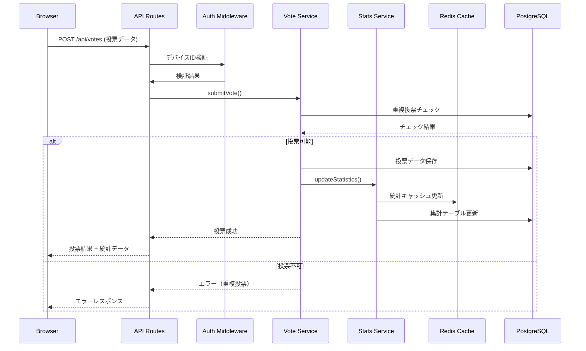

### 4.2 統計データ取得のデータフロー

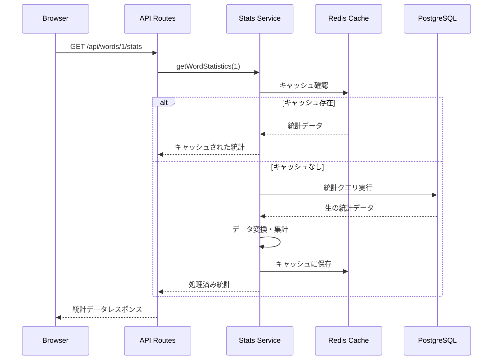

### 4.3 新語承認処理のデータフロー

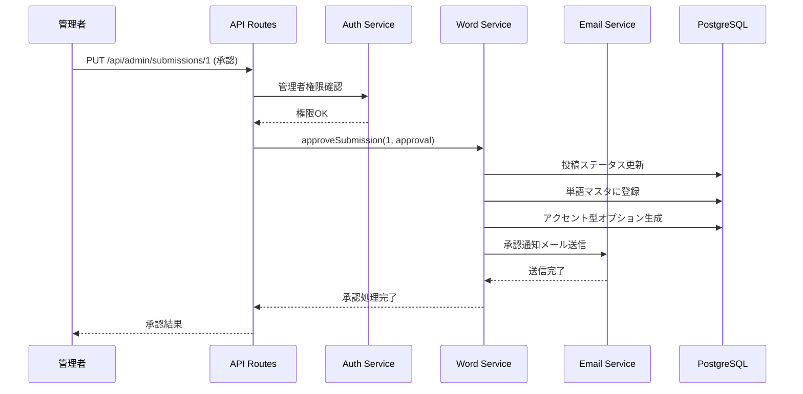

## 5. インフラ構成設計

### 5.1 本番環境構成

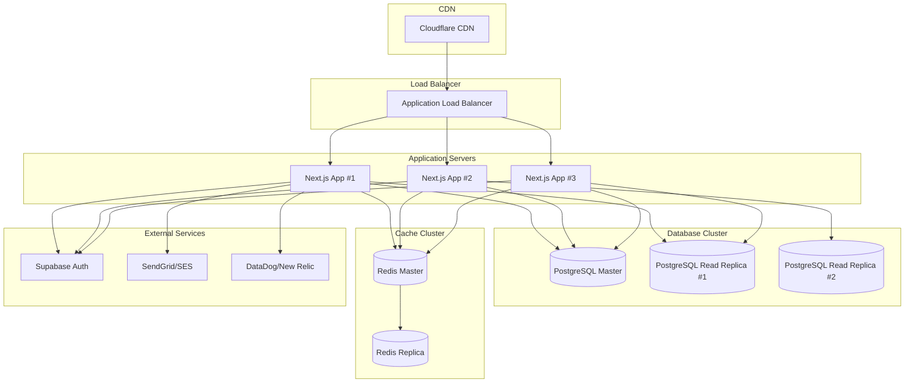

### 5.2 開発・ステージング環境

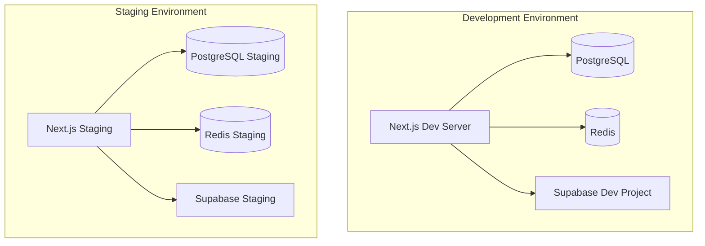

## 6. 技術スタック構成

### 6.1 フロントエンド技術スタック

| カテゴリ | 技術・ライブラリ | バージョン | 役割 |
|---------|----------------|------------|------|
| フレームワーク | Next.js | 14.x | React フルスタックフレームワーク |
| 言語 | TypeScript | 5.x | 型安全性とコード品質向上 |
| UI フレームワーク | React | 18.x | コンポーネントベース UI |
| スタイリング | Tailwind CSS | 3.x | ユーティリティファーストCSS |
| 状態管理 | TanStack Query | 5.x | サーバー状態管理・キャッシュ |
| 状態管理 | Zustand | 4.x | クライアント状態管理 |
| フォーム | React Hook Form | 7.x | 高性能フォームライブラリ |
| バリデーション | Zod | 3.x | TypeScript スキーマバリデーション |
| 可視化 | Apache ECharts | 5.x | 地図・グラフ描画 |
| アニメーション | Framer Motion | 11.x | 滑らかなアニメーション |

### 6.2 バックエンド技術スタック

| カテゴリ | 技術・ライブラリ | バージョン | 役割 |
|---------|----------------|------------|------|
| API | Next.js API Routes | 14.x | RESTful API・WebSocket |
| ORM | Prisma | 5.x | データベース操作・マイグレーション |
| データベース | PostgreSQL | 15.x | メインデータストア |
| キャッシュ | Redis | 7.x | セッション・キャッシュ・レート制限 |
| 認証 | Supabase Auth | latest | ユーザー認証・セッション管理 |
| バリデーション | Zod | 3.x | API入力検証 |
| セキュリティ | bcryptjs | 2.x | パスワードハッシュ化 |
| ボット対策 | Cloudflare Turnstile | latest | ボット検証 |

### 6.3 開発・運用技術スタック

| カテゴリ | 技術・ツール | 役割 |
|---------|-------------|------|
| パッケージ管理 | pnpm | 高速パッケージマネージャー |
| コード品質 | ESLint + Prettier | コードフォーマット・lint |
| テスト | Vitest + React Testing Library | ユニット・統合テスト |
| E2E テスト | Playwright | エンドツーエンドテスト |
| Git Hooks | Husky + lint-staged | コミット時品質チェック |
| CI/CD | GitHub Actions | 自動デプロイ・テスト |
| 監視 | DataDog / New Relic | パフォーマンス監視 |
| ログ | Winston / Pino | 構造化ログ出力 |

## 7. セキュリティアーキテクチャ

### 7.1 セキュリティ層の配置

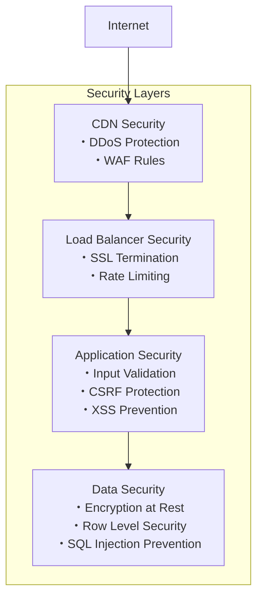

### 7.2 認証・認可フロー

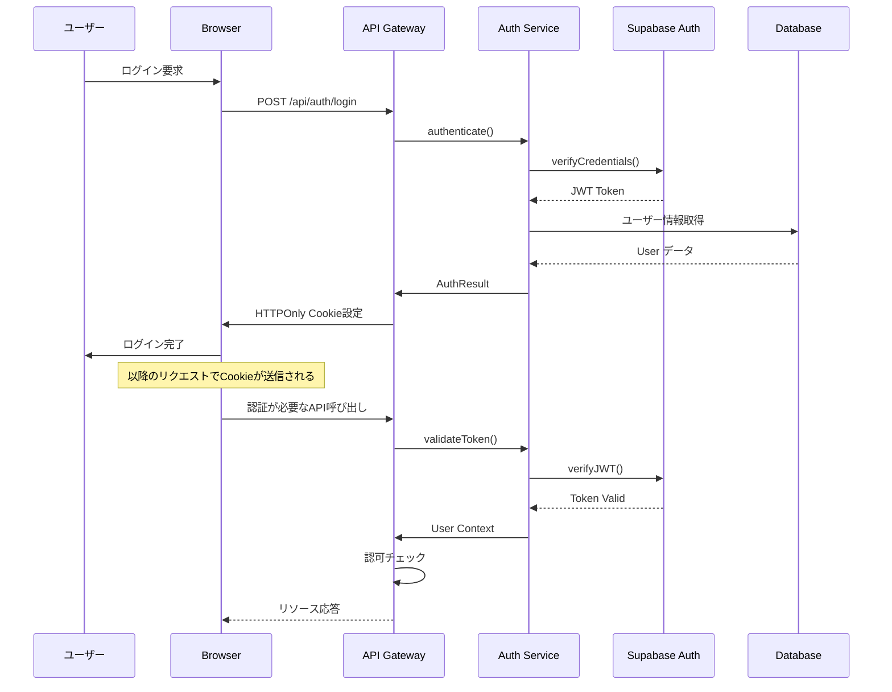

## 8. パフォーマンス設計

### 8.1 キャッシュ戦略

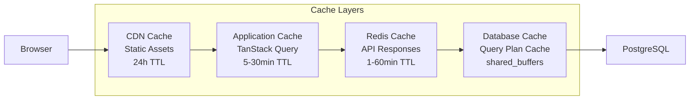

### 8.2 データベース最適化戦略

| 最適化項目 | 実装手法 | 効果 |
|-----------|----------|------|
| インデックス最適化 | 複合インデックス・部分インデックス | クエリ速度向上 |
| マテリアライズドビュー | 重い集計クエリの事前計算 | 統計表示の高速化 |
| パーティショニング | 日付ベースのテーブル分割 | 大容量データ対応 |
| 接続プーリング | PgBouncer使用 | 同時接続数最適化 |
| レプリケーション | 読み書き分離構成 | 読み取り処理の分散 |

### 8.3 フロントエンド最適化戦略

| 最適化項目 | 実装手法 | 効果 |
|-----------|----------|------|
| コード分割 | Dynamic Import・Route-based Splitting | 初期ロード時間短縮 |
| 画像最適化 | Next.js Image・WebP変換・遅延ローディング | 画像ロード最適化 |
| バンドルサイズ | Tree Shaking・不要ライブラリ除去 | JavaScript サイズ削減 |
| メモ化 | React.memo・useMemo・useCallback | 不要な再レンダリング抑制 |
| プリフェッチ | Link prefetch・TanStack Query | ページ遷移の高速化 |

## 9. 監視・ログ設計

### 9.1 監視項目とメトリクス

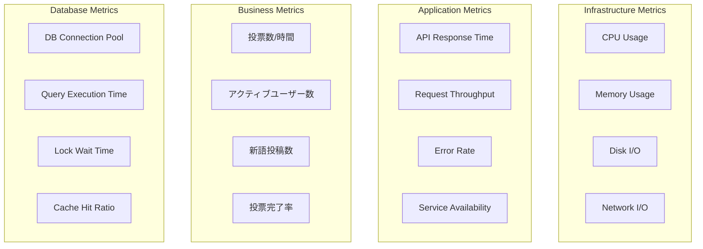

### 9.2 ログ収集アーキテクチャ

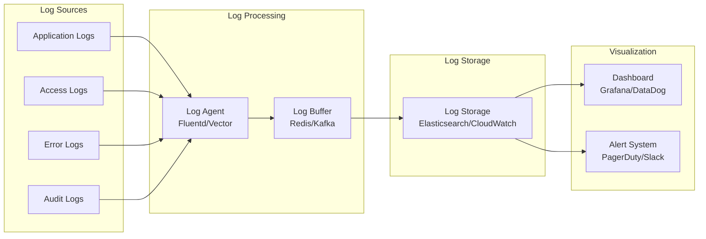

## 10. スケーラビリティ設計

### 10.1 水平スケーリング戦略

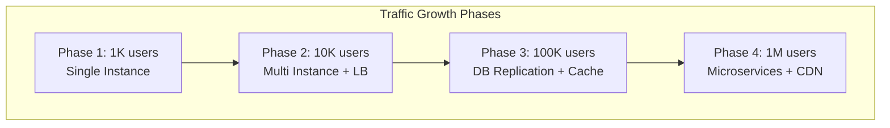

### 10.2 データベーススケーリング

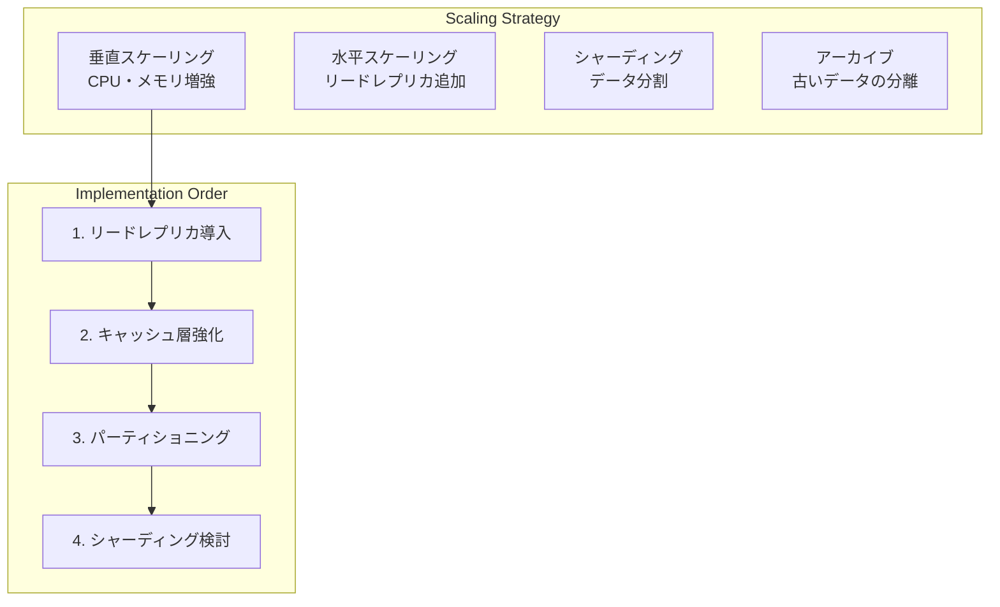

## 11. 障害対応・復旧設計

### 11.1 障害シナリオと対応策

| 障害シナリオ | 影響範囲 | 対応策 | 復旧時間目標 |
|------------|----------|--------|--------------|
| アプリケーションサーバー障害 | 一部機能停止 | ロードバランサー自動切り替え | 30秒以内 |
| データベースマスター障害 | 全機能停止 | リードレプリカの手動昇格 | 5分以内 |
| Redis障害 | パフォーマンス低下 | DB直接アクセスに切り替え | 1分以内 |
| 外部サービス障害 | 一部機能制限 | グレースフル・デグレーデーション | 継続運用 |
| CDN障害 | 表示速度低下 | オリジンサーバー直接配信 | 1分以内 |

### 11.2 バックアップ・復旧戦略

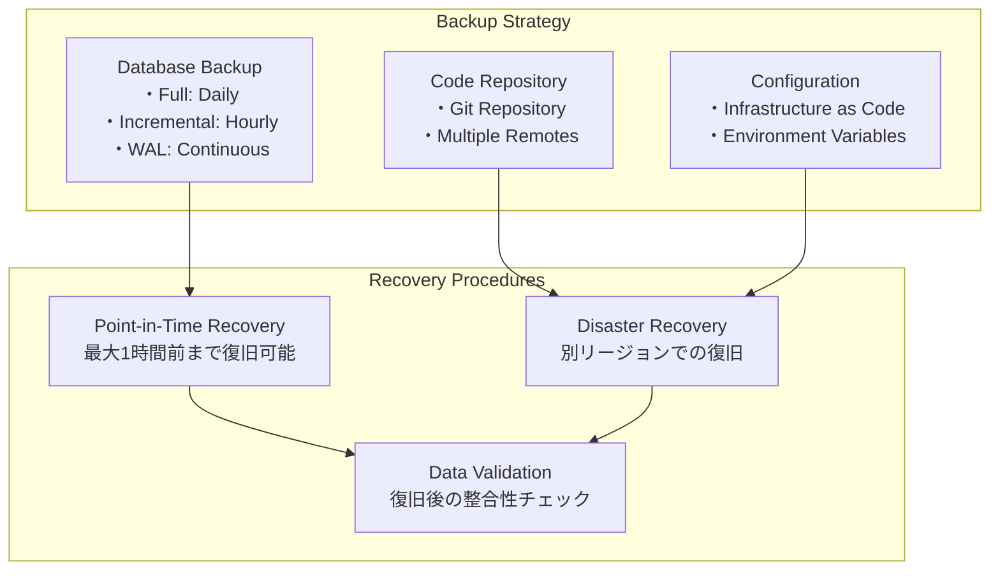

## 12. まとめと次ステップ

### 12.1 アーキテクチャの特徴
1. **モジュラー設計**: 各層の独立性により、段階的な改修・拡張が可能
2. **スケーラブル**: 負荷増加に応じた柔軟なスケーリング対応
3. **可観測性**: 包括的な監視・ログ・メトリクス収集
4. **セキュア**: 多層防御による堅牢なセキュリティ
5. **開発効率**: モダンな技術スタックによる高い開発生産性

### 12.2 実装時の注意点
1. **段階的実装**: MVP → 機能拡張 → 最適化の順で進行
2. **パフォーマンステスト**: 各段階でのパフォーマンス検証
3. **セキュリティレビュー**: 定期的なセキュリティ監査
4. **ドキュメント整備**: アーキテクチャ変更の継続的なドキュメント更新

### 12.3 将来的な発展方向
1. **マイクロサービス化**: トラフィック増加に応じた段階的なサービス分割
2. **機械学習統合**: アクセント予測・異常検知機能の追加
3. **リアルタイム機能**: WebSocketベースの投票結果リアルタイム更新
4. **国際化**: 多言語対応と他言語アクセント調査への拡張

このアーキテクチャ設計により、日本語アクセント投票サイトの要求を満たしつつ、将来の拡張性も確保した堅牢なシステムを構築できます。