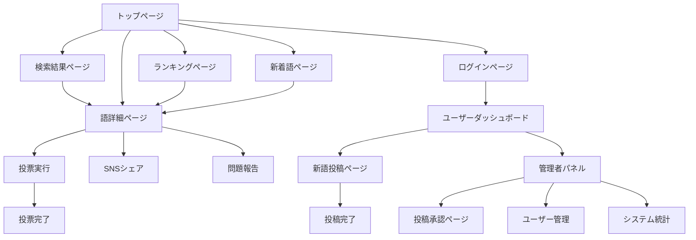
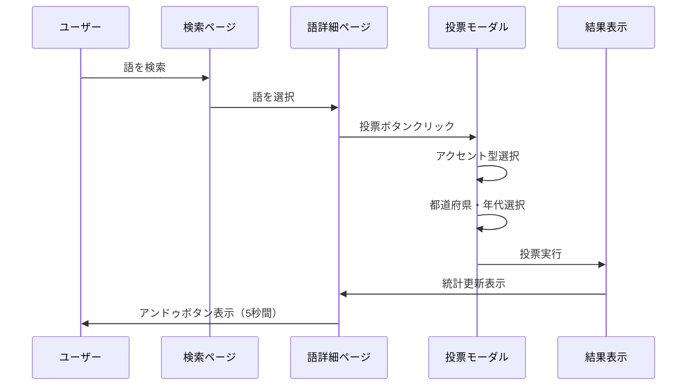
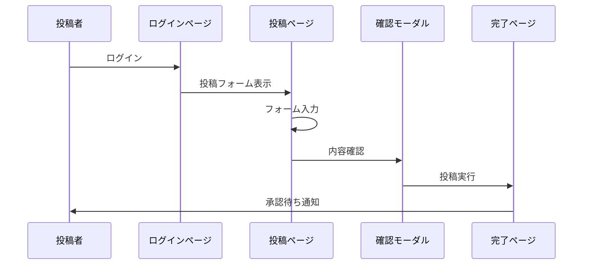

# UI/UX設計書: 日本語アクセント投票サイト

**バージョン**: 1.0  
**最終更新日**: 2025-08-28  
**対象システム**: 日本語アクセント投票サイト

## 1. 概要とデザイン方針

### 1.1 デザイン理念
- **アクセシビリティファースト**: 視覚障害者や高齢者も含む全ユーザーが使いやすいインターフェース
- **直感的操作性**: 専門知識がなくても理解できるシンプルで分かりやすいデザイン
- **学術的信頼性**: 研究データを扱うサイトとしての信頼感と専門性を表現
- **レスポンシブ設計**: デスクトップからスマートフォンまで全デバイス対応
- **和の美学**: 日本語・日本文化を扱うサイトにふさわしい上品なデザイン

### 1.2 デザインシステムの構築方針
- **原子設計（Atomic Design）**: コンポーネントの体系的構築
- **統一されたブランディング**: 一貫したカラー・タイポグラフィ・トーン
- **スケーラブル設計**: 機能追加時の拡張性を考慮
- **パフォーマンス重視**: 軽量で高速なUI実装

## 2. ブランディングとビジュアルアイデンティティ

### 2.1 カラーパレット

#### 2.1.1 メインカラー
```css
/* プライマリカラー */
--primary-50:  #eff6ff;   /* 極薄青 */
--primary-100: #dbeafe;   /* 薄青 */
--primary-200: #bfdbfe;   /* 薄青 */
--primary-300: #93c5fd;   /* 中青 */
--primary-400: #60a5fa;   /* 青 */
--primary-500: #3b82f6;   /* 基本青（メイン） */
--primary-600: #2563eb;   /* 濃青 */
--primary-700: #1d4ed8;   /* 深青 */
--primary-800: #1e40af;   /* 極濃青 */
--primary-900: #1e3a8a;   /* 最濃青 */

/* セカンダリカラー（和の色合い） */
--secondary-50:  #fef7f0;  /* 桜色系薄 */
--secondary-100: #fef2e8;  /* 桜色系 */
--secondary-200: #fde2d0;  /* 薄桃 */
--secondary-300: #fbc7a8;  /* 桃色 */
--secondary-400: #f7a570;  /* 山吹色 */
--secondary-500: #f59e0b;  /* 基本橙（セカンダリ） */
--secondary-600: #d97706;  /* 濃橙 */
--secondary-700: #b45309;  /* 深橙 */
--secondary-800: #92400e;  /* 極濃橙 */
--secondary-900: #78350f;  /* 最濃橙 */
```

#### 2.1.2 アクセント型別カラー
```css
/* 4つのアクセント型を表現する色彩 */
--accent-atamadaka: #ef4444;  /* 頭高型 - 赤（警戒・注目） */
--accent-heiban:    #3b82f6;  /* 平板型 - 青（安定・信頼） */
--accent-nakadaka:  #10b981;  /* 中高型 - 緑（バランス） */
--accent-odaka:     #f59e0b;  /* 尾高型 - 橙（活発・温暖） */

/* アクセント型パステルバリエーション */
--accent-atamadaka-light: #fca5a5;
--accent-heiban-light:    #93c5fd;
--accent-nakadaka-light:  #6ee7b7;
--accent-odaka-light:     #fbbf24;
```

#### 2.1.3 ニュートラルカラー
```css
/* グレースケール */
--neutral-0:   #ffffff;   /* 純白 */
--neutral-50:  #f9fafb;   /* 極薄グレー */
--neutral-100: #f3f4f6;   /* 薄グレー */
--neutral-200: #e5e7eb;   /* 薄グレー */
--neutral-300: #d1d5db;   /* 中薄グレー */
--neutral-400: #9ca3af;   /* 中グレー */
--neutral-500: #6b7280;   /* グレー */
--neutral-600: #4b5563;   /* 濃グレー */
--neutral-700: #374151;   /* 深グレー */
--neutral-800: #1f2937;   /* 極濃グレー */
--neutral-900: #111827;   /* 最濃グレー（黒に近い） */
```

#### 2.1.4 セマンティックカラー
```css
/* 状態を表すカラー */
--success-50:  #ecfdf5;
--success-500: #10b981;   /* 成功 */
--success-700: #047857;

--warning-50:  #fffbeb;
--warning-500: #f59e0b;   /* 警告 */
--warning-700: #b45309;

--error-50:    #fef2f2;
--error-500:   #ef4444;   /* エラー */
--error-700:   #c53030;

--info-50:     #eff6ff;
--info-500:    #3b82f6;   /* 情報 */
--info-700:    #1d4ed8;
```

### 2.2 タイポグラフィ

#### 2.2.1 フォント選択
```css
/* メインフォント（優先順位順） */
--font-japanese: 
  "Hiragino Sans", 
  "Hiragino Kaku Gothic ProN", 
  "Yu Gothic Medium", 
  "Meiryo", 
  "MS Gothic", 
  sans-serif;

/* 英数字フォント */
--font-latin: 
  "Inter", 
  "Segoe UI", 
  "Roboto", 
  "Helvetica Neue", 
  "Arial", 
  sans-serif;

/* モノスペースフォント（コード・データ表示用） */
--font-mono: 
  "SFMono-Regular", 
  "Consolas", 
  "Liberation Mono", 
  "Menlo", 
  monospace;

/* アクセントパターン表示用フォント */
--font-accent: 
  "MS Gothic", 
  "Osaka-Mono", 
  monospace;
```

#### 2.2.2 タイポグラフィスケール
```css
/* フォントサイズ階層 */
--text-xs:   0.75rem;  /* 12px - キャプション */
--text-sm:   0.875rem; /* 14px - 小文字 */
--text-base: 1rem;     /* 16px - 基本 */
--text-lg:   1.125rem; /* 18px - 大きめ */
--text-xl:   1.25rem;  /* 20px - 見出し小 */
--text-2xl:  1.5rem;   /* 24px - 見出し中 */
--text-3xl:  1.875rem; /* 30px - 見出し大 */
--text-4xl:  2.25rem;  /* 36px - 見出し特大 */
--text-5xl:  3rem;     /* 48px - タイトル */

/* 行の高さ */
--leading-none:    1;
--leading-tight:   1.25;
--leading-snug:    1.375;
--leading-normal:  1.5;
--leading-relaxed: 1.625;
--leading-loose:   2;

/* 文字の太さ */
--font-thin:       100;
--font-light:      300;
--font-normal:     400;
--font-medium:     500;
--font-semibold:   600;
--font-bold:       700;
--font-extrabold:  800;
--font-black:      900;
```

### 2.3 コンポーネントサイズとスペーシング

#### 2.3.1 スペーシングシステム
```css
/* 8px基準のスペーシングシステム */
--space-px:  1px;
--space-0:   0px;
--space-1:   0.25rem;  /* 4px */
--space-2:   0.5rem;   /* 8px */
--space-3:   0.75rem;  /* 12px */
--space-4:   1rem;     /* 16px */
--space-5:   1.25rem;  /* 20px */
--space-6:   1.5rem;   /* 24px */
--space-8:   2rem;     /* 32px */
--space-10:  2.5rem;   /* 40px */
--space-12:  3rem;     /* 48px */
--space-16:  4rem;     /* 64px */
--space-20:  5rem;     /* 80px */
--space-24:  6rem;     /* 96px */
--space-32:  8rem;     /* 128px */
```

#### 2.3.2 ブレークポイント
```css
/* レスポンシブブレークポイント */
--screen-xs:  475px;   /* 小型スマートフォン */
--screen-sm:  640px;   /* スマートフォン */
--screen-md:  768px;   /* タブレット縦 */
--screen-lg:  1024px;  /* タブレット横・小型PC */
--screen-xl:  1280px;  /* PC */
--screen-2xl: 1536px;  /* 大型PC */
```

## 3. 画面遷移図

### 3.1 サイト全体の情報アーキテクチャ



### 3.2 主要フロー詳細

#### 3.2.1 投票フロー


#### 3.2.2 新語投稿フロー


## 4. ワイヤーフレーム設計

### 4.1 トップページ

#### 4.1.1 デスクトップ版レイアウト
```
┌─────────────────────────────────────────────────────────────────┐
│ Header: Logo | Navigation | Search Box | Login/User Menu          │
├─────────────────────────────────────────────────────────────────┤
│                                                                 │
│  Hero Section                                                   │
│  ┌─────────────────────────────────────────────────────────────┐ │
│  │ サイトタイトル・説明                                         │ │
│  │ 大きな検索ボックス                                           │ │
│  │ 「日本語のアクセントを調べよう」CTA ボタン                  │ │
│  └─────────────────────────────────────────────────────────────┘ │
│                                                                 │
│  Statistics Overview                                            │
│  ┌───────────────┬───────────────┬───────────────┬─────────────┐ │
│  │ 総語数        │ 総投票数      │ 参加県数      │ 今日の投票  │ │
│  │ 1,234語       │ 12,345票      │ 47県          │ 123票       │ │
│  └───────────────┴───────────────┴───────────────┴─────────────┘ │
│                                                                 │
│  Main Content (Grid Layout)                                     │
│  ┌─────────────────────────────┬─────────────────────────────────┐ │
│  │ Popular Rankings            │ Recent Words                    │ │
│  │ ┌─────────────────────────┐ │ ┌─────────────────────────────┐ │ │
│  │ │ 1位 桜 (サクラ)         │ │ │ 新着: 紅葉 (コウヨウ)       │ │ │
│  │ │    567票 関東で平板型   │ │ │      投稿者: ユーザーA      │ │ │
│  │ │ 2位 富士 (フジ)         │ │ │ 新着: 雪景色 (ユキゲシキ)   │ │ │
│  │ │    456票 関西で頭高型   │ │ │      投稿者: ユーザーB      │ │ │
│  │ │ 3位 寿司 (スシ)         │ │ │ [もっと見る]                │ │ │
│  │ │    345票 全国で平板型   │ │ └─────────────────────────────┘ │ │
│  │ │ [もっと見る]            │ │                                 │ │
│  │ └─────────────────────────┘ │                                 │ │
│  └─────────────────────────────┴─────────────────────────────────┘ │
│                                                                 │
│  ┌─────────────────────────────────────────────────────────────┐ │
│  │ Featured Content                                            │ │
│  │ 「今週の注目語: 『季語』の地域差を調べてみよう」            │ │
│  └─────────────────────────────────────────────────────────────┘ │
├─────────────────────────────────────────────────────────────────┤
│ Footer: About | Privacy | Contact | SNS Links                  │
└─────────────────────────────────────────────────────────────────┘
```

#### 4.1.2 モバイル版レイアウト
```
┌─────────────────────┐
│ Header              │
│ ☰ Logo  [検索] [👤]  │
├─────────────────────┤
│                     │
│ Hero Section        │
│ ┌─────────────────┐ │
│ │ サイトタイトル  │ │
│ │ [検索ボックス]  │ │
│ │ [調べる]        │ │
│ └─────────────────┘ │
│                     │
│ Quick Stats         │
│ ┌─────┬─────┬─────┐ │
│ │1234 │12345│ 47  │ │
│ │語   │票   │県   │ │
│ └─────┴─────┴─────┘ │
│                     │
│ Popular Words       │
│ ┌─────────────────┐ │
│ │ 🥇 桜 (567票)    │ │
│ │ 🥈 富士 (456票)  │ │
│ │ 🥉 寿司 (345票)  │ │
│ │ [もっと見る]    │ │
│ └─────────────────┘ │
│                     │
│ Recent Words        │
│ ┌─────────────────┐ │
│ │ 新着: 紅葉      │ │
│ │ 新着: 雪景色    │ │
│ │ [もっと見る]    │ │
│ └─────────────────┘ │
│                     │
├─────────────────────┤
│ Footer              │
└─────────────────────┘
```

### 4.2 語詳細ページ

#### 4.2.1 デスクトップ版レイアウト
```
┌─────────────────────────────────────────────────────────────────┐
│ Header + Breadcrumb                                             │
│ Home > 検索結果 > 桜                                             │
├─────────────────────────────────────────────────────────────────┤
│                                                                 │
│ Word Information Section                                        │
│ ┌─────────────────────────────────────────────────────────────┐ │
│ │ 桜 (サクラ) [音声アイコン] [シェア] [ブックマーク]           │ │
│ │ カテゴリ: 一般語 | モーラ数: 3 | 投稿者: システム            │ │
│ │ 別表記: さくら、櫻                                           │ │
│ └─────────────────────────────────────────────────────────────┘ │
│                                                                 │
│ Accent Voting Section                                           │
│ ┌─────────────────────────────────────────────────────────────┐ │
│ │ この語のアクセントはどれですか？                             │ │
│ │                                                             │ │
│ │ ┌─────────────┬─────────────┬─────────────┬─────────────┐   │ │
│ │ │ 頭高型      │ 平板型      │ 中高型      │ 尾高型      │   │ │
│ │ │ ￣￣＼      │ ＿￣￣      │ ＿￣＼      │ ＿￣￣     │   │ │
│ │ │ サクラ      │ サクラ      │ サクラ      │ サクラ      │   │ │
│ │ │             │             │             │             │   │ │
│ │ │ 123票(23%)  │ 345票(65%)  │ 45票(9%)    │ 17票(3%)    │   │ │
│ │ │ [投票する]  │ [投票する]  │ [投票する]  │ [投票する]  │   │ │
│ │ └─────────────┴─────────────┴─────────────┴─────────────┘   │ │
│ └─────────────────────────────────────────────────────────────┘ │
│                                                                 │
│ Statistics Visualization                                        │
│ ┌─────────────────────────────────────────────────────────────┐ │
│ │ 都道府県別アクセント分布                                     │ │
│ │                                                             │ │
│ │ ┌─────────────────────────┬─────────────────────────────┐   │ │
│ │ │ 日本地図                │ 選択県詳細グラフ              │   │ │
│ │ │ (色分けされた地図)      │ ┌─────────────────────────┐ │   │ │
│ │ │                         │ │ 東京都の投票結果          │ │   │ │
│ │ │ [凡例]                  │ │ ■平板型 65% (123票)      │ │   │ │
│ │ │ ■赤: 頭高型            │ │ ■頭高型 23% (43票)       │ │   │ │
│ │ │ ■青: 平板型            │ │ ■中高型 9% (17票)        │ │   │ │
│ │ │ ■緑: 中高型            │ │ ■尾高型 3% (5票)         │ │   │ │
│ │ │ ■橙: 尾高型            │ │ 総投票数: 188票           │ │   │ │
│ │ │                         │ └─────────────────────────┘ │   │ │
│ │ └─────────────────────────┴─────────────────────────────┘   │ │
│ └─────────────────────────────────────────────────────────────┘ │
│                                                                 │
│ Sidebar Information                                             │
│ ┌─────────────────────────────────────────────────────────────┐ │
│ │ 関連語                                                       │ │
│ │ • 花見 (ハナミ)                                             │ │
│ │ • 桜餅 (サクラモチ)                                         │ │
│ │ • 花弁 (カベン)                                             │ │
│ │                                                             │ │
│ │ 投票統計                                                     │ │
│ │ • 総投票数: 530票                                           │ │
│ │ • 参加県数: 43県                                            │ │
│ │ • 最終投票: 2時間前                                         │ │
│ │                                                             │ │
│ │ カテゴリ情報                                                 │ │
│ │ • 語種: 和語                                               │ │
│ │ • 語彙的カテゴリ: 自然・植物                               │ │
│ └─────────────────────────────────────────────────────────────┘ │
├─────────────────────────────────────────────────────────────────┤
│ Footer                                                          │
└─────────────────────────────────────────────────────────────────┘
```

### 4.3 投票モーダル・インターフェース

#### 4.3.1 投票フロー画面設計
```
Step 1: アクセント型選択
┌─────────────────────────────────────────┐
│ 「桜」のアクセント型を選択してください      │
├─────────────────────────────────────────┤
│                                         │
│ ┌─────────────────────────────────────┐ │
│ │ 頭高型 [選択中]                      │ │
│ │ サ￣ ク＼ ラ                        │ │
│ │ 最初の音（サ）が高く、以降が低い    │ │
│ └─────────────────────────────────────┘ │
│                                         │
│ ┌─────────────────────────────────────┐ │
│ │ 平板型                              │ │
│ │ サ＿ ク￣ ラ￣                      │ │
│ │ 2音目以降が高く平坦                 │ │
│ └─────────────────────────────────────┘ │
│                                         │
│ ┌─────────────────────────────────────┐ │
│ │ 中高型                              │ │
│ │ サ＿ ク￣ ラ＼                      │ │
│ │ 途中で下がる                        │ │
│ └─────────────────────────────────────┘ │
│                                         │
│ ┌─────────────────────────────────────┐ │
│ │ 尾高型                              │ │
│ │ サ＿ ク￣ ラ￣                      │ │
│ │ 語末が高く助詞で下がる              │ │
│ └─────────────────────────────────────┘ │
│                                         │
│            [次へ] [キャンセル]           │
└─────────────────────────────────────────┘

Step 2: 地域・年代情報入力
┌─────────────────────────────────────────┐
│ あなたの情報を教えてください            │
├─────────────────────────────────────────┤
│                                         │
│ 都道府県 (必須)                         │
│ ┌─────────────────────────────────────┐ │
│ │ [東京都 ▼]                          │ │
│ └─────────────────────────────────────┘ │
│                                         │
│ 年代 (任意)                             │
│ ┌─────────────────────────────────────┐ │
│ │ [30代 ▼]                            │ │
│ └─────────────────────────────────────┘ │
│                                         │
│ ┌─ボット検証─────────────────────────┐ │
│ │ [Cloudflare Turnstile Widget]       │ │
│ └─────────────────────────────────────┘ │
│                                         │
│          [投票する] [戻る]               │
└─────────────────────────────────────────┘

Step 3: 投票完了・結果表示
┌─────────────────────────────────────────┐
│ 投票ありがとうございました！            │
├─────────────────────────────────────────┤
│                                         │
│ ✅ 「桜」に「頭高型」で投票しました      │
│                                         │
│ 投票結果が統計に反映されました          │
│                                         │
│ ┌─────────────────────────────────────┐ │
│ │ 更新された統計:                      │ │
│ │ • 頭高型: 124票 (23.4%) [+1]        │ │
│ │ • 平板型: 345票 (65.1%)             │ │
│ │ • 中高型: 45票 (8.5%)               │ │
│ │ • 尾高型: 17票 (3.2%)               │ │
│ └─────────────────────────────────────┘ │
│                                         │
│ [取り消し (5秒)] [閉じる] [他の語を探す] │
└─────────────────────────────────────────┘
```

## 5. コンポーネント階層設計

### 5.1 原子（Atoms）レベル

#### 5.1.1 基本UIコンポーネント
```typescript
// Button コンポーネント
interface ButtonProps {
  variant: 'primary' | 'secondary' | 'outline' | 'ghost' | 'danger';
  size: 'xs' | 'sm' | 'md' | 'lg' | 'xl';
  disabled?: boolean;
  loading?: boolean;
  icon?: React.ReactNode;
  children: React.ReactNode;
  onClick?: () => void;
}

// Input コンポーネント  
interface InputProps {
  type: 'text' | 'email' | 'password' | 'search' | 'tel';
  placeholder?: string;
  value?: string;
  error?: string;
  disabled?: boolean;
  required?: boolean;
  onChange?: (value: string) => void;
}

// Badge コンポーネント
interface BadgeProps {
  variant: 'default' | 'success' | 'warning' | 'error' | 'info';
  size: 'sm' | 'md' | 'lg';
  children: React.ReactNode;
}
```

#### 5.1.2 アクセント専用コンポーネント
```typescript
// MoraDisplay - モーラ表示コンポーネント
interface MoraDisplayProps {
  moraSegments: string[];
  accentPattern: number[];
  dropPosition?: number;
  size?: 'sm' | 'md' | 'lg';
  interactive?: boolean;
}

// AccentLine - アクセント線描画コンポーネント
interface AccentLineProps {
  pattern: number[];
  width?: number;
  height?: number;
  color?: string;
  strokeWidth?: number;
  animated?: boolean;
}

// VoteButton - 投票専用ボタン
interface VoteButtonProps {
  accentType: AccentType;
  voteCount?: number;
  percentage?: number;
  isSelected?: boolean;
  disabled?: boolean;
  onClick?: () => void;
}
```

### 5.2 分子（Molecules）レベル

#### 5.2.1 検索関連コンポーネント
```typescript
// SearchBox - 検索入力とサジェスト
interface SearchBoxProps {
  placeholder?: string;
  suggestions?: WordSuggestion[];
  onSearch: (query: string) => void;
  onSuggestionClick: (word: WordSuggestion) => void;
  loading?: boolean;
}

// SearchFilters - 検索フィルター
interface SearchFiltersProps {
  categories: Category[];
  selectedCategory?: string;
  sortOptions: SortOption[];
  selectedSort?: string;
  onCategoryChange: (category: string) => void;
  onSortChange: (sort: string) => void;
}

// WordCard - 語カード表示
interface WordCardProps {
  word: WordSummary;
  showStats?: boolean;
  showCategory?: boolean;
  onClick?: () => void;
}
```

#### 5.2.2 投票関連コンポーネント
```typescript
// AccentCard - アクセント型カード
interface AccentCardProps {
  accentOption: AccentOption;
  wordMoraSegments: string[];
  voteStats?: VoteStats;
  isSelected?: boolean;
  canVote?: boolean;
  onVote?: () => void;
}

// VoteStatsBar - 投票統計バー
interface VoteStatsBarProps {
  accentType: AccentType;
  voteCount: number;
  percentage: number;
  totalVotes: number;
  color?: string;
  animated?: boolean;
}

// PrefectureSelector - 都道府県選択
interface PrefectureSelectorProps {
  selectedPrefecture?: string;
  onChange: (prefecture: string) => void;
  disabled?: boolean;
  required?: boolean;
}
```

### 5.3 有機体（Organisms）レベル

#### 5.3.1 ページセクション
```typescript
// WordDetailHeader - 語詳細ヘッダー
interface WordDetailHeaderProps {
  word: WordDetail;
  onShare: () => void;
  onBookmark: () => void;
  onReport: () => void;
}

// AccentVotingSection - 投票セクション
interface AccentVotingSectionProps {
  word: WordDetail;
  accentOptions: AccentOption[];
  userVote?: UserVote;
  canVote: boolean;
  onVote: (accentTypeId: number) => void;
}

// StatisticsVisualization - 統計可視化
interface StatisticsVisualizationProps {
  wordId: number;
  nationalStats: NationalStat[];
  prefectureStats: PrefectureStat[];
  selectedPrefecture?: string;
  onPrefectureSelect: (prefecture: string) => void;
}
```

#### 5.3.2 レイアウト構成要素
```typescript
// Header - サイトヘッダー
interface HeaderProps {
  user?: User;
  searchQuery?: string;
  onSearch: (query: string) => void;
  onLogin: () => void;
  onLogout: () => void;
}

// Sidebar - サイドバー
interface SidebarProps {
  relatedWords?: WordSummary[];
  wordStats?: WordStats;
  categoryInfo?: CategoryInfo;
}

// Footer - サイトフッター
interface FooterProps {
  links: FooterLink[];
  socialLinks: SocialLink[];
}
```

## 6. レスポンシブデザイン戦略

### 6.1 デバイス別最適化方針

#### 6.1.1 スマートフォン (375px - 767px)
- **単一カラムレイアウト**: すべてのコンテンツを縦に並べる
- **タッチ操作最適化**: 44px以上のタッチターゲット
- **スワイプ操作**: 左右スワイプでアクセント型切り替え
- **モーダル最小化**: フルスクリーンモーダルで情報表示
- **フォントサイズ調整**: 16px以上で読みやすさ確保

#### 6.1.2 タブレット (768px - 1023px)
- **2カラムレイアウト**: メインコンテンツ + サイドバー
- **タブ切り替え**: 地図・グラフの表示切り替え機能
- **タッチとマウス両対応**: デバイス検出によるUI切り替え
- **横向き対応**: ランドスケープモードでの表示最適化

#### 6.1.3 デスクトップ (1024px以上)
- **3カラムレイアウト**: フルコンテンツ + 2つのサイドバー
- **ホバー効果**: マウスオーバーでの詳細情報表示
- **キーボードショートカット**: 効率的な操作支援
- **大画面活用**: より多くの情報を同時表示

### 6.2 コンポーネントレスポンシブ実装例

```typescript
// ResponsiveAccentCards コンポーネント
export function ResponsiveAccentCards({ accentOptions, onVote }: Props) {
  const isMobile = useMediaQuery('(max-width: 767px)');
  const isTablet = useMediaQuery('(min-width: 768px) and (max-width: 1023px)');

  if (isMobile) {
    return (
      <div className="space-y-4">
        {accentOptions.map((option) => (
          <AccentCard
            key={option.id}
            accentOption={option}
            layout="horizontal"
            size="large"
            onVote={onVote}
          />
        ))}
      </div>
    );
  }

  if (isTablet) {
    return (
      <div className="grid grid-cols-2 gap-4">
        {accentOptions.map((option) => (
          <AccentCard
            key={option.id}
            accentOption={option}
            layout="vertical"
            size="medium"
            onVote={onVote}
          />
        ))}
      </div>
    );
  }

  return (
    <div className="grid grid-cols-4 gap-6">
      {accentOptions.map((option) => (
        <AccentCard
          key={option.id}
          accentOption={option}
          layout="vertical"
          size="large"
          onVote={onVote}
        />
      ))}
    </div>
  );
}
```

### 6.3 アクセシビリティ実装方針

#### 6.3.1 WCAG 2.1 AA 準拠項目
- **色覚対応**: 色だけに依存しない情報伝達
- **コントラスト**: 4.5:1以上のコントラスト比確保
- **フォーカス管理**: 明確なフォーカス表示とナビゲーション
- **スクリーンリーダー**: ARIAラベルと構造化マークアップ
- **キーボード操作**: すべての機能をキーボードで操作可能

#### 6.3.2 日本語特有のアクセシビリティ考慮
```typescript
// 音声読み上げ対応のアクセントパターン表示
export function AccessibleAccentPattern({ pattern, moraSegments }: Props) {
  const accentDescription = generateAccentDescription(pattern, moraSegments);
  
  return (
    <div
      role="img"
      aria-label={accentDescription}
      className="accent-pattern"
    >
      {/* 視覚的なアクセント線 */}
      <AccentLine pattern={pattern} />
      
      {/* スクリーンリーダー用のテキスト説明 */}
      <span className="sr-only">
        {moraSegments.join('・')}の音の高低パターン: {accentDescription}
      </span>
      
      {/* モーラ表示 */}
      <div className="mora-segments">
        {moraSegments.map((mora, index) => (
          <span
            key={index}
            className={`mora ${pattern[index] ? 'high' : 'low'}`}
            aria-hidden="true"
          >
            {mora}
          </span>
        ))}
      </div>
    </div>
  );
}

function generateAccentDescription(pattern: number[], moraSegments: string[]): string {
  const pitches = pattern.map((level, index) => 
    `${moraSegments[index]}は${level ? '高い' : '低い'}音`
  );
  return pitches.join('、');
}
```

## 7. アニメーション・インタラクション設計

### 7.1 マイクロインタラクション定義

#### 7.1.1 投票フィードバック
```typescript
// 投票ボタンクリック時のアニメーション
const voteButtonAnimations = {
  initial: { scale: 1 },
  pressed: { 
    scale: 0.95,
    transition: { duration: 0.1, ease: "easeInOut" }
  },
  success: {
    scale: [1, 1.05, 1],
    backgroundColor: ['#3b82f6', '#10b981', '#3b82f6'],
    transition: { duration: 0.6, ease: "easeInOut" }
  }
};

// 統計更新時のカウントアップアニメーション
const countUpAnimation = {
  initial: { opacity: 0, y: 10 },
  animate: { opacity: 1, y: 0 },
  transition: { duration: 0.5, ease: "easeOut" }
};
```

#### 7.1.2 地図インタラクション
```typescript
// 都道府県ホバー・選択アニメーション
const prefectureHoverEffects = {
  hover: {
    scale: 1.02,
    filter: 'brightness(1.1)',
    transition: { duration: 0.2 }
  },
  selected: {
    stroke: '#1d4ed8',
    strokeWidth: 2,
    filter: 'brightness(1.2)',
    transition: { duration: 0.3 }
  }
};
```

### 7.2 ページ遷移アニメーション

```typescript
// ページ遷移時のフェードアニメーション
const pageTransitions = {
  enter: {
    opacity: 0,
    y: 20,
    transition: { duration: 0.3, ease: "easeOut" }
  },
  center: {
    opacity: 1,
    y: 0,
    transition: { duration: 0.3, ease: "easeOut" }
  },
  exit: {
    opacity: 0,
    y: -20,
    transition: { duration: 0.2, ease: "easeIn" }
  }
};

// モーダル表示・非表示アニメーション
const modalAnimations = {
  overlay: {
    initial: { opacity: 0 },
    animate: { opacity: 1 },
    exit: { opacity: 0 }
  },
  content: {
    initial: { opacity: 0, scale: 0.9, y: 50 },
    animate: { 
      opacity: 1, 
      scale: 1, 
      y: 0,
      transition: { type: "spring", damping: 20, stiffness: 300 }
    },
    exit: { 
      opacity: 0, 
      scale: 0.9, 
      y: 50,
      transition: { duration: 0.2 }
    }
  }
};
```

## 8. パフォーマンス最適化

### 8.1 画像・アセット最適化
- **WebP形式採用**: 従来比30-50%のファイルサイズ削減
- **遅延読み込み**: Intersection Observer APIによる画像遅延読み込み
- **適応的配信**: デバイス解像度に応じた画像サイズ配信
- **SVGアイコン**: ベクター形式によるスケーラブルなアイコン

### 8.2 レンダリング最適化
```typescript
// React.memo による不要な再レンダリング防止
export const AccentCard = React.memo(({ accentOption, onVote }: Props) => {
  // コンポーネント実装
}, (prevProps, nextProps) => {
  return (
    prevProps.accentOption.id === nextProps.accentOption.id &&
    prevProps.accentOption.voteCount === nextProps.accentOption.voteCount
  );
});

// useMemo によるやくタスクメモ化
export function useWordStatistics(wordId: number) {
  const processedStats = useMemo(() => {
    if (!rawStats) return null;
    
    return {
      nationalRanking: calculateRanking(rawStats.national),
      prefectureMap: generateMapData(rawStats.prefectures),
      dominantAccents: findDominantAccents(rawStats.prefectures)
    };
  }, [rawStats]);
  
  return processedStats;
}
```

### 8.3 バンドルサイズ最適化
- **コード分割**: ページ単位・機能単位の動的インポート
- **Tree Shaking**: 未使用コードの自動除去
- **ライブラリ最適化**: 必要な機能のみの部分インポート
- **Webpackバンドル分析**: バンドルサイズの定期的な監視

## 9. テーマ・カスタマイゼーション設計

### 9.1 ダークモード対応
```css
/* ダークモードカラーパレット */
:root[data-theme="dark"] {
  --primary-50: #0f172a;
  --primary-500: #60a5fa;
  --primary-600: #3b82f6;
  
  --neutral-0: #0f172a;
  --neutral-50: #1e293b;
  --neutral-100: #334155;
  --neutral-900: #f1f5f9;
  
  --background: var(--neutral-0);
  --surface: var(--neutral-50);
  --text-primary: var(--neutral-900);
  --text-secondary: var(--neutral-400);
}

/* アクセント型カラーのダークモード調整 */
:root[data-theme="dark"] {
  --accent-atamadaka: #fca5a5;
  --accent-heiban: #93c5fd;
  --accent-nakadaka: #6ee7b7;
  --accent-odaka: #fbbf24;
}
```

### 9.2 アクセシビリティ対応テーマ
```css
/* ハイコントラストモード */
:root[data-theme="high-contrast"] {
  --text-primary: #000000;
  --text-secondary: #000000;
  --background: #ffffff;
  --surface: #f0f0f0;
  --border: #000000;
  
  /* アクセント型を区別しやすいパターン */
  --accent-atamadaka: #ff0000; /* 明確な赤 */
  --accent-heiban: #0000ff;    /* 明確な青 */
  --accent-nakadaka: #00aa00;  /* 明確な緑 */  
  --accent-odaka: #ff6600;     /* 明確な橙 */
}

/* 動きを抑制するモード */
@media (prefers-reduced-motion: reduce) {
  * {
    animation-duration: 0.01ms !important;
    animation-iteration-count: 1 !important;
    transition-duration: 0.01ms !important;
    scroll-behavior: auto !important;
  }
}
```

## 10. ブラウザ対応・互換性

### 10.1 対応ブラウザ
- **モダンブラウザ**: Chrome 90+, Firefox 88+, Safari 14+, Edge 90+
- **モバイルブラウザ**: iOS Safari 14+, Chrome Mobile 90+, Samsung Internet 13+
- **IE対応**: Internet Explorer は非対応（代替ページ表示）

### 10.2 フォールバック戦略
```typescript
// CSS Grid 非対応ブラウザへのフォールバック
.accent-cards {
  display: flex;
  flex-wrap: wrap;
  gap: 1rem;
}

@supports (display: grid) {
  .accent-cards {
    display: grid;
    grid-template-columns: repeat(auto-fit, minmax(250px, 1fr));
    gap: 1.5rem;
  }
}

// Web Components 非対応ブラウザでの代替実装
if (!window.customElements) {
  // ポリフィルの読み込み
  await import('@webcomponents/webcomponentsjs');
}
```

## 11. 実装ガイドライン

### 11.1 コンポーネント実装規約
1. **単一責任の原則**: 1つのコンポーネントは1つの機能に集中
2. **Props命名規則**: 明確で一貫性のある命名
3. **TypeScript厳格モード**: 型安全性の徹底
4. **アクセシビリティ必須**: すべてのコンポーネントでWCAG準拠
5. **テスト可能性**: テストしやすい構造での実装

### 11.2 スタイリング規約
1. **Tailwind CSS優先**: ユーティリティファーストアプローチ
2. **カスタムCSS最小化**: 必要最小限のカスタムスタイル
3. **レスポンシブファースト**: モバイルファーストな設計
4. **パフォーマンス重視**: 不要なスタイルの除去
5. **メンテナンス性**: 変更しやすく理解しやすいコード

この設計書により、一貫性があり、アクセシブルで、高性能なユーザーインターフェースを構築できます。